# New Activity Diagram Beta syntax and features

> ## Excerpt
> The new syntax is more consistent. You can have start, stop, labels, conditions, while loops, repeat loops, notes, partitions. Changing fonts and colors is also possible.

---
## Activity Diagram (New Syntax)

The [previous syntax used for activity diagrams](https://plantuml.com/en/activity-diagram-legacy) encountered several limitations and maintainability issues. Recognizing these drawbacks, we have introduced a wholly revamped syntax and implementation that is not only user-friendly but also more stable.

### Benefits of the New Syntax

-   No Dependency on Graphviz: Just like with sequence diagrams, the new syntax eliminates the necessity for Graphviz installation, thereby simplifying the setup process.
-   Ease of Maintenance: The intuitive nature of the new syntax means it is easier to manage and maintain your diagrams.

### Transition to the New Syntax

While we will continue to support the old syntax to maintain compatibility, we highly encourage users to migrate to the new syntax to leverage the enhanced features and benefits it offers.

Make the shift today and experience a more streamlined and efficient diagramming process with the new activity diagram syntax.

## Simple action

Activities label starts with `:` and ends with `;`.

Text formatting can be done using [creole wiki syntax](https://plantuml.com/en/creole).

They are implicitly linked in their definition order.

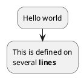


## Start/Stop/End

You can use `start` and `stop` keywords to denote the beginning and the end of a diagram.

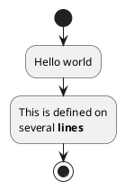


You can also use the `end` keyword.

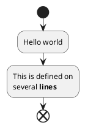


## Conditional \[if, then, else, endif\]

You can use `if`, `then`, `else` and `endif` keywords to put tests in your diagram. Labels can be provided using parentheses.

The 3 syntaxes are possible:

-   `if (...) then (...) ... [else (...) ...] endif`

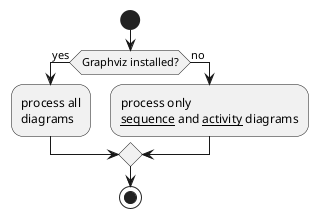


-   `if (...) is (...) then ... [else (...) ...] endif`

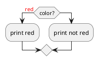


-   `if (...) equals (...) then ... [else (...) ...] endif`

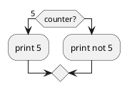


_\[Ref. [QA-301](https://forum.plantuml.net/301/activity-diagram-beta?show=302#a302)\]_

### Several tests (horizontal mode)

You can use the `elseif` keyword to have several tests _(by default, it is the horizontal mode)_:

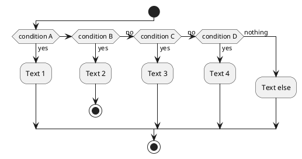


### Several tests (vertical mode)

You can use the command `!pragma useVerticalIf on` to have the tests in vertical mode:

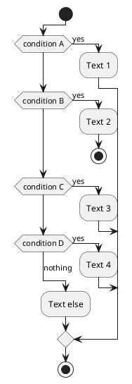


You can use the `-P` [command-line](https://plantuml.com/en/command-line) option to specify the pragma:

```
java -jar plantuml.jar -PuseVerticalIf=on
```

_\[Refs. [QA-3931](https://forum.plantuml.net/3931/please-provide-elseif-structure-vertically-activity-diagrams), [GH-582](https://github.com/plantuml/plantuml/issues/582)\]_

## Switch and case \[switch, case, endswitch\]

You can use `switch`, `case` and `endswitch` keywords to put switch in your diagram.

Labels can be provided using parentheses.

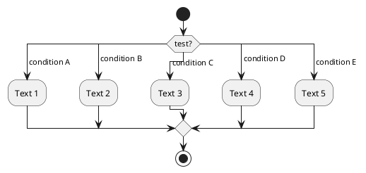


## Conditional with stop on an action \[kill, detach\]

You can stop action on a if loop.

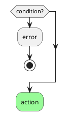


But if you want to stop at the precise action, you can use the `kill` or `detach` keyword:

-   `kill`

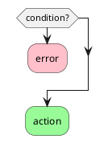


_\[Ref. [QA-265](https://forum.plantuml.net/265/new-activity-diagram-syntax-direction-of-links?show=306#a306)\]_

-   `detach`


## Repeat loop

### Simple repeat loop

You can use `repeat` and `repeat while` keywords to have repeat loops.

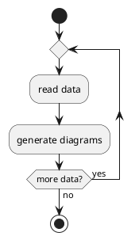


### Repeat loop with repeat action and backward action

It is also possible to use a full action as `repeat` target and insert an action in the return path using the `backward` keyword.

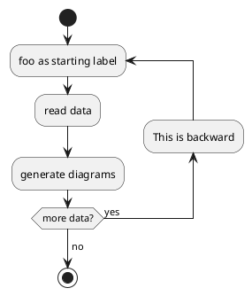


_\[Ref. [QA-5826](https://forum.plantuml.net/5826/please-provide-action-repeat-loop-start-instead-condition?show=5831#a5831)\]_

## Break on a repeat loop \[break\]

You can use the `break` keyword after an action on a loop.

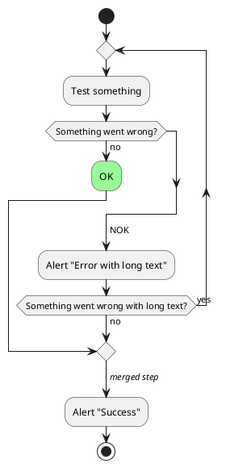


_\[Ref. [QA-6105](https://forum.plantuml.net/6105/possible-to-draw-a-line-to-another-box-via-id-or-label?show=6107#a6107)\]_

## Goto and Label Processing \[label, goto\]

⚠ It is currently only experimental 🚧

You can use `label` and `goto` keywords to denote goto processing, with:

-   `label <label_name>`
-   `goto <label_name>`

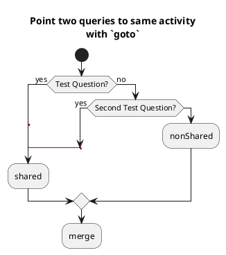


_\[Ref. [QA-15026](https://forum.plantuml.net/15026/), [QA-12526](https://forum.plantuml.net/12526/) and initially [QA-1626](https://forum.plantuml.net/1626)\]_

## While loop

### Simple while loop

You can use `while` and `endwhile` keywords to have while loop.

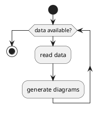


It is possible to provide a label after the `endwhile` keyword, or using the `is` keyword.

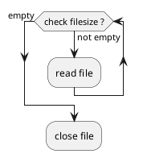


### While loop with backward action

It is also possible to insert an action in the return path using the `backward` keyword.

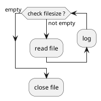


_\[Ref. [QA-11144](https://forum.plantuml.net/11144/backward-for-while-endwhile)\]_

### Infinite while loop

If you are using `detach` to form an infinite while loop, then you will want to also hide the partial arrow that results using `-[hidden]->`

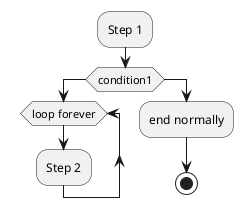


## Parallel processing \[fork, fork again, end fork, end merge\]

You can use `fork`, `fork again` and `end fork` or `end merge` keywords to denote parallel processing.

### Simple `fork`

```plantuml
@startuml
start
fork
  :action 1;
fork again
  :action 2;
end fork
stop
@enduml
```


### `fork` with end merge

```plantuml
@startuml
start
fork
  :action 1;
fork again
  :action 2;
end merge
stop
@enduml
```


_\[Ref. [QA-5320](https://forum.plantuml.net/5320/please-provide-fork-without-join-with-merge-activity-diagrams?show=5321#a5321)\]_

```plantuml
@startuml
start
fork
  :action 1;
fork again
  :action 2;
fork again
  :action 3;
fork again
  :action 4;
end merge
stop
@enduml
```


```plantuml
@startuml
start
fork
  :action 1;
fork again
  :action 2;
  end
end merge
stop
@enduml
```


_\[Ref. [QA-13731](https://forum.plantuml.net/13731)\]_

### Label on `end fork` (or UML joinspec):

```plantuml
@startuml
start
fork
  :action A;
fork again
  :action B;
end fork {or}
stop
@enduml
```


```plantuml
@startuml
start
fork
  :action A;
fork again
  :action B;
end fork {and}
stop
@enduml
```


_\[Ref. [QA-5346](https://forum.plantuml.net/5346/please-inplement-joinspec-for-join-nodes?show=5348#a5348)\]_

### Other example

```plantuml
@startuml

start

if (multiprocessor?) then (yes)
  fork
    :Treatment 1;
  fork again
    :Treatment 2;
  end fork
else (monoproc)
  :Treatment 1;
  :Treatment 2;
endif

@enduml
```


## Split processing

### Split

You can use `split`, `split again` and `end split` keywords to denote split processing.

```plantuml
@startuml
start
split
   :A;
split again
   :B;
split again
   :C;
split again
   :a;
   :b;
end split
:D;
end
@enduml
```


### Input split (multi-start)

You can use `hidden` arrows to make an input split (multi-start):

```plantuml
@startuml
split
   -[hidden]->
   :A;
split again
   -[hidden]->
   :B;
split again
   -[hidden]->
   :C;
end split
:D;
@enduml
```


```plantuml
@startuml
split
   -[hidden]->
   :A;
split again
   -[hidden]->
   :a;
   :b;
split again
   -[hidden]->
   (Z)
end split
:D;
@enduml
```


_\[Ref. [QA-8662](https://forum.plantuml.net/8662)\]_

### Output split (multi-end)

You can use `kill` or `detach` to make an output split (multi-end):


\


\

## Notes

Text formatting can be done using [creole wiki syntax](https://plantuml.com/en/creole).

A note can be floating, using `floating` keyword.


\

You can add note on backward activity:


\

_\[Ref. [QA-11788](https://forum.plantuml.net/11788/is-it-possible-to-add-a-note-to-backward-activity?show=11802#a11802)\]_

You can add note on partition activity:


\

_\[Ref. [QA-2398](https://forum.plantuml.net/2398/is-it-possible-to-add-a-comment-on-top-of-a-activity-partition?show=2403#a2403)\]_

## Colors

You can specify a [color](https://plantuml.com/en/color) for some activities.


\

You can also use [gradient color](https://plantuml.com/en/color).


\

_\[Ref. [QA-4906](https://forum.plantuml.net/4906/setting-ad-hoc-gradient-backgrounds-in-activity?show=4917#a4917)\]_

## Lines without arrows

You can use `skinparam ArrowHeadColor none` in order to connect activities using lines only, without arrows.


\


\

## Arrows

Using the `->` notation, you can add texts to arrow, and change their [color](https://plantuml.com/en/color).

It's also possible to have dotted, dashed, bold or hidden arrows.


\

## Multiple colored arrow

You can use multiple colored arrow.


\

_\[Ref. [QA-4411](https://forum.plantuml.net/4411)\]_

## Connector (or Circle)

You can use parentheses to denote connector.


\

## Color on connector

You can add [color](https://plantuml.com/en/color) on connector.


\

_\[Ref. [QA-10077](https://forum.plantuml.net/10077/assigning-color-to-connectors?show=10080#c10080)\]_

And even use style on Circle:


\

_\[Ref. [QA-19975](https://forum.plantuml.net/19975/please-provide-change-background-connectors-activity-diagrams?show=19976#a19976)\]_

## Grouping or partition

### Group

You can group activity together by defining group:


\

### Partition

You can group activity together by defining partition:


\

It's also possible to change partition [color](https://plantuml.com/en/color):


\

_\[Ref. [QA-2793](https://forum.plantuml.net/2793/activity-beta-partition-name-more-than-one-word-does-not-work?show=2798#a2798)\]_

It's also possible to add [link](https://plantuml.com/en/link) to partition:


\

_\[Ref. [QA-542](https://forum.plantuml.net/542/ability-to-define-hyperlink-on-diagram-elements?show=14003#c14003)\]_

### Group, Partition, Package, Rectangle or Card

You can group activity together by defining:

-   group;
-   partition;
-   package;
-   rectangle;
-   card.


\

## Swimlanes

Using pipe `|`, you can define swimlanes.

It's also possible to change swimlanes [color](https://plantuml.com/en/color).


\

You can add `if` conditional or `repeat` or `while` loop within swimlanes.


\

You can also use `alias` with swimlanes, with this syntax:

-   `|[#<color>|]<swimlane_alias>| <swimlane_title>`


\

_\[Ref. [QA-2681](https://forum.plantuml.net/2681/possible-define-alias-swimlane-place-alias-everywhere-else?show=2685#a2685)\]_

## Detach or kill \[detach, kill\]

It's possible to remove an arrow using the `detach` or `kill` keyword:

-   `detach`


\

-   `kill`


\

## SDL (Specification and Description Language)

### Table of SDL Shape Name

| Name | Old syntax | Stereotype syntax |
|------|------------|-------------------|
| Input | `<` | `<<input>>` |
| Output | `>` | `<<output>>` |
| Procedure | `|` | `<<procedure>>` |
| Load | `\` | `<<load>>` |
| Save | `/` | `<<save>>` |
| Continuous | `}` | `<<continuous>>` |
| Task | `]` | `<<task>>` |

_\[Ref. [QA-11518](https://forum.plantuml.net/11518/issues-with-final-separator-latex-math-expression-activity?show=17268#a17268), [GH-1270](https://github.com/plantuml/plantuml/discussions/1270)\]_

### SDL using final separator _(Deprecated form)_

By changing the final `;` separator, you can set different rendering for the activity:

-   `|`
-   `<`
-   `>`
-   `/`
-   `\\`
-   `]`
-   `}`


\

### SDL using Normal separator and Stereotype _(Current official form)_


\


\

## UML (Unified Modeling Language) Shape

### Table of UML Shape Name

| Name | Stereotype syntax |
|------|-------------------|
| ObjectNode | `<<object>>` |
| ObjectNode<br>typed by signal | `<<objectSignal>>` or `<<object-signal>>` |
| AcceptEventAction<br>without TimeEvent trigger | `<<acceptEvent>>` or `<<accept-event>>` |
| AcceptEventAction<br>with TimeEvent trigger | `<<timeEvent>>` or `<<time-event>>` |
| SendSignalAction<br>SendObjectAction<br>with signal type | `<<sendSignal>>` or `<<send-signal>>` |
| Trigger | `<<trigger>>` |

_\[Ref. [GH-2185](https://github.com/plantuml/plantuml/pull/2185)\]_

### UML Shape Example using Stereotype


\

_\[Ref. [GH-2185](https://github.com/plantuml/plantuml/pull/2185), [QA-16558](https://forum.plantuml.net/16558), [GH-1659](https://github.com/plantuml/plantuml/issues/1659)\]_

## Complete example


\

## Condition Style

### Inside style (by default)


\


\

### Diamond style


\

### InsideDiamond (or _Foo1_) style


\


\

_\[Ref. [QA-1290](https://forum.plantuml.net/1290/plantuml-condition-rendering) and [#400](https://github.com/plantuml/plantuml/issues/400#issuecomment-721287124)\]_

## Condition End Style

### Diamond style (by default)

-   With one branch


\

-   With two branches (`B1`, `B2`)


\

### Horizontal line (hline) style

-   With one branch


\

-   With two branches (`B1`, `B2`)


\

_\[Ref. [QA-4015](https://forum.plantuml.net/4015/its-possible-to-draw-if-else-endif-without-merge-symbol)\]_

## Using (global) style

### Without style _(by default)_


\

### With style

You can use [style](https://plantuml.com/en/style-evolution) to change rendering of elements.


\
