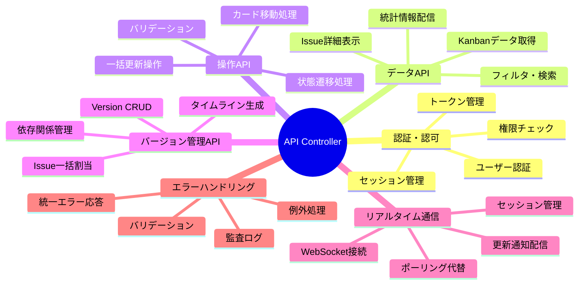
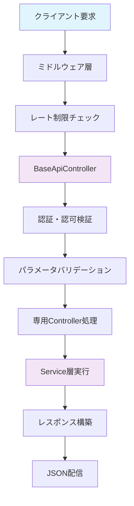
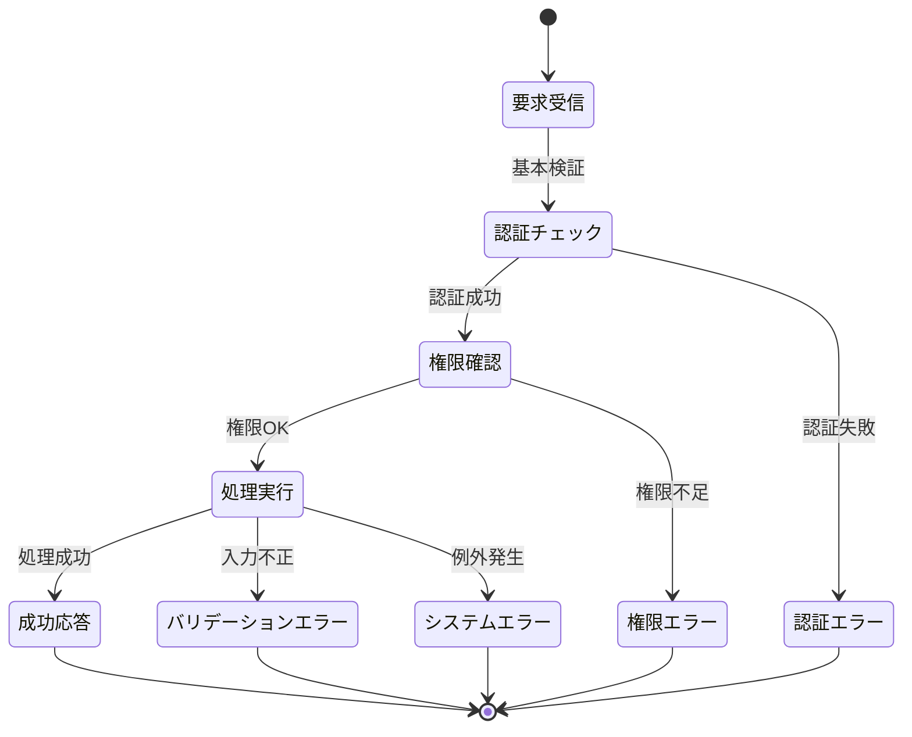
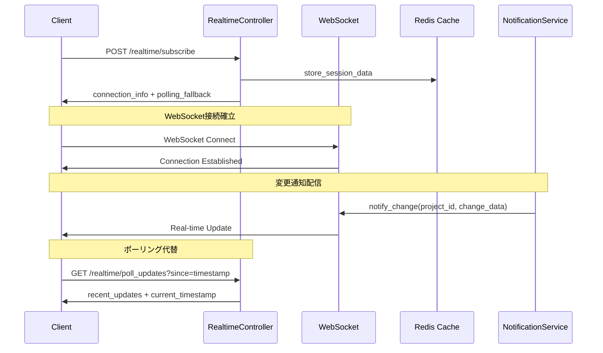
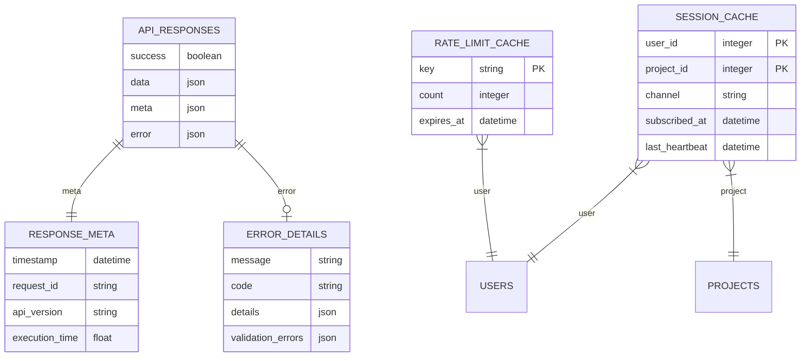
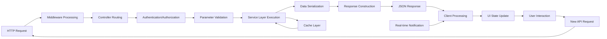
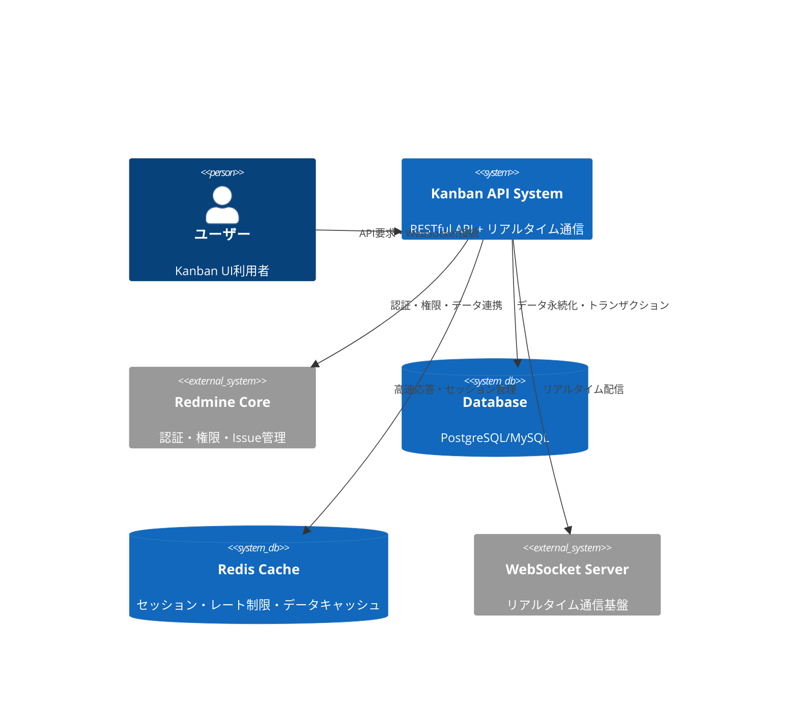
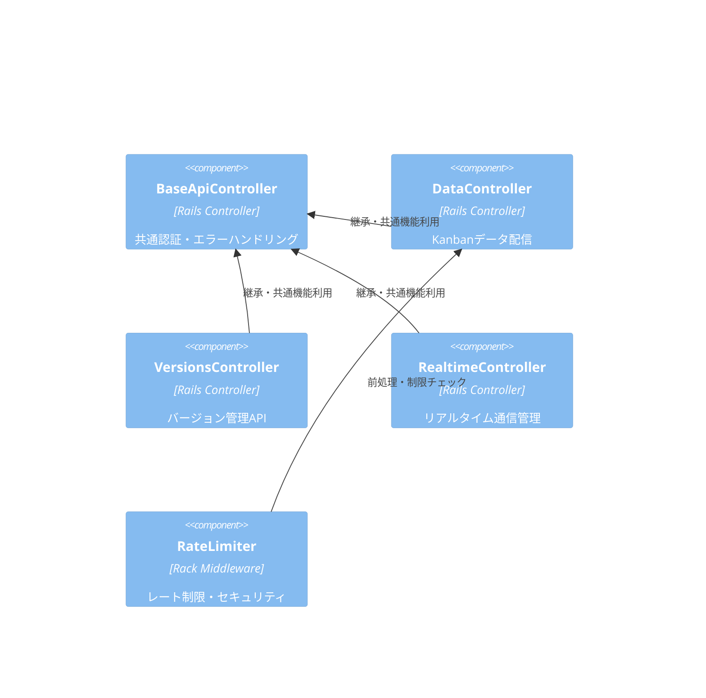
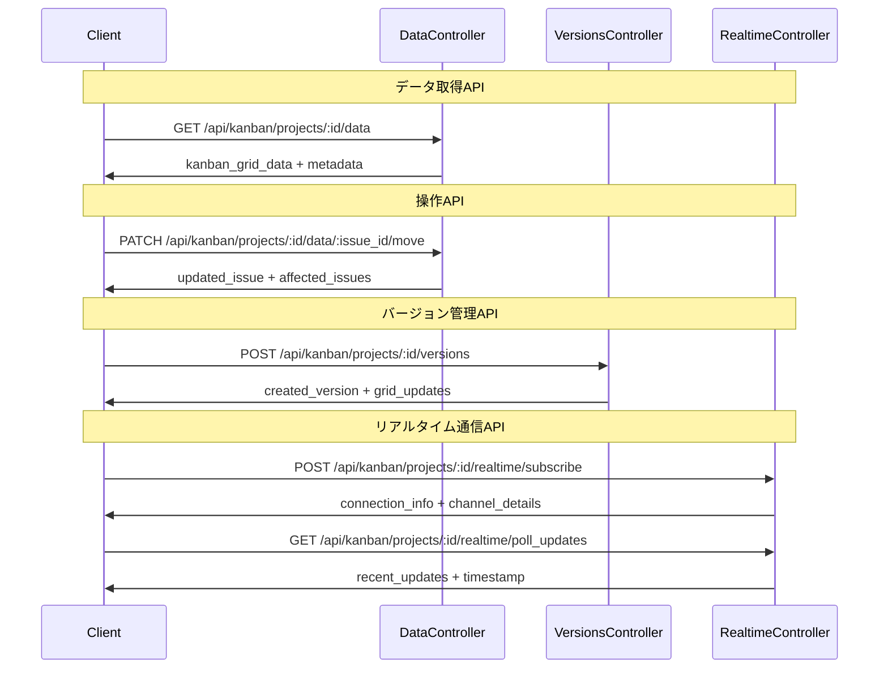
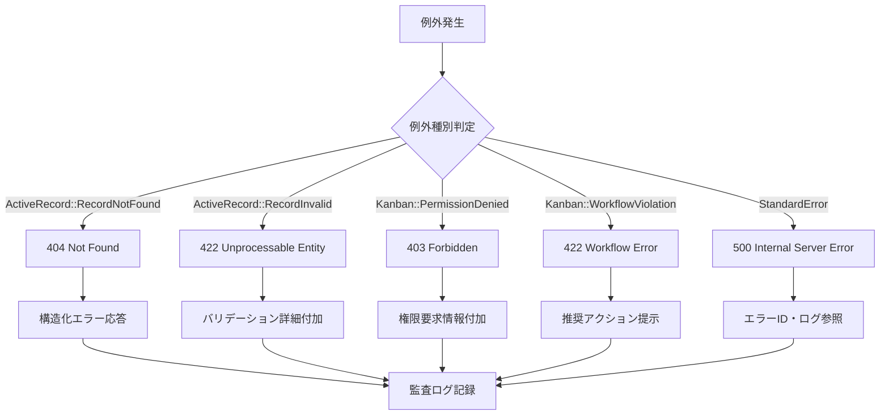

# API Controller サーバーサイド詳細設計書

## 🔗 関連ドキュメント
- @vibes/specs/ui/api_integration_wireframe.drawio
- @vibes/rules/technical_architecture_standards.md
- @vibes/logics/api_integration/api_integration_specification.md

## 1. 設計概要

### 1.1 設計目的・背景
**なぜこのAPI Controller実装が必要なのか**
- ビジネス要件：Kanban UI用の統一されたRESTful API提供、セキュリティ強化、パフォーマンス最適化
- ユーザー価値：高速レスポンス、エラーハンドリング、リアルタイム同期、信頼性の高いUI操作
- システム価値：API標準化、認証・認可統合、監査ログ、スケーラビリティ確保

### 1.2 設計方針
**どのようなアプローチで実現するか**
- 主要設計思想：RESTful API設計、統一エラーハンドリング、レイヤード・アーキテクチャ
- 技術選択理由：Rails MVC + API Mode、JSON API仕様準拠、認証・認可統合
- 制約・前提条件：Redmine権限モデル準拠、後方互換性維持、高可用性要求

## 2. 機能要求仕様

### 2.1 主要機能


### 2.2 機能詳細
| 機能ID | 機能名 | 説明 | 優先度 | 受容条件 |
|--------|--------|------|---------|----------|
| AC001 | 認証・認可統合 | Redmine権限モデル統合、セキュリティ強化 | High | 権限チェック100%、監査ログ完備 |
| AC002 | データAPI提供 | Kanbanデータ・Issue詳細の効率的配信 | High | 2秒以内レスポンス、キャッシュ対応 |
| AC003 | 操作API処理 | D&D・一括更新の安全な実行 | High | トランザクション保証、ロールバック対応 |
| AC004 | リアルタイム通信 | WebSocket/ポーリング併用の同期機能 | Medium | 5秒以内更新配信、接続復旧対応 |
| AC005 | エラーハンドリング | 統一エラー応答、詳細ログ、クライアント対応支援 | Medium | 全例外捕捉、構造化エラー応答 |

## 3. UI/UX設計仕様

### 3.1 API処理フロー


### 3.2 エラーハンドリング状態遷移


### 3.3 リアルタイム通信シーケンス


## 4. データ設計

### 4.1 API応答データ構造


### 4.2 API データフロー


## 5. アーキテクチャ設計

### 5.1 システム構成


### 5.2 コンポーネント構成


## 6. インターフェース設計

### 6.1 統一API応答インターフェース
```ruby
# API応答形式標準（疑似コード）
class StandardApiResponse
  # 成功応答
  success_format: {
    success: true,
    data: {
      # 実際のデータ内容
      grid: KanbanGridData,
      metadata: SystemMetadata,
      statistics: StatisticsData
    },
    meta: {
      timestamp: "2025-09-26T10:30:00Z",
      request_id: "req_abc123",
      api_version: "v1",
      execution_time: 250.5
    }
  }

  # エラー応答
  error_format: {
    success: false,
    error: {
      message: "リソースが見つかりません",
      code: "not_found",
      details: {
        resource_type: "Issue",
        resource_id: 123
      },
      validation_errors: [
        {
          field: "status_id",
          message: "無効なステータスです",
          code: "invalid_status"
        }
      ]
    },
    meta: {
      timestamp: "2025-09-26T10:30:00Z",
      request_id: "req_abc123",
      api_version: "v1"
    }
  }
end
```

### 6.2 主要API エンドポイント定義


## 7. 非機能要求

### 7.1 パフォーマンス要求
| 項目 | 要求値 | 測定方法 |
|------|---------|----------|
| API応答時間 | 2秒以内（95%tile） | APM・ログ分析 |
| 同時接続数 | 100ユーザー対応 | 負荷テスト |
| リアルタイム配信 | 5秒以内 | WebSocket・ポーリング測定 |
| エラー率 | 1%以下 | エラー監視・アラート |

### 7.2 セキュリティ要求
- **認証・認可**: Redmine権限モデル100%準拠、不正アクセス防止
- **レート制限**: IP・ユーザー別制限、DDoS攻撃対策
- **監査ログ**: 全API操作記録、トレーサビリティ確保

## 8. 実装指針

### 8.1 技術スタック
- **フレームワーク**: Ruby on Rails 6.1+ (API Mode)
- **認証**: Redmine標準認証 + Token認証
- **キャッシュ**: Redis (セッション・レート制限・データキャッシュ)
- **リアルタイム**: ActionCable/WebSocket + Server-Sent Events
- **監視**: Rails Logger + APM統合

### 8.2 実装パターン
```ruby
# BaseApiController実装パターン（疑似コード）
class BaseApiController < ApplicationController
  # 1. 共通フィルタチェーン
  before_action :require_login, :find_project, :authorize_kanban_access
  before_action :set_start_time

  # 2. 統一例外ハンドリング
  rescue_from StandardError, with: :handle_internal_error
  rescue_from ActiveRecord::RecordNotFound, with: :handle_not_found
  rescue_from Kanban::PermissionDenied, with: :handle_permission_denied

  # 3. 統一レスポンス形式
  def render_success(data = {}, status = :ok)
    render json: build_success_response(data), status: status
  end

  def render_error(message, status, details = {})
    render json: build_error_response(message, status, details), status: status
  end

  # 4. パフォーマンス監視
  after_action :log_performance_metrics
end
```

### 8.3 エラーハンドリング戦略


## 9. テスト設計

テスト戦略・ケース設計・実装については以下を参照：
- @vibes/rules/testing/server_side_testing_strategy.md
- @vibes/rules/testing/api_controller_server_test_specification.md

## 10. 運用・保守設計

### 10.1 監視・ログ設計
- **パフォーマンス監視**: API応答時間・スループット・エラー率
- **セキュリティ監視**: 不正アクセス検知・レート制限発動・権限違反
- **ビジネス監視**: API利用状況・機能使用頻度・ユーザー行動分析

### 10.2 運用自動化
- **ヘルスチェック**: API生存監視・DB接続確認・外部依存性チェック
- **アラート**: 異常検知・エスカレーション・自動復旧
- **デプロイ**: Blue-Green デプロイ・ロールバック・設定管理

---

*API Controller サーバーサイド実装は、Kanban UIに対する統一されたRESTful API基盤を提供し、セキュリティ・パフォーマンス・可用性を重視した設計です。リアルタイム通信機能により、マルチユーザー環境での協調作業を支援します。*