# API統合 詳細設計書

## 🔗 関連ドキュメント
- @vibes/logics/ui_components/feature_card/feature_card_component_specification.md
- @vibes/logics/ui_components/kanban_grid/kanban_grid_layout_specification.md
- @vibes/logics/data_structures/data_structures_specification.md
- @vibes/rules/technical_architecture_standards.md

## 1. 設計概要

### 1.1 設計目的・背景
**なぜこのAPI統合システムが必要なのか**
- ビジネス要件：React Frontend と Ruby Rails Backend の完全分離・独立開発可能性
- ユーザー価値：リアルタイム操作・即座フィードバック・オフライン耐性・楽観的更新
- システム価値：Redmine標準API活用・プラグイン互換性・拡張性・セキュリティ保証

### 1.2 設計方針
**どのようなアプローチで実現するか**
- 主要設計思想：RESTful API設計、レイヤード アーキテクチャ、API First開発
- 技術選択理由：JSON API（軽量）、CSRF保護（セキュリティ）、楽観的更新（UX）
- 制約・前提条件：Redmine標準API準拠、既存プラグイン互換性、認証・権限継承

## 2. 機能要求仕様

### 2.1 主要機能
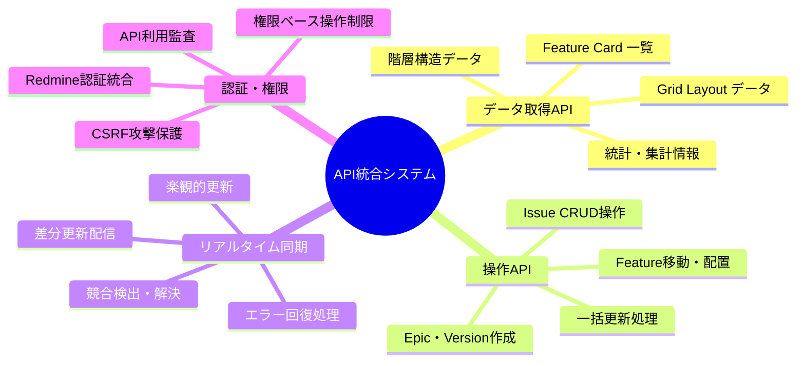

### 2.2 機能詳細
| 機能ID | API名 | 説明 | 優先度 | 受容条件 |
|--------|-------|------|---------|----------|
| API001 | Grid Data取得 | Epic×Version マトリクスデータ取得 | High | 3秒以内で完全データ取得 |
| API002 | Feature移動 | D&D操作によるFeature配置変更 | High | 1秒以内で楽観的更新完了 |
| API003 | 階層作成・編集 | Epic・Version・UserStory作成 | High | 作成後即座にUI反映 |
| API004 | Version自動伝播 | 親要素Version変更時の子要素更新 | High | 階層全体で一貫性保証 |
| API005 | 一括操作 | 複数Issue同時更新・割り当て | Medium | 100件以内2秒で処理完了 |
| API006 | リアルタイム同期 | 他ユーザー操作の即座反映 | Medium | WebSocket・ポーリング対応 |
| API007 | エラー回復 | 通信失敗・競合時の自動回復 | Low | ユーザー操作継続可能性確保 |

## 3. API設計仕様

### 3.1 API階層アーキテクチャ
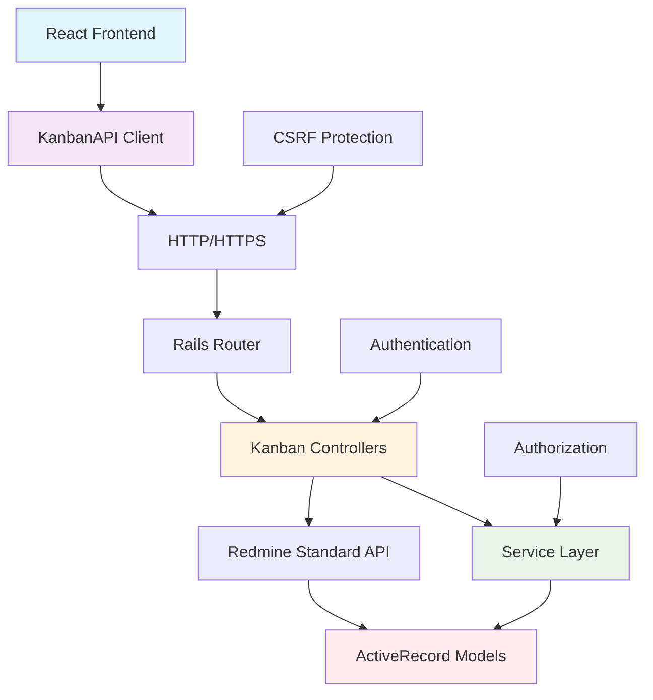

### 3.2 エンドポイント設計
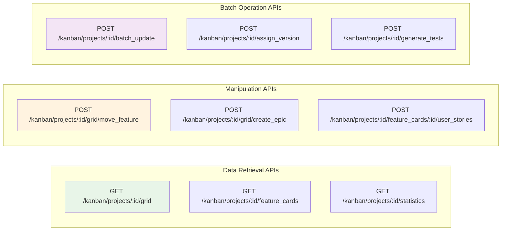

### 3.3 API通信フロー設計
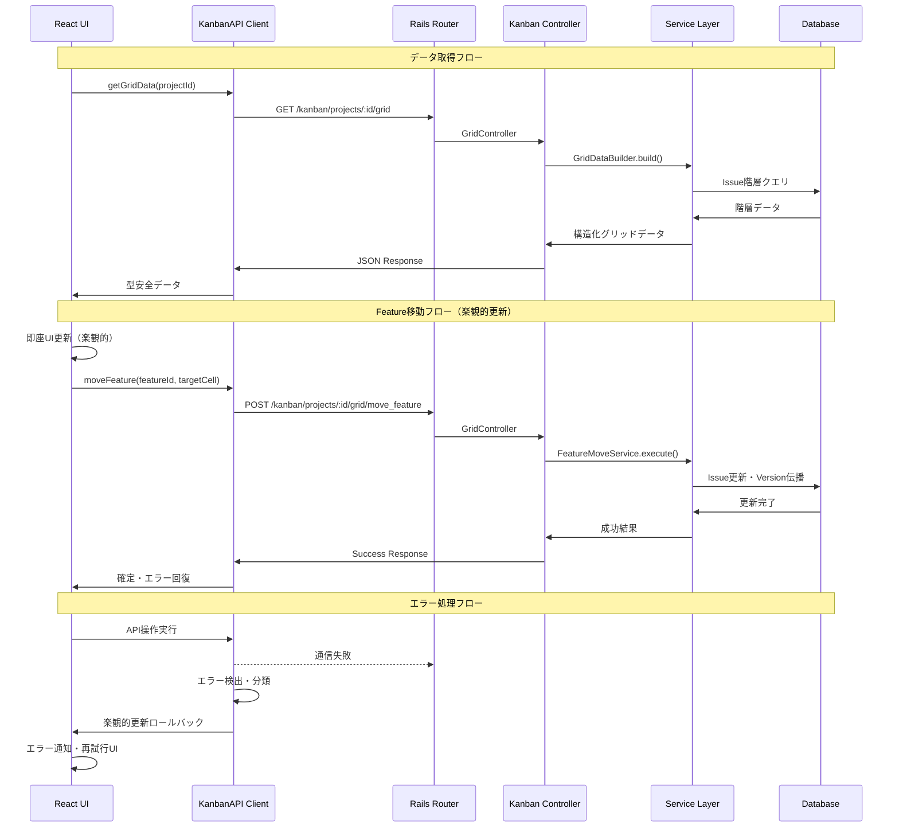

## 4. クライアントサイドAPI設計

### 4.1 API Client アーキテクチャ
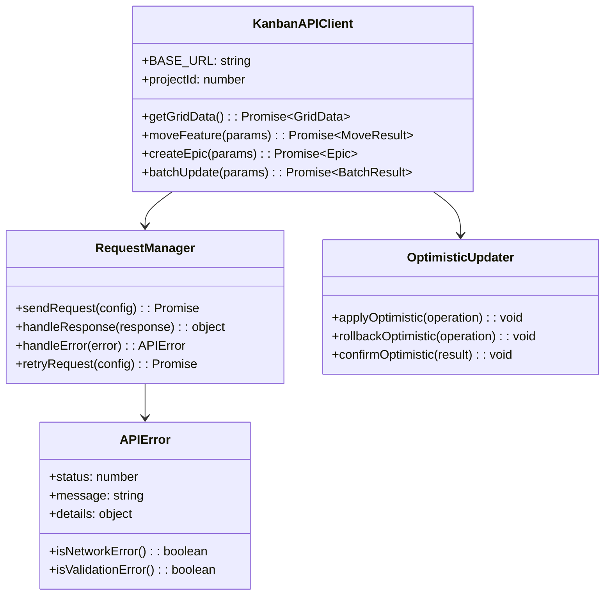

### 4.2 エラーハンドリング戦略
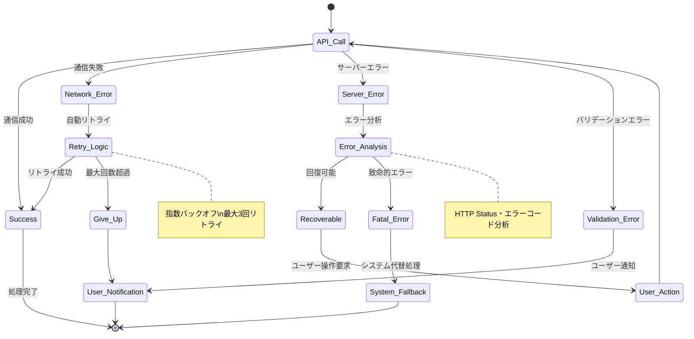

## 5. サーバーサイドAPI設計

### 5.1 Controller層設計
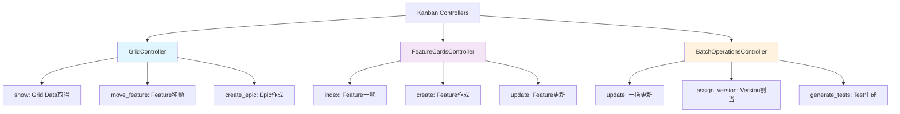

### 5.2 Service層統合設計
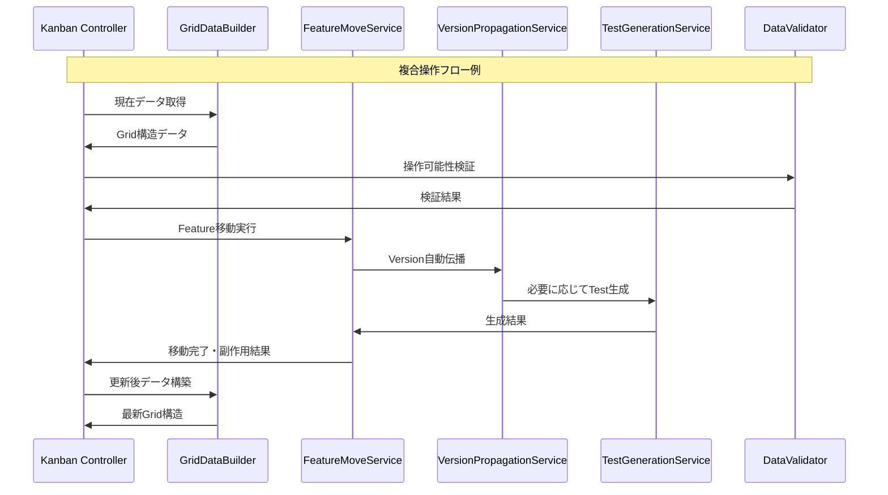

## 6. データ変換・シリアライゼーション

### 6.1 データ変換フロー
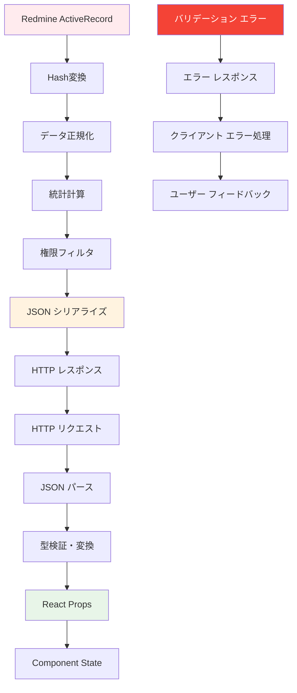

### 6.2 型安全性保証
```typescript
// API型定義インターフェース（疑似コード）
interface APIEndpoint<TRequest, TResponse> {
  method: HTTPMethod;
  path: string;
  requestSchema: Schema<TRequest>;
  responseSchema: Schema<TResponse>;
  authRequired: boolean;
  permissions: Permission[];
}

// Grid Data API例
interface GridDataAPI extends APIEndpoint<GridDataRequest, GridDataResponse> {
  method: 'GET';
  path: '/kanban/projects/:id/grid';
  requestSchema: GridDataRequestSchema;
  responseSchema: GridDataResponseSchema;
  authRequired: true;
  permissions: ['view_issues'];
}

// Feature移動API例
interface MoveFeatureAPI extends APIEndpoint<MoveFeatureRequest, MoveFeatureResponse> {
  method: 'POST';
  path: '/kanban/projects/:id/grid/move_feature';
  requestSchema: MoveFeatureRequestSchema;
  responseSchema: MoveFeatureResponseSchema;
  authRequired: true;
  permissions: ['edit_issues'];
}
```

## 7. 非機能要求

### 7.1 パフォーマンス要求
| 項目 | 要求値 | 測定方法 | 備考 |
|------|---------|----------|------|
| Grid Data初期取得 | 3秒以内 | Time to First Response | 100Epic×10Version想定 |
| Feature移動レスポンス | 500ms以内 | API Response Time | 楽観的更新適用時 |
| 一括操作処理 | 100件2秒以内 | Batch Processing Time | Version伝播含む |
| API同時接続 | 50ユーザー対応 | Concurrent Users | Rails標準制限内 |
| データ転送量 | 1MB以内/リクエスト | Payload Size | gzip圧縮適用時 |

### 7.2 可用性・信頼性要求
- **API可用性**: 99.9%以上（Redmine本体稼働時）
- **エラー回復**: 一時的障害から30秒以内自動回復
- **データ整合性**: 競合操作時の適切な競合解決
- **セキュリティ**: CSRF・XSS・SQLインジェクション対策完備

### 7.3 運用性要求
- **監査ログ**: 全API操作のログ記録・追跡可能性
- **API監視**: レスポンス時間・エラー率・使用状況監視
- **バージョニング**: API仕様変更時の後方互換性保証
- **ドキュメント**: OpenAPI/Swagger仕様書自動生成

## 8. セキュリティ設計

### 8.1 認証・認可フロー
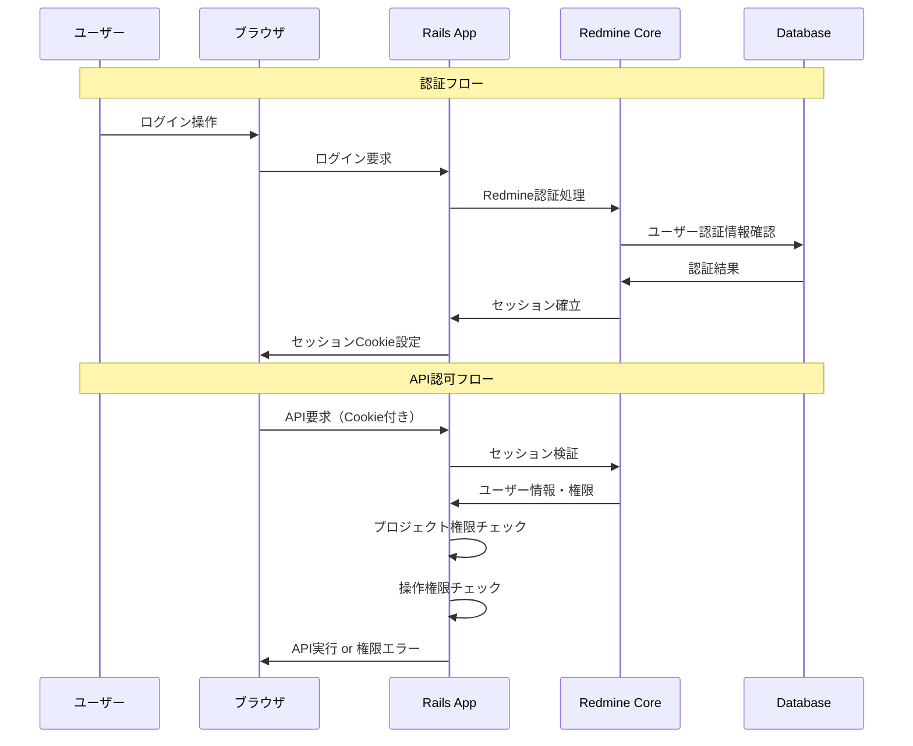

### 8.2 セキュリティ対策
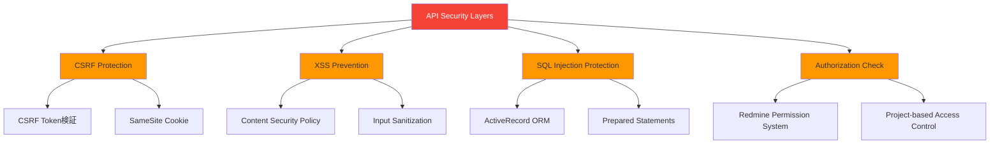

## 9. テスト設計

### 9.1 API テスト戦略
```mermaid
pyramid
    title API統合 テストピラミッド

    "E2E API テスト（Postman/Newman）" : 10
    "統合テスト（Controller + Service）" : 30
    "単体テスト（Service・Utils）" : 60
```

### 9.2 テストケース設計
| テストレベル | 対象 | 主要テストケース | カバレッジ目標 |
|-------------|------|------------------|----------------|
| 単体テスト | Service・Utils | データ変換・バリデーション・計算ロジック | 95%以上 |
| 統合テスト | Controller + DB | API動作・権限・エラー処理 | 90%以上 |
| E2Eテスト | フルスタック | ユーザーシナリオ・実環境動作 | 主要API100% |

### 9.3 API契約テスト
```typescript
// API契約テスト例（疑似コード）
describe('Grid Data API Contract', () => {
  it('should return valid grid data structure', async () => {
    const response = await request(app)
      .get('/kanban/projects/1/grid')
      .set('X-CSRF-Token', csrfToken)
      .expect(200);

    // レスポンススキーマ検証
    expect(response.body).toMatchSchema(GridDataResponseSchema);

    // 必須フィールド存在確認
    expect(response.body).toHaveProperty('project');
    expect(response.body).toHaveProperty('epics');
    expect(response.body).toHaveProperty('versions');

    // 統計情報精度確認
    const statistics = response.body.metadata.statistics;
    expect(statistics.total_features).toBeGreaterThan(0);
  });

  it('should handle feature move with version propagation', async () => {
    const moveRequest = {
      feature_id: 123,
      target_epic_id: 456,
      target_version_id: 789
    };

    const response = await request(app)
      .post('/kanban/projects/1/grid/move_feature')
      .send(moveRequest)
      .expect(200);

    expect(response.body.success).toBe(true);
    expect(response.body.propagation_results).toBeDefined();
  });
});
```

## 10. 運用・保守設計

### 10.1 API監視・ログ設計
- **アクセスログ**: 全API要求の記録（時刻・ユーザー・エンドポイント・レスポンス時間）
- **エラーログ**: API障害・バリデーションエラー・権限違反の詳細記録
- **パフォーマンス監視**: 応答時間・スループット・リソース使用率測定
- **ビジネスログ**: Feature移動・Epic作成等の業務操作監査証跡

### 10.2 API進化・バージョン管理
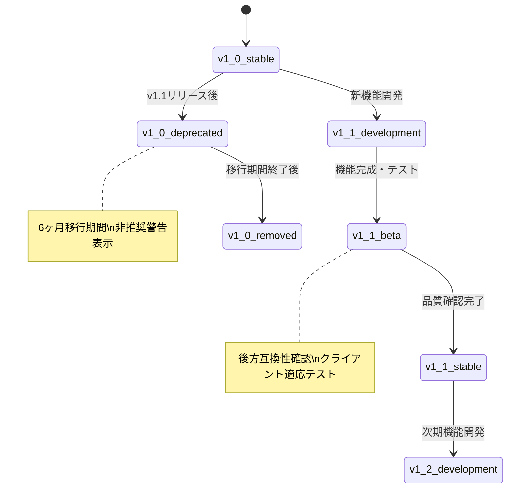

### 10.3 スケーラビリティ・パフォーマンス監視
- **スケールアウト対応**: ロードバランサー・複数Rails インスタンス対応
- **キャッシング戦略**: Redis活用の統計情報・頻繁アクセスデータキャッシング
- **データベース最適化**: クエリ最適化・インデックス設計・接続プール管理
- **CDN活用**: 静的アセット・APIレスポンス（適切な場合）のCDN配信

---

*API統合設計は、React Frontend と Rails Backend を結ぶ重要な架け橋です。この設計書は実装コードではなく、RESTful API設計・セキュリティ・パフォーマンス・運用の思想を明確化し、フロントエンド・バックエンド開発チーム間の効率的な協働を実現します。*