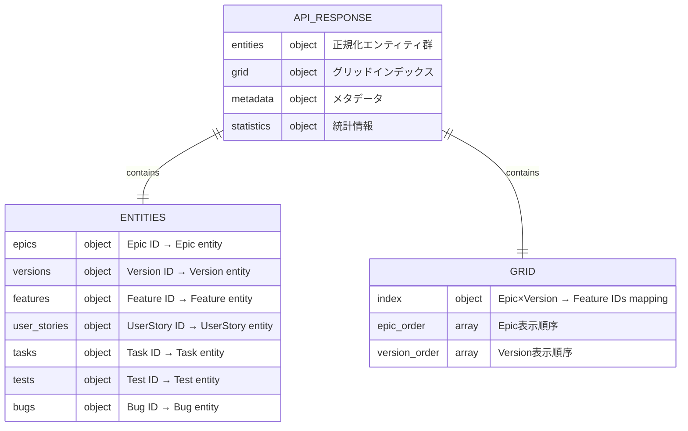
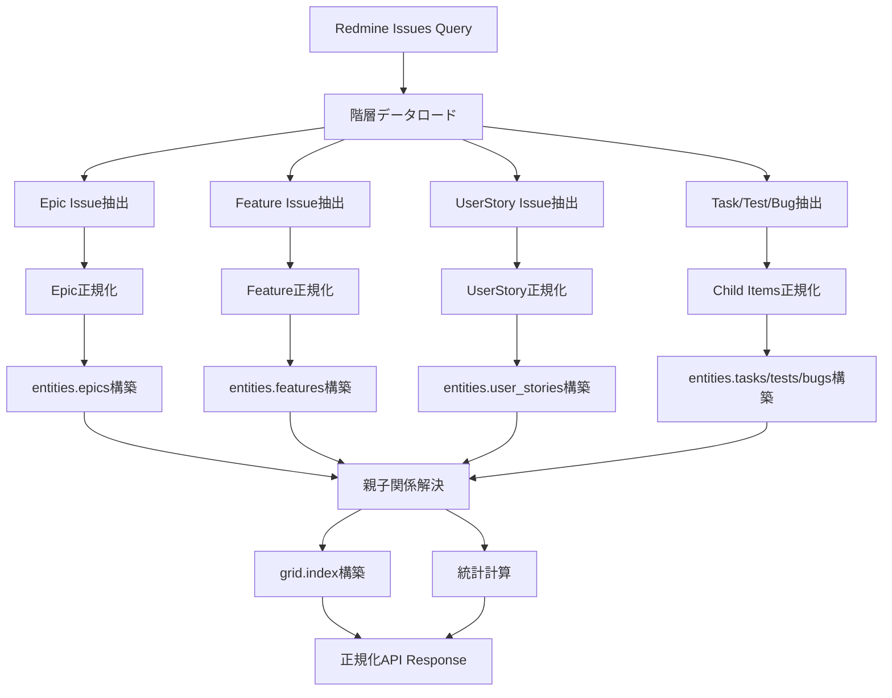

# 正規化API仕様書 (Normalized API Specification)

## 🔗 関連ドキュメント
- @vibes/logics/api_integration/api_integration_specification.md
- @vibes/logics/data_structures/data_structures_specification.md
- @vibes/logics/kanban_grid/kanban_grid_server_specification.md
- @vibes/rules/technical_architecture_standards.md

## 1. 設計概要

### 1.1 設計目的・背景
**なぜ正規化API設計が必要なのか**
- ビジネス要件：大規模データ（10,000+ Issues）での高速レンダリング、リアルタイム差分更新対応
- ユーザー価値：即座のUI応答、スムーズなD&D操作、複数ユーザー同時編集対応
- システム価値：フロントエンド最適化、型安全性、スケーラビリティ、保守性向上

### 1.2 設計方針
**どのようなアプローチで実現するか**
- 主要設計思想：データ正規化、エンティティ中心設計、IDベース参照、O(1)アクセス保証
- 技術選択理由：Redux/Zustand ベストプラクティス、React Query最適化、WebSocket差分更新対応
- 制約・前提条件：既存API仕様との互換性、段階的移行可能性、TypeScript型安全性

## 2. 正規化データ構造設計

### 2.1 全体構造


### 2.2 エンティティ構造定義

#### 2.2.1 Epic エンティティ
```typescript
interface Epic {
  // 基本情報
  id: string;                    // Epic ID (例: "epic1")
  subject: string;               // 件名
  description?: string;          // 説明
  status: IssueStatus;           // ステータス (open/closed)

  // Version関連
  fixed_version_id: string | null;  // 割り当てVersion ID

  // 階層関連
  feature_ids: string[];         // 子Feature IDs配列

  // 統計情報
  statistics: {
    total_features: number;           // 配下Feature総数
    completed_features: number;       // 完了Feature数
    total_user_stories: number;       // 配下UserStory総数
    total_child_items: number;        // 配下Task/Test/Bug総数
    completion_percentage: number;    // 完了率 (0-100)
  };

  // メタデータ
  created_on: string;            // 作成日時 (ISO8601)
  updated_on: string;            // 更新日時 (ISO8601)
  author_id?: number;            // 作成者ID
  tracker_id: number;            // トラッカーID
}
```

#### 2.2.2 Version エンティティ
```typescript
interface Version {
  id: string;                    // Version ID (例: "v1")
  name: string;                  // Version名
  description?: string;          // 説明
  effective_date?: string;       // リリース予定日 (ISO8601 date)
  status: VersionStatus;         // 状態 (open/locked/closed)

  // 統計情報
  issue_count: number;           // 関連Issue総数
  statistics: {
    total_issues: number;
    completed_issues: number;
    completion_rate: number;     // 完了率 (0-100)
  };

  // メタデータ
  created_on: string;
  updated_on: string;
}
```

#### 2.2.3 Feature エンティティ
```typescript
interface Feature {
  id: string;                    // Feature ID (例: "f1")
  title: string;                 // 件名
  description?: string;          // 説明
  status: IssueStatus;           // ステータス

  // 階層関連
  parent_epic_id: string;        // 親Epic ID
  user_story_ids: string[];      // 子UserStory IDs配列

  // Version関連
  fixed_version_id: string | null;     // 割り当てVersion ID
  version_source: VersionSource;       // Version継承元 ("direct" | "inherited" | "none")

  // 統計情報
  statistics: {
    total_user_stories: number;
    completed_user_stories: number;
    total_child_items: number;
    child_items_by_type: {
      tasks: number;
      tests: number;
      bugs: number;
    };
    completion_percentage: number;
  };

  // 担当者・メタデータ
  assigned_to_id?: number;       // 担当者ID
  priority_id?: number;          // 優先度ID
  created_on: string;
  updated_on: string;
  tracker_id: number;
}
```

#### 2.2.4 UserStory エンティティ
```typescript
interface UserStory {
  id: string;                    // UserStory ID (例: "us1")
  title: string;                 // 件名
  description?: string;          // 説明
  status: IssueStatus;           // ステータス

  // 階層関連
  parent_feature_id: string;     // 親Feature ID
  task_ids: string[];            // 子Task IDs配列
  test_ids: string[];            // 子Test IDs配列
  bug_ids: string[];             // 子Bug IDs配列

  // Version関連
  fixed_version_id: string | null;
  version_source: VersionSource;

  // UI状態
  expansion_state: boolean;      // 展開状態 (true: 展開, false: 折りたたみ)

  // 統計情報
  statistics: {
    total_tasks: number;
    completed_tasks: number;
    total_tests: number;
    passed_tests: number;
    total_bugs: number;
    resolved_bugs: number;
    completion_percentage: number;
  };

  // メタデータ
  assigned_to_id?: number;
  estimated_hours?: number;      // 見積時間
  done_ratio?: number;           // 進捗率 (0-100)
  created_on: string;
  updated_on: string;
  tracker_id: number;
}
```

#### 2.2.5 Task/Test/Bug エンティティ
```typescript
interface Task {
  id: string;                    // Task ID (例: "t1")
  title: string;                 // 件名
  description?: string;          // 説明
  status: IssueStatus;           // ステータス

  // 階層関連
  parent_user_story_id: string;  // 親UserStory ID

  // Version関連
  fixed_version_id: string | null;

  // 作業情報
  assigned_to_id?: number;       // 担当者ID
  estimated_hours?: number;      // 見積時間
  spent_hours?: number;          // 実績時間
  done_ratio?: number;           // 進捗率

  // メタデータ
  created_on: string;
  updated_on: string;
  tracker_id: number;
}

interface Test {
  id: string;
  title: string;
  description?: string;
  status: IssueStatus;
  parent_user_story_id: string;
  fixed_version_id: string | null;
  test_result?: TestResult;      // テスト結果 ("passed" | "failed" | "pending")
  assigned_to_id?: number;
  created_on: string;
  updated_on: string;
  tracker_id: number;
}

interface Bug {
  id: string;
  title: string;
  description?: string;
  status: IssueStatus;
  parent_user_story_id: string;
  fixed_version_id: string | null;
  severity?: BugSeverity;        // 重大度 ("critical" | "major" | "minor")
  assigned_to_id?: number;
  created_on: string;
  updated_on: string;
  tracker_id: number;
}
```

### 2.3 グリッドインデックス構造
```typescript
interface GridIndex {
  // Epic × Version マッピング
  // キー形式: "{epicId}:{versionId}"
  // 値: そのセルに配置されるFeature IDの配列
  index: Record<string, string[]>;

  // 表示順序制御
  epic_order: string[];          // Epic表示順序 (ドラッグ並び替え対応)
  version_order: string[];       // Version表示順序

  // 例:
  // {
  //   index: {
  //     "epic1:v1": ["f1", "f2"],
  //     "epic1:v2": ["f3"],
  //     "epic2:v2": ["f4"]
  //   },
  //   epic_order: ["epic1", "epic2"],
  //   version_order: ["v1", "v2", "v3", "none"]
  // }
}
```

### 2.4 メタデータ構造
```typescript
interface Metadata {
  // プロジェクト情報
  project: {
    id: number;
    name: string;
    identifier: string;
    description?: string;
    created_on: string;
  };

  // ユーザー権限
  user_permissions: {
    view_issues: boolean;
    edit_issues: boolean;
    add_issues: boolean;
    delete_issues: boolean;
    manage_versions: boolean;
    manage_project: boolean;
  };

  // グリッド設定
  grid_configuration: {
    default_expanded: boolean;     // デフォルト展開状態
    show_statistics: boolean;      // 統計情報表示
    show_closed_issues: boolean;   // 完了Issue表示
    columns: ColumnConfig[];       // カラム設定
  };

  // API情報
  api_version: string;             // API バージョン (例: "v1")
  timestamp: string;               // レスポンス生成日時 (ISO8601)
  request_id: string;              // リクエストID (トレーシング用)
}

interface ColumnConfig {
  id: string;                      // カラムID
  name: string;                    // カラム名
  status_ids: number[];            // 対応するステータスID配列
  position: number;                // 表示順序
}
```

### 2.5 統計情報構造
```typescript
interface Statistics {
  // プロジェクト全体統計
  overview: {
    total_issues: number;          // 全Issue数
    completed_issues: number;      // 完了Issue数
    completion_rate: number;       // 完了率 (0-100)
    total_epics: number;
    total_features: number;
    total_user_stories: number;
  };

  // Version別統計
  by_version: Record<string, VersionStats>;

  // ステータス別分布
  by_status: Record<string, number>;

  // トラッカー別分布
  by_tracker: Record<string, number>;

  // トレンド分析 (オプション)
  trend?: {
    completion_history: Array<{
      date: string;
      completion_rate: number;
    }>;
    velocity: number;              // 週あたり完了Issue数
  };
}

interface VersionStats {
  total: number;                   // 該当Version総Issue数
  completed: number;               // 完了Issue数
  completion_rate: number;         // 完了率
  by_status: Record<string, number>;
}
```

## 3. API エンドポイント仕様

### 3.1 Grid Data 取得API

#### エンドポイント
```
GET /api/kanban/projects/:project_id/grid
```

#### リクエストパラメータ
```typescript
interface GridDataRequest {
  // クエリパラメータ
  include_closed?: boolean;      // 完了Issueを含むか (default: false)
  epic_ids?: string[];           // 特定Epic絞り込み
  version_ids?: string[];        // 特定Version絞り込み
  assigned_to_ids?: number[];    // 担当者絞り込み
  updated_since?: string;        // 指定日時以降の更新のみ (ISO8601)
}
```

#### レスポンス形式
```typescript
interface NormalizedAPIResponse {
  entities: {
    epics: Record<string, Epic>;
    versions: Record<string, Version>;
    features: Record<string, Feature>;
    user_stories: Record<string, UserStory>;
    tasks: Record<string, Task>;
    tests: Record<string, Test>;
    bugs: Record<string, Bug>;
  };
  grid: GridIndex;
  metadata: Metadata;
  statistics: Statistics;
}
```

#### HTTPステータスコード
- `200 OK`: 正常取得
- `400 Bad Request`: パラメータ不正
- `403 Forbidden`: 権限不足
- `404 Not Found`: プロジェクト不存在
- `500 Internal Server Error`: サーバーエラー

### 3.2 Feature移動API

#### エンドポイント
```
POST /api/kanban/projects/:project_id/grid/move_feature
```

#### リクエストボディ
```typescript
interface MoveFeatureRequest {
  feature_id: string;            // 移動するFeature ID
  target_epic_id: string;        // 移動先Epic ID
  target_version_id: string | null;  // 移動先Version ID
  position?: number;             // 挿入位置 (省略時は末尾)
}
```

#### レスポンス形式
```typescript
interface MoveFeatureResponse {
  success: boolean;

  // 更新されたエンティティ (差分のみ)
  updated_entities: {
    features?: Record<string, Feature>;
    epics?: Record<string, Epic>;
    versions?: Record<string, Version>;
  };

  // 更新されたグリッドインデックス (差分のみ)
  updated_grid_index: {
    [key: string]: string[];     // 変更があったセルのみ
  };

  // 更新された統計情報 (差分のみ)
  updated_statistics?: Partial<Statistics>;

  // Version伝播結果
  propagation_result?: {
    affected_issue_ids: string[];
    conflicts: Array<{
      issue_id: string;
      message: string;
    }>;
  };
}
```

### 3.3 差分更新取得API (ポーリング/WebSocket用)

#### エンドポイント (ポーリング)
```
GET /api/kanban/projects/:project_id/grid/updates?since=<timestamp>
```

#### リクエストパラメータ
```typescript
interface UpdatesRequest {
  since: string;                 // ISO8601形式のタイムスタンプ
  entity_types?: string[];       // 取得するエンティティタイプ絞り込み
}
```

#### レスポンス形式
```typescript
interface UpdatesResponse {
  // 追加・更新されたエンティティ
  updated_entities: {
    epics?: Record<string, Epic>;
    versions?: Record<string, Version>;
    features?: Record<string, Feature>;
    user_stories?: Record<string, UserStory>;
    tasks?: Record<string, Task>;
    tests?: Record<string, Test>;
    bugs?: Record<string, Bug>;
  };

  // 削除されたエンティティID
  deleted_entities: {
    epic_ids?: string[];
    version_ids?: string[];
    feature_ids?: string[];
    user_story_ids?: string[];
    task_ids?: string[];
    test_ids?: string[];
    bug_ids?: string[];
  };

  // グリッドインデックス変更
  grid_changes?: {
    updated_cells: Record<string, string[]>;
    removed_cells: string[];
  };

  // 統計情報更新
  updated_statistics?: Partial<Statistics>;

  // 次回リクエスト用タイムスタンプ
  current_timestamp: string;

  // 変更有無フラグ
  has_changes: boolean;
}
```

## 4. データ変換戦略

### 4.1 Redmine Issue → 正規化エンティティ変換



### 4.2 正規化変換ロジック (Ruby疑似コード)

```ruby
class NormalizedGridDataBuilder
  def build
    raw_data = load_hierarchical_data

    {
      entities: build_entities(raw_data),
      grid: build_grid_index(raw_data),
      metadata: build_metadata,
      statistics: calculate_statistics(raw_data)
    }
  end

  private

  def build_entities(data)
    {
      epics: normalize_epics(data.epics),
      versions: normalize_versions(data.versions),
      features: normalize_features(data.features),
      user_stories: normalize_user_stories(data.user_stories),
      tasks: normalize_tasks(data.tasks),
      tests: normalize_tests(data.tests),
      bugs: normalize_bugs(data.bugs)
    }
  end

  def normalize_epics(epics)
    epics.each_with_object({}) do |epic, hash|
      hash[epic.id.to_s] = {
        id: epic.id.to_s,
        subject: epic.subject,
        description: epic.description,
        status: epic.status.name.downcase,
        fixed_version_id: epic.fixed_version_id&.to_s,
        feature_ids: epic.children.pluck(:id).map(&:to_s),
        statistics: calculate_epic_statistics(epic),
        created_on: epic.created_on.iso8601,
        updated_on: epic.updated_on.iso8601,
        tracker_id: epic.tracker_id
      }
    end
  end

  def build_grid_index(data)
    index = {}
    epic_order = []

    data.epics.each do |epic|
      epic_order << epic.id.to_s

      data.versions.each do |version|
        key = "#{epic.id}:#{version.id}"

        # このEpic配下で、このVersionに割り当てられたFeatureを抽出
        feature_ids = epic.children
                          .select { |f| f.fixed_version_id == version.id }
                          .map { |f| f.id.to_s }

        index[key] = feature_ids
      end

      # No Versionセル
      no_version_key = "#{epic.id}:none"
      index[no_version_key] = epic.children
                                  .select { |f| f.fixed_version_id.nil? }
                                  .map { |f| f.id.to_s }
    end

    {
      index: index,
      epic_order: epic_order,
      version_order: data.versions.pluck(:id).map(&:to_s) + ['none']
    }
  end
end
```

## 5. パフォーマンス最適化

### 5.1 N+1クエリ回避

```ruby
# ✅ Good: 一括ロード
def load_hierarchical_data
  epic_tracker = Kanban::TrackerHierarchy.tracker_names[:epic]

  epics = @project.issues
                  .includes(
                    :tracker, :status, :fixed_version, :author,
                    children: [
                      :tracker, :status, :fixed_version,
                      children: [
                        :tracker, :status, :fixed_version,
                        children: [:tracker, :status, :assigned_to]
                      ]
                    ]
                  )
                  .joins(:tracker)
                  .where(trackers: { name: epic_tracker })

  # 1クエリで全階層データ取得
end

# ❌ Bad: N+1発生
def load_hierarchical_data_bad
  epics = @project.issues.where(tracker: epic_tracker)

  epics.each do |epic|
    epic.children.each do |feature|  # ← N+1
      feature.children.each do |story|  # ← N+1
        story.children  # ← N+1
      end
    end
  end
end
```

### 5.2 キャッシュ戦略

```ruby
class NormalizedGridDataBuilder
  CACHE_EXPIRATION = 5.minutes

  def build_with_cache
    cache_key = generate_cache_key

    Rails.cache.fetch(cache_key, expires_in: CACHE_EXPIRATION) do
      build
    end
  end

  private

  def generate_cache_key
    # プロジェクト・ユーザー・更新日時でキャッシュキー生成
    [
      'normalized_grid_data',
      @project.id,
      @user.id,
      @options.to_json,
      @project.issues.maximum(:updated_on)&.to_i
    ].join('/')
  end
end

# キャッシュ無効化
class IssueUpdateObserver
  def after_save(issue)
    # Issueが更新されたら関連キャッシュを削除
    Rails.cache.delete_matched("normalized_grid_data/#{issue.project_id}/*")
  end
end
```

### 5.3 フロントエンド最適化

```typescript
// React Query使用例
const useNormalizedGridData = (projectId: number) => {
  return useQuery(
    ['normalized-grid', projectId],
    () => api.getGridData(projectId),
    {
      staleTime: 5 * 60 * 1000,  // 5分間キャッシュ
      cacheTime: 10 * 60 * 1000, // 10分間保持
      refetchOnWindowFocus: true,

      // 差分更新対応
      onSuccess: (newData) => {
        // エンティティ単位でキャッシュ更新
        Object.entries(newData.entities.features).forEach(([id, feature]) => {
          queryClient.setQueryData(['feature', id], feature);
        });
      }
    }
  );
};

// WebSocket差分更新
websocket.on('feature_updated', (delta) => {
  queryClient.setQueryData(['normalized-grid', projectId], (old) => ({
    ...old,
    entities: {
      ...old.entities,
      features: {
        ...old.entities.features,
        [delta.id]: { ...old.entities.features[delta.id], ...delta.changes }
      }
    }
  }));
});
```

## 6. テスト戦略

### 6.1 APIレスポンス検証

```typescript
import { describe, it, expect } from 'vitest';

describe('Normalized API Response Validation', () => {
  it('should return valid normalized structure', async () => {
    const response = await api.getGridData(1);

    // 構造検証
    expect(response).toHaveProperty('entities');
    expect(response).toHaveProperty('grid');
    expect(response).toHaveProperty('metadata');
    expect(response).toHaveProperty('statistics');

    // エンティティ検証
    expect(response.entities).toHaveProperty('epics');
    expect(response.entities).toHaveProperty('features');

    // 参照整合性検証
    const feature = Object.values(response.entities.features)[0];
    expect(response.entities.epics[feature.parent_epic_id]).toBeDefined();

    // グリッドインデックス検証
    const cellKey = Object.keys(response.grid.index)[0];
    const featureIds = response.grid.index[cellKey];

    featureIds.forEach(id => {
      expect(response.entities.features[id]).toBeDefined();
    });
  });

  it('should maintain data consistency after move', async () => {
    const moveResult = await api.moveFeature({
      feature_id: 'f1',
      target_epic_id: 'epic2',
      target_version_id: 'v2'
    });

    // 移動後の整合性検証
    const updatedFeature = moveResult.updated_entities.features['f1'];
    expect(updatedFeature.parent_epic_id).toBe('epic2');
    expect(updatedFeature.fixed_version_id).toBe('v2');

    // グリッドインデックス更新検証
    expect(moveResult.updated_grid_index['epic2:v2']).toContain('f1');
  });
});
```

## 7. エラーハンドリング

### 7.1 エラーレスポンス形式

```typescript
interface ErrorResponse {
  success: false;
  error: {
    code: string;                // エラーコード ("validation_error", "not_found", etc.)
    message: string;             // ユーザー向けメッセージ
    details?: {
      field?: string;            // エラー発生フィールド
      validation_errors?: Array<{
        field: string;
        message: string;
        code: string;
      }>;
    };
  };
  metadata: {
    timestamp: string;
    request_id: string;
  };
}
```

### 7.2 エラーコード一覧

| コード | 説明 | HTTPステータス |
|--------|------|---------------|
| `validation_error` | バリデーションエラー | 400 |
| `not_found` | リソース不存在 | 404 |
| `permission_denied` | 権限不足 | 403 |
| `conflict` | データ競合 | 409 |
| `internal_error` | サーバー内部エラー | 500 |

## 8. 移行ガイド

### 8.1 段階的移行ステップ

**Phase 1: サーバー側正規化API実装**
- `NormalizedGridDataBuilder` 実装
- 既存APIと並行提供 (`/api/v2/kanban/...`)

**Phase 2: フロントエンド Zustand Store 正規化対応**
- 正規化データ構造への移行
- セレクター関数実装

**Phase 3: コンポーネント移行**
- 正規化データ対応UI実装
- 既存コンポーネント段階的置換

**Phase 4: 旧API廃止**
- 完全移行確認後、旧API削除

---

**この正規化API設計により、フロントエンド最適化、スケーラビリティ、リアルタイム同期が実現され、長期的な保守性が大幅に向上します。**
