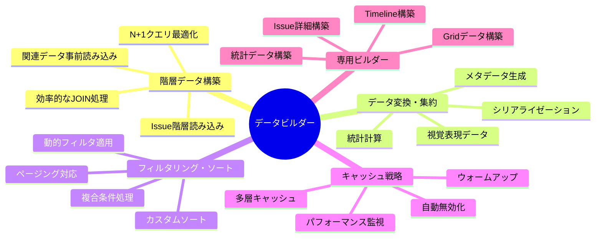
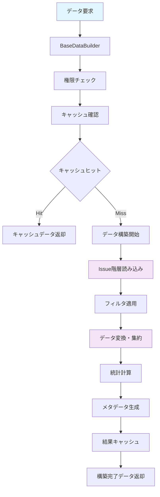
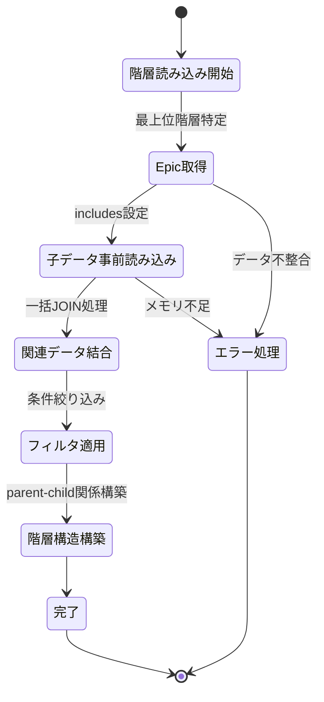
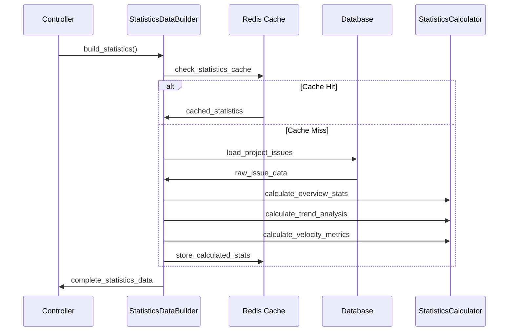
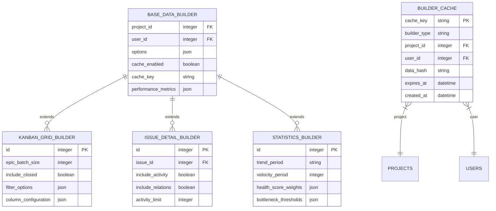
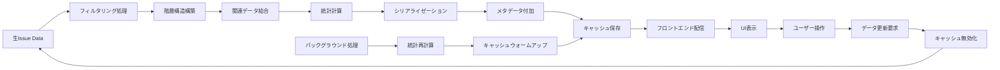
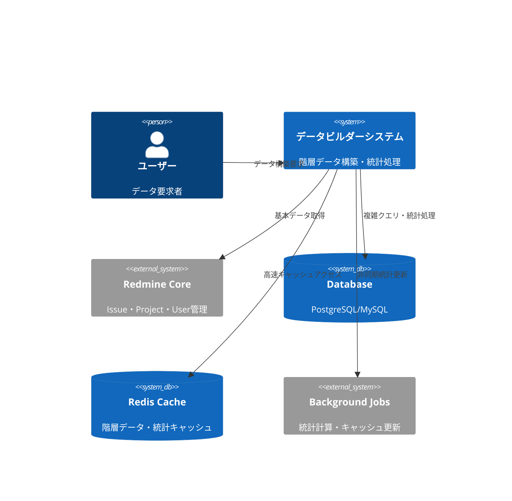
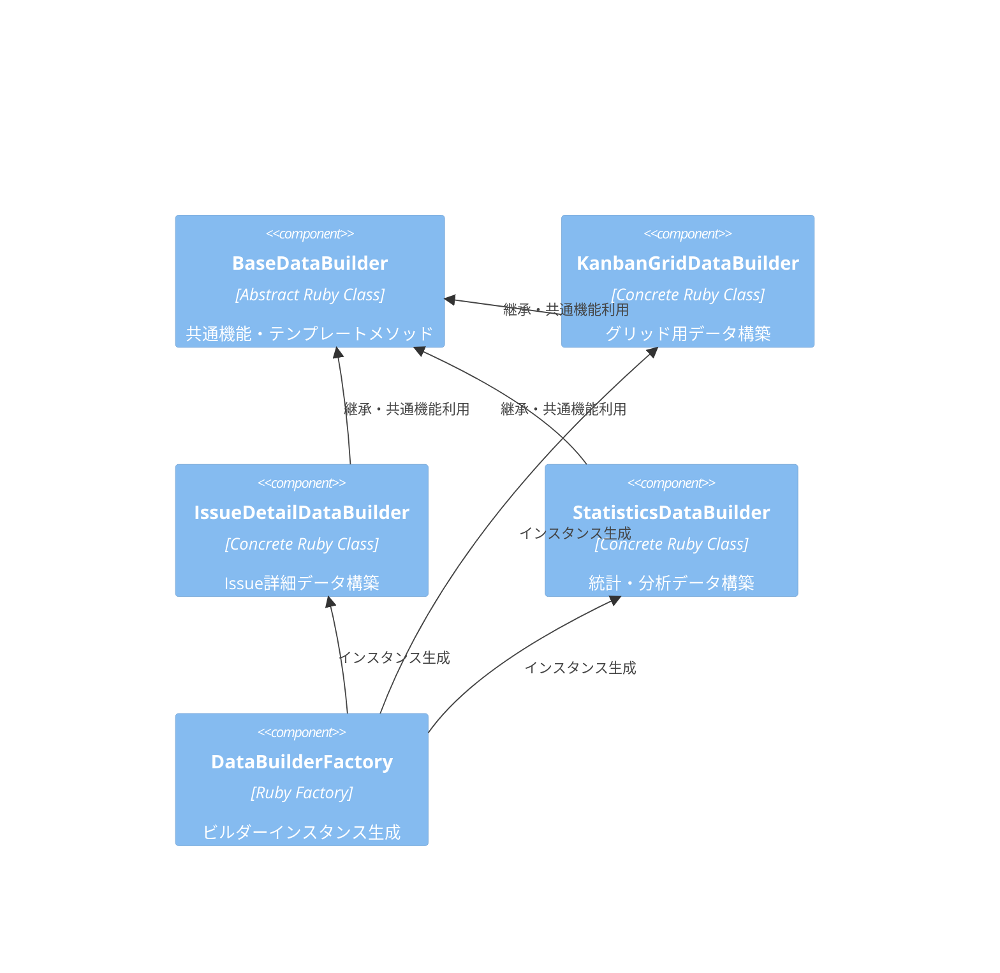
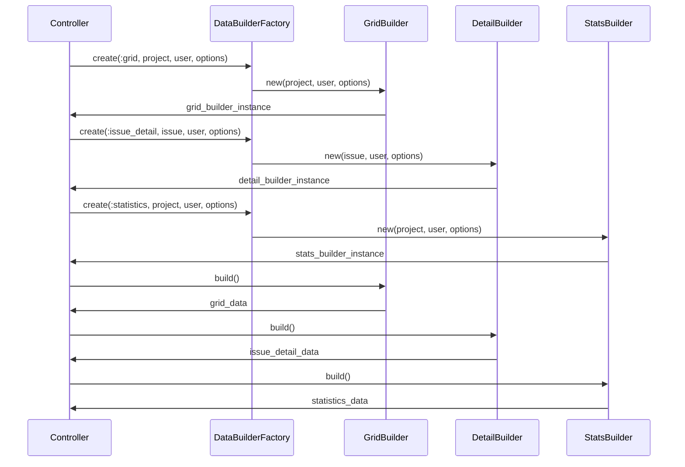
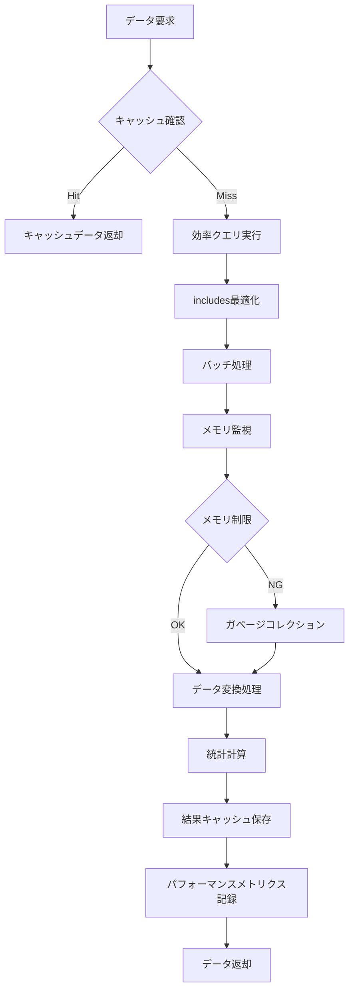

# データビルダー サーバーサイド詳細設計書

## 🔗 関連ドキュメント
- @vibes/docs/logics/wireframe/kanban_ui_grid_layout.drawio (データ構造とUI連携参考)
- @vibes/rules/technical_architecture_standards.md
- @vibes/logics/data_structures/data_structures_specification.md

## 1. 設計概要

### 1.1 設計目的・背景
**なぜこのデータビルダー実装が必要なのか**
- ビジネス要件：複雑なIssue階層データの効率的な変換・集約・配信
- ユーザー価値：高速なデータ表示、リアルタイム統計、柔軟なフィルタリング機能
- システム価値：N+1クエリ解消、キャッシュ最適化、スケーラブルなデータ処理アーキテクチャ

### 1.2 設計方針
**どのようなアプローチで実現するか**
- 主要設計思想：Builder パターン、Template Method パターン、Factory パターン
- 技術選択理由：Rails Service Object、Active Record最適化、Redis キャッシング
- 制約・前提条件：大規模データ対応、リアルタイム性、メモリ効率、拡張性

## 2. 機能要求仕様

### 2.1 主要機能


### 2.2 機能詳細
| 機能ID | 機能名 | 説明 | 優先度 | 受容条件 |
|--------|--------|------|---------|----------|
| DB001 | 階層データ効率構築 | Issue階層の最適化された読み込み・変換 | High | N+1クエリゼロ、3秒以内構築 |
| DB002 | 動的フィルタリング | 複数条件の組み合わせフィルタ処理 | High | 10種類以上フィルタ対応、1秒以内適用 |
| DB003 | リアルタイム統計 | プロジェクト・Epic・機能別統計計算 | Medium | 50指標対応、2秒以内計算 |
| DB004 | 多層キャッシュ | Redis・メモリキャッシュの効率的活用 | High | 90%キャッシュヒット率、自動無効化 |
| DB005 | 拡張可能アーキテクチャ | 新しいビルダータイプの容易な追加 | Medium | Factory パターン、プラグイン対応 |

## 3. UI/UX設計仕様

### 3.1 データ構築処理フロー


### 3.2 階層データ読み込み戦略


### 3.3 統計計算パイプライン


## 4. データ設計

### 4.1 データビルダー階層構造


### 4.2 データ処理フロー


## 5. アーキテクチャ設計

### 5.1 システム構成


### 5.2 ビルダー構成


## 6. インターフェース設計

### 6.1 統一データビルダー インターフェース
```ruby
# データビルダー統一インターフェース（疑似コード）
module Kanban
  class BaseDataBuilder
    # 共通初期化・設定
    def initialize(project, user, options = {})
      @project = project
      @user = user
      @options = options.with_indifferent_access
      validate_permissions!
    end

    # メイン構築メソッド（Template Method）
    def build
      return cached_result if cache_enabled? && cached_result_exists?

      result = benchmark("#{self.class.name}#build_data") do
        build_data # サブクラスで実装
      end

      cache_result(result) if cache_enabled?
      result
    end

    # サブクラスで実装必須
    protected

    def build_data
      raise NotImplementedError, "Subclasses must implement #build_data"
    end

    # 共通ユーティリティ
    def serialize_issue(issue, options = {})
      Kanban::SerializerService.serialize_issue(issue, options)
    end

    def apply_filters(scope)
      # 複数フィルターの統一適用
    end
  end

  # 具体的なビルダー例
  class KanbanGridDataBuilder < BaseDataBuilder
    def build_data
      {
        grid_structure: build_grid_structure,
        metadata: build_metadata,
        statistics: build_statistics,
        performance_metrics: @performance_metrics
      }
    end

    private

    def build_grid_structure
      epics = load_epics_with_hierarchy
      versions = load_active_versions

      # 2次元グリッド構築ロジック
    end
  end
end
```

### 6.2 ファクトリーパターン活用


## 7. 非機能要求

### 7.1 パフォーマンス要求
| 項目 | 要求値 | 測定方法 |
|------|---------|----------|
| グリッドデータ構築 | 3秒以内 | 100 Epic × 1000 Issue規模 |
| N+1クエリ発生 | ゼロ件必須 | Rails Query ログ監視 |
| メモリ使用量 | 500MB以内 | Ruby プロファイラ測定 |
| キャッシュヒット率 | 90%以上 | Redis 統計・APM監視 |

### 7.2 スケーラビリティ要求
- **データ量対応**: 10,000 Issue、100 Epic、50 Version同時処理
- **同時ユーザー**: 100ユーザー並列データ構築要求
- **メモリ効率**: バッチ処理・ストリーミング対応

## 8. 実装指針

### 8.1 技術スタック
- **フレームワーク**: Ruby on Rails Service Object パターン
- **ORM最適化**: Active Record includes/joins最適化、Raw SQL併用
- **キャッシュ**: Redis (階層キャッシュ・統計キャッシュ・メタデータ)
- **バックグラウンド処理**: Sidekiq (統計更新・キャッシュウォームアップ)
- **監視**: Rails Benchmark・New Relic・カスタムメトリクス

### 8.2 実装パターン
```ruby
# 効率的な階層データ読み込みパターン（疑似コード）
class KanbanGridDataBuilder < BaseDataBuilder
  # 1. N+1クエリ回避のincludes設定
  def epic_includes
    [
      :tracker, :status, :assigned_to, :fixed_version,
      { children: [
        :tracker, :status, :assigned_to, :fixed_version,
        { children: [:tracker, :status] }
      ]}
    ]
  end

  # 2. バッチ処理によるメモリ効率化
  def load_epics_with_hierarchy
    epics = @project.issues
                    .includes(epic_includes)
                    .joins(:tracker)
                    .where(trackers: { name: 'Epic' })
                    .find_in_batches(batch_size: BATCH_SIZE)

    # 階層構造を効率的に構築
    build_hierarchy_efficiently(epics)
  end

  # 3. キャッシュ戦略の実装
  def build_with_cache
    cache_key = generate_hierarchical_cache_key

    Rails.cache.fetch(cache_key, expires_in: 15.minutes) do
      benchmark('grid_data_build') { build_data }
    end
  end
end
```

### 8.3 パフォーマンス最適化戦略


## 9. テスト設計

テスト戦略・ケース設計・実装については以下を参照：
- @vibes/rules/testing/server_side_testing_strategy.md
- @vibes/rules/testing/data_builder_server_test_specification.md

## 10. 運用・保守設計

### 10.1 監視・メトリクス設計
- **パフォーマンス監視**: ビルダー実行時間・メモリ使用量・クエリ回数
- **キャッシュ監視**: ヒット率・無効化頻度・ストレージ使用量
- **エラー監視**: 構築失敗率・タイムアウト・メモリ不足

### 10.2 運用自動化
- **キャッシュ管理**: 自動無効化・定期ウォームアップ・容量監視
- **パフォーマンス最適化**: スロークエリ検知・自動チューニング推奨
- **障害対応**: フォールバック処理・部分データ構築・エラー復旧

---

*データビルダー サーバーサイド実装は、複雑なIssue階層データを効率的に構築・変換し、高性能なKanban UI体験を支える中核システムです。スケーラブルなアーキテクチャと最適化されたキャッシュ戦略により、大規模プロジェクトでも安定したパフォーマンスを実現します。*