# データ構造 詳細設計書

## 🔗 関連ドキュメント
- @vibes/logics/ui_components/feature_card/feature_card_component_specification.md
- @vibes/logics/ui_components/kanban_grid/kanban_grid_layout_specification.md
- @vibes/logics/api_integration/api_integration_specification.md
- @vibes/rules/technical_architecture_standards.md

## 1. 設計概要

### 1.1 設計目的・背景
**なぜこのデータ構造設計が必要なのか**
- ビジネス要件：Epic→Feature→UserStory→Task/Test/Bug の4層階層でプロジェクト管理統一
- ユーザー価値：直感的な階層理解、Version伝播による一貫性、リアルタイム統計
- システム価値：React-Ruby間データ整合性、型安全性確保、拡張性・保守性向上

### 1.2 設計方針
**どのようなアプローチで実現するか**
- 主要設計思想：階層データ正規化、型安全性重視、イミュータブル設計、統計計算分離
- 技術選択理由：TypeScript（型安全性）、正規化（データ整合性）、JSON API（軽量通信）
- 制約・前提条件：Redmine Issue構造準拠、既存プラグイン互換性、パフォーマンス配慮

## 2. 機能要求仕様

### 2.1 主要機能
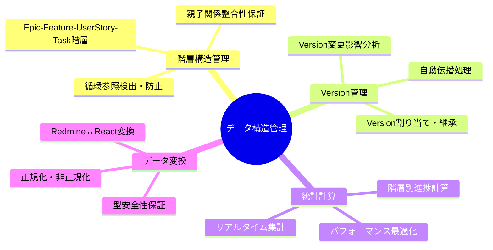

### 2.2 機能詳細
| 機能ID | 機能名 | 説明 | 優先度 | 受容条件 |
|--------|--------|------|---------|----------|
| DS001 | 階層構造管理 | Epic-Feature-UserStory-Task の4層階層データ管理 | High | 親子関係・循環参照検証完了 |
| DS002 | Version継承管理 | 親要素のVersion変更時の子要素自動更新 | High | 階層全体でVersion一貫性確保 |
| DS003 | 統計情報計算 | 各階層の進捗率・完了数リアルタイム計算 | High | 1秒以内での統計更新完了 |
| DS004 | データ型安全性 | TypeScript型定義による実行時型チェック | Medium | コンパイル時・実行時エラー0 |
| DS005 | データ正規化 | 重複排除・参照整合性保証のデータ構造 | Medium | データ整合性100%保証 |
| DS006 | 変更追跡 | データ変更履歴・差分検出機能 | Low | 変更点正確検出・ロールバック対応 |

## 3. データ設計仕様

### 3.1 階層構造設計
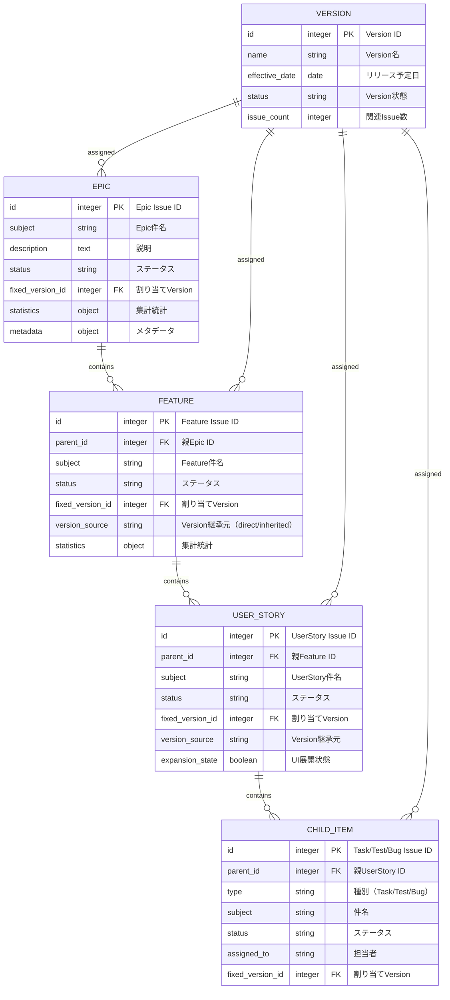

### 3.2 統計データ構造設計
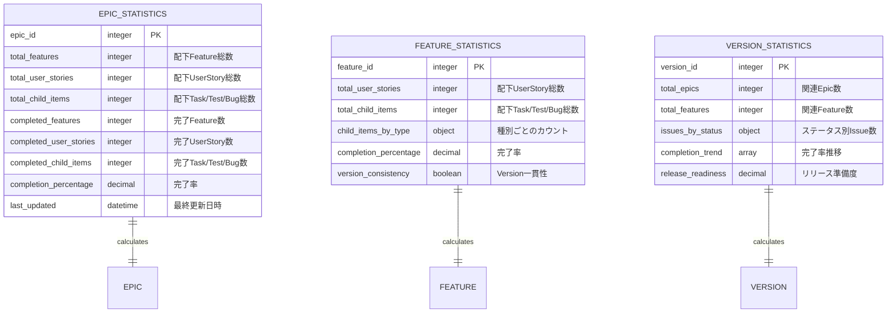

### 3.3 データフロー設計
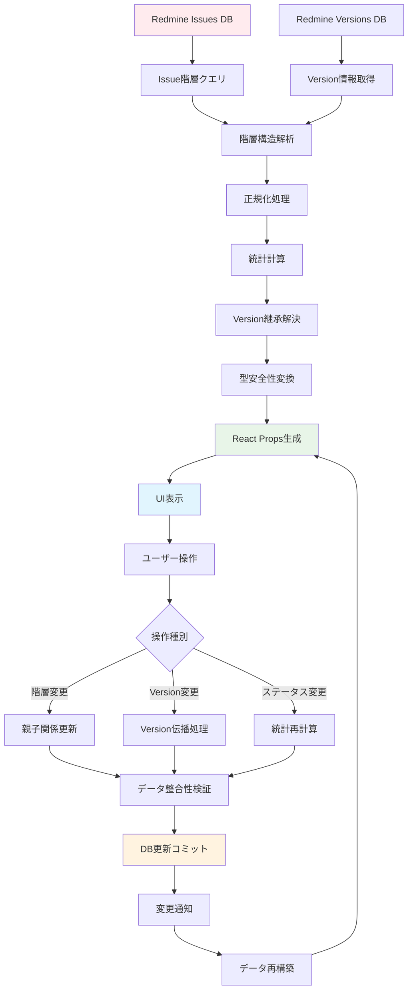

## 4. 型安全性設計

### 4.1 TypeScript型階層設計
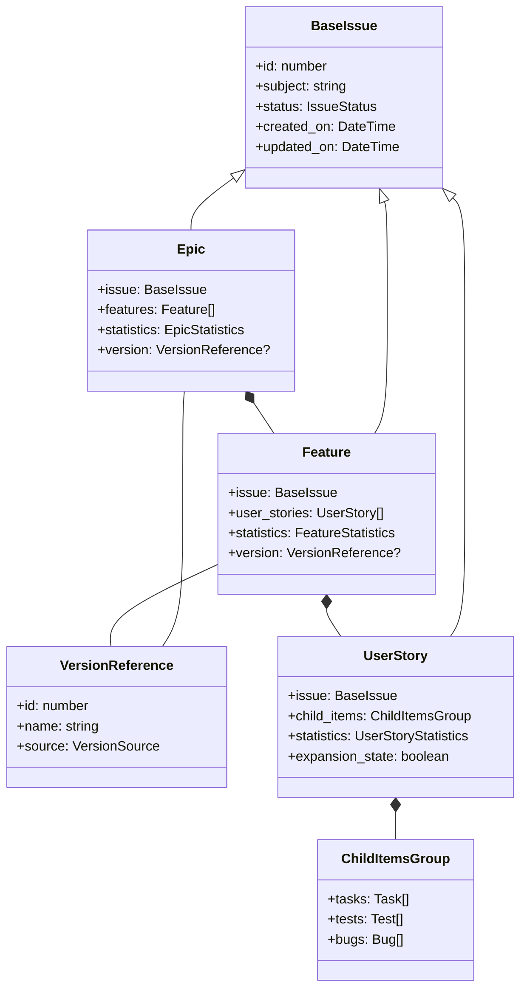

### 4.2 型制約・バリデーション設計
```typescript
// 型安全性保証の実装指針（疑似コード）
interface TypeSafetyConstraints {
  // 階層制約
  epic_can_only_contain_features: boolean;
  feature_must_have_parent_epic: boolean;
  user_story_must_have_parent_feature: boolean;

  // Version制約
  child_version_must_match_or_inherit_parent: boolean;
  version_change_triggers_propagation: boolean;

  // 循環参照防止
  no_circular_parent_child_reference: boolean;
  max_hierarchy_depth: 4; // Epic→Feature→UserStory→Task
}

// バリデーション関数型定義
type HierarchyValidator<T> = (data: T) => ValidationResult;
type VersionConsistencyChecker = (hierarchy: IssueHierarchy) => ConsistencyReport;
type StatisticsCalculator<T> = (items: T[]) => StatisticsResult;
```

## 5. Version管理設計

### 5.1 Version継承戦略
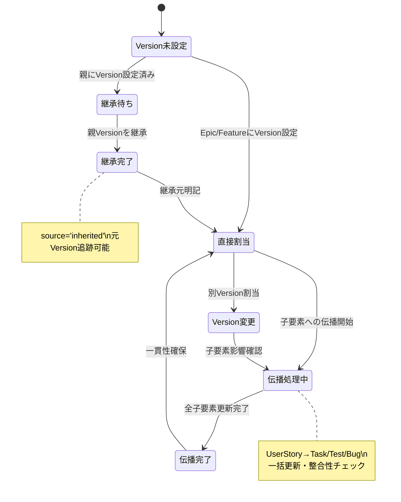

### 5.2 Version変更影響分析
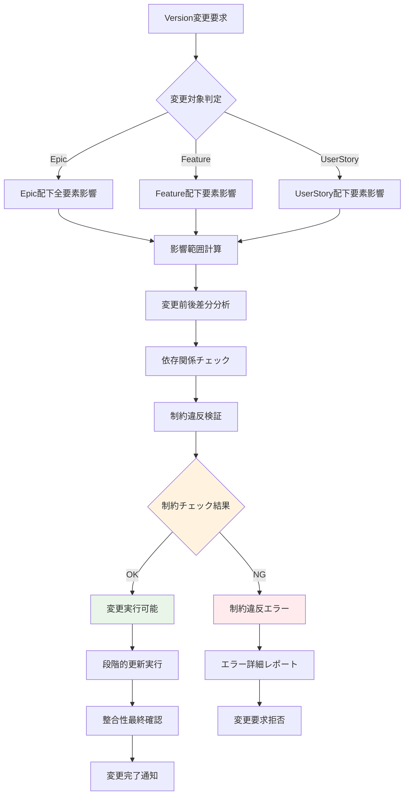

## 6. アーキテクチャ設計

### 6.1 システム構成
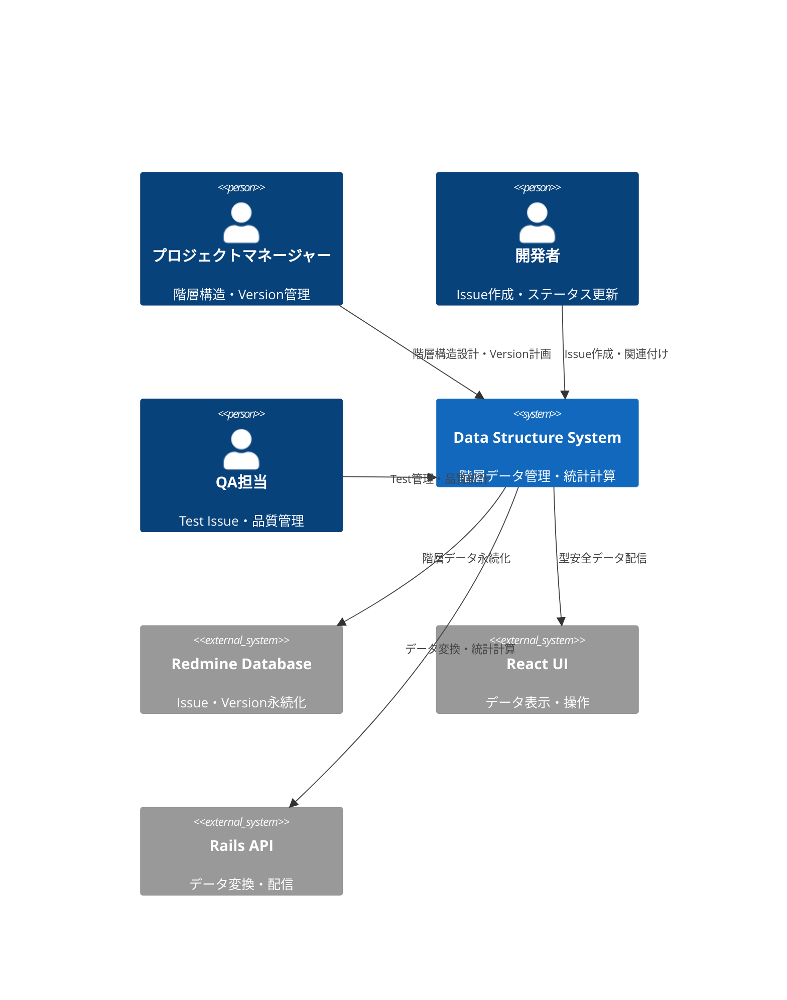

### 6.2 データレイヤー構成
```mermaid
C4Component
    Component(hierarchy_manager, "Hierarchy Manager", "階層構造管理", "親子関係・循環参照チェック")
    Component(version_manager, "Version Manager", "Version継承管理", "自動伝播・整合性保証")
    Component(statistics_engine, "Statistics Engine", "統計計算エンジン", "リアルタイム集計・キャッシング")
    Component(type_converter, "Type Converter", "型変換システム", "Redmine↔React安全変換")
    Component(data_validator, "Data Validator", "データ検証", "整合性・制約チェック")
    Component(cache_manager, "Cache Manager", "キャッシュ管理", "統計・クエリ結果キャッシング")

    Rel(hierarchy_manager, version_manager, "階層変更→Version伝播")
    Rel(hierarchy_manager, statistics_engine, "構造変更→統計再計算")
    Rel(version_manager, data_validator, "Version変更→整合性検証")
    Rel(statistics_engine, cache_manager, "統計結果キャッシング")
    Rel(type_converter, data_validator, "変換後データ検証")

    style hierarchy_manager fill:#e1f5fe
    style version_manager fill:#f3e5f5
    style statistics_engine fill:#fff3e0
    style data_validator fill:#e8f5e8
```

## 7. パフォーマンス設計

### 7.1 統計計算最適化戦略
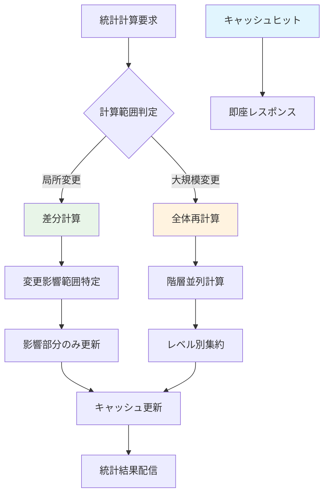

### 7.2 データ取得最適化
| 最適化項目 | 手法 | 効果 | 適用条件 |
|-----------|------|------|----------|
| N+1問題回避 | includes・joins活用 | 90%クエリ削減 | 階層データ取得時 |
| 統計キャッシング | Redis・メモリキャッシュ | 80%応答時間短縮 | 頻繁な統計参照 |
| 部分更新 | 差分検出・局所更新 | 70%計算時間削減 | 小規模データ変更 |
| 並列処理 | 非同期・並列計算 | 60%処理時間短縮 | 大規模統計計算 |

## 8. 実装指針

### 8.1 技術スタック
- **型システム**: TypeScript 4.8+ strict mode
- **データ検証**: joi・yup（スキーマ検証）
- **状態管理**: Immutable.js・immer（イミュータブル）
- **キャッシング**: React Query・SWR（クライアント）、Redis（サーバー）
- **統計計算**: Lodash・Ramda（関数型計算）

### 8.2 実装パターン
```typescript
// データ構造管理基本パターン（疑似コード）
class HierarchyManager {
  // 階層構造検証
  validateHierarchy(data: IssueHierarchy): ValidationResult {
    const rules = [
      this.checkCircularReference,
      this.validateParentChildTypes,
      this.checkHierarchyDepth,
      this.validateVersionConsistency
    ];

    return rules.reduce((result, rule) => ({
      ...result,
      ...rule(data)
    }), { valid: true, errors: [] });
  }

  // Version自動伝播
  async propagateVersion(parentIssue: Issue, newVersion: Version): Promise<PropagationResult> {
    const affectedIssues = await this.findChildrenRecursively(parentIssue);

    const propagationPlan = affectedIssues.map(issue => ({
      id: issue.id,
      currentVersion: issue.fixed_version,
      targetVersion: newVersion,
      conflicts: this.detectVersionConflicts(issue, newVersion)
    }));

    if (propagationPlan.some(plan => plan.conflicts.length > 0)) {
      return { success: false, conflicts: propagationPlan };
    }

    return await this.executePropagation(propagationPlan);
  }

  // 統計計算（メモ化）
  @Memoize({ ttl: 300000 }) // 5分キャッシュ
  calculateStatistics(hierarchy: IssueHierarchy): HierarchyStatistics {
    return {
      epic: this.calculateEpicStatistics(hierarchy.epics),
      feature: this.calculateFeatureStatistics(hierarchy.features),
      userStory: this.calculateUserStoryStatistics(hierarchy.userStories),
      overall: this.calculateOverallStatistics(hierarchy)
    };
  }
}

// 型安全なデータ変換
class TypeSafeConverter {
  redmineToReact<T>(redmineData: RedmineIssue[], schema: Schema<T>): T[] {
    return redmineData.map(data => {
      const converted = this.convertFields(data);
      const validated = schema.validate(converted);

      if (validated.error) {
        throw new DataValidationError(validated.error);
      }

      return validated.value;
    });
  }
}
```

### 8.3 エラーハンドリング設計
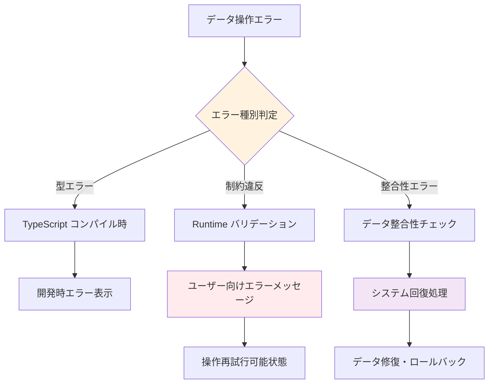

## 9. テスト設計

### 9.1 テスト戦略
```mermaid
pyramid
    title データ構造 テストピラミッド

    "E2E（階層操作シナリオ）" : 5
    "統合テスト（DB連携）" : 15
    "単体テスト（ロジック・計算）" : 80
```

### 9.2 テストケース設計
| テストレベル | 対象 | 主要テストケース | カバレッジ目標 |
|-------------|------|------------------|----------------|
| 単体テスト | データ変換・統計計算 | 型変換・統計計算・バリデーション | 95%以上 |
| 統合テスト | 階層操作・Version伝播 | 親子関係・Version継承・整合性 | 90%以上 |
| E2Eテスト | ユーザーシナリオ | Epic作成→Feature追加→Version伝播 | 主要フロー100% |

### 9.3 テストデータ設計
```typescript
// テスト用階層データ生成（疑似コード）
const createTestHierarchy = (options: TestOptions) => ({
  epics: Array(options.epicCount).fill(null).map((_, i) => ({
    id: 100 + i,
    subject: `Epic ${i + 1}`,
    features: Array(options.featuresPerEpic).fill(null).map((_, j) => ({
      id: 1000 + i * 10 + j,
      subject: `Feature ${i + 1}-${j + 1}`,
      user_stories: Array(options.userStoriesPerFeature).fill(null).map((_, k) => ({
        id: 10000 + i * 100 + j * 10 + k,
        subject: `UserStory ${i + 1}-${j + 1}-${k + 1}`,
        child_items: {
          tasks: createChildItems('Task', 2),
          tests: createChildItems('Test', 1),
          bugs: createChildItems('Bug', 0)
        }
      }))
    }))
  }))
});
```

## 10. 運用・保守設計

### 10.1 データ品質監視
- **整合性監視**: 階層構造・Version一貫性の定期チェック
- **パフォーマンス監視**: 統計計算時間・クエリ実行時間測定
- **データ異常検出**: 循環参照・孤立データ・不整合の自動検出
- **統計精度検証**: 手動計算結果との定期突合

### 10.2 スキーマ進化戦略
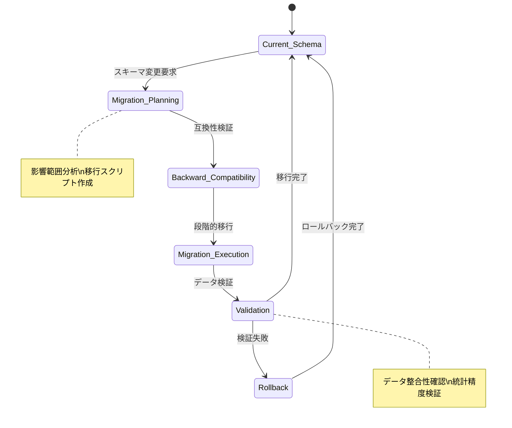

### 10.3 データアーカイブ戦略
- **履歴データ管理**: 変更履歴・統計推移の長期保存
- **パフォーマンス維持**: 古いデータの段階的アーカイブ
- **復旧対応**: 重要データの定期バックアップ・復元テスト
- **法的要件**: データ保持期間・削除ポリシー準拠

---

*データ構造設計は、Kanban Release システムの信頼性・拡張性・保守性を支える重要な基盤です。この設計書は実装コードではなく、階層データ管理・Version継承・統計計算の設計思想を明確化し、開発チーム全体でのデータ品質向上を実現します。*