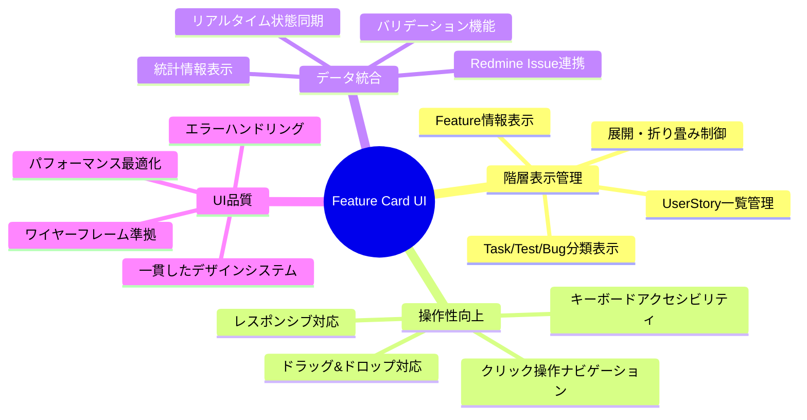
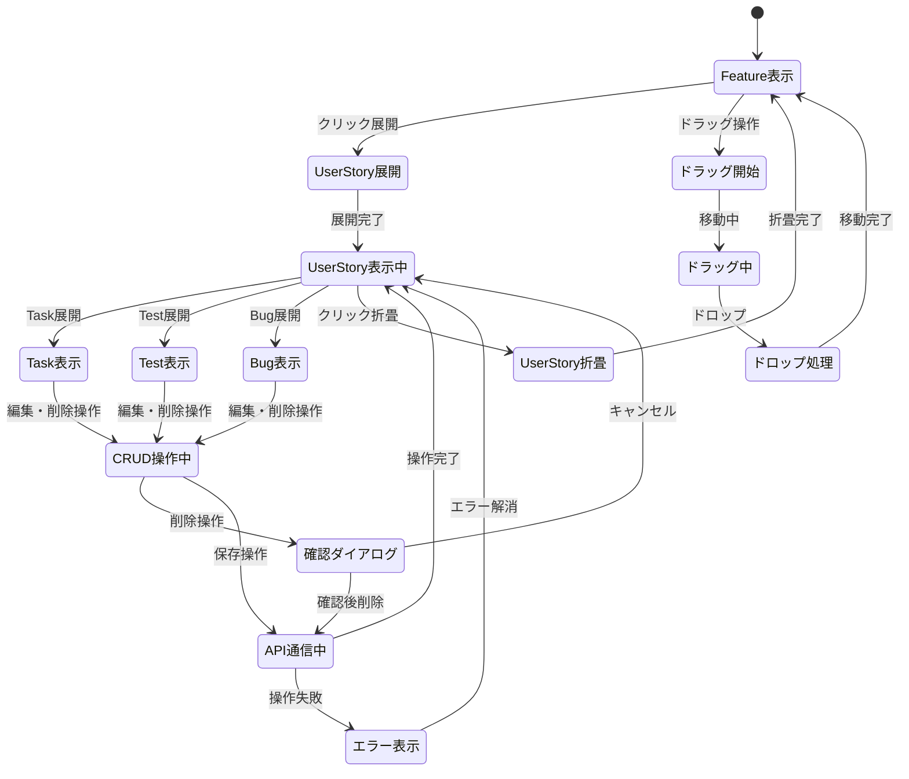
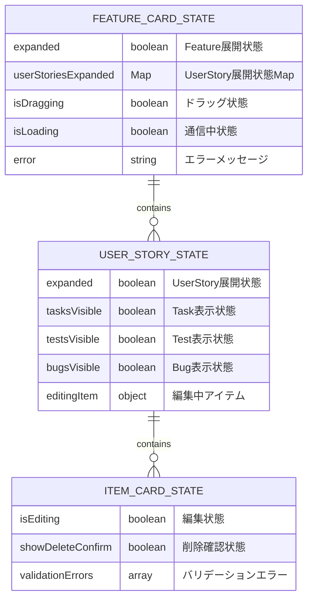
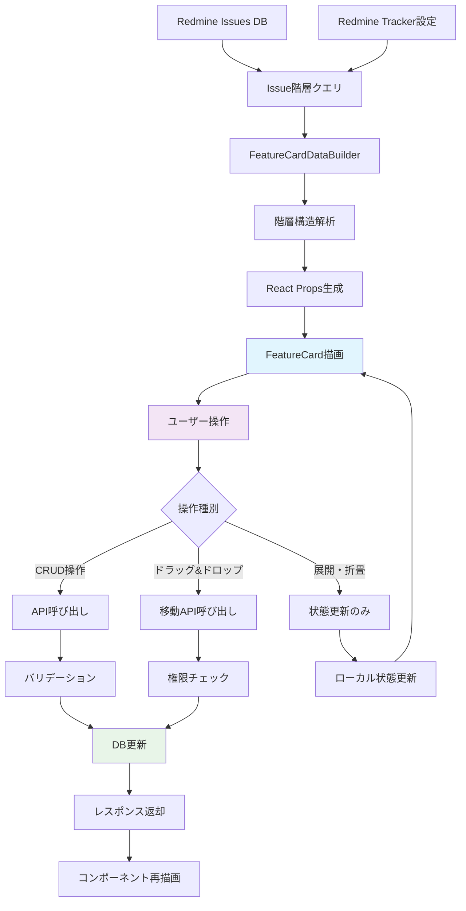
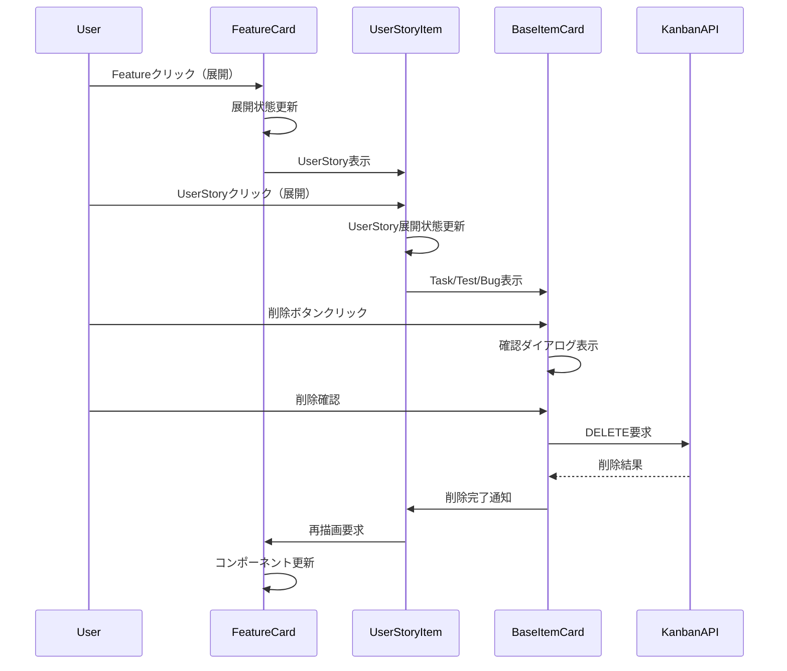
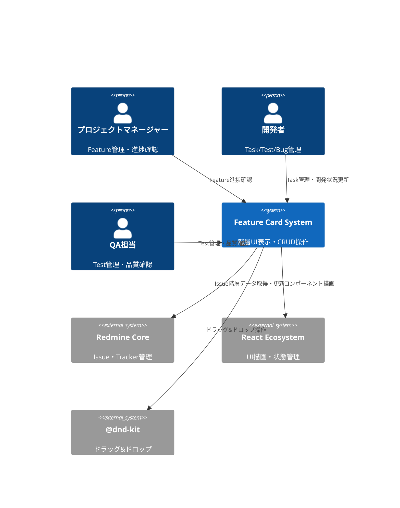
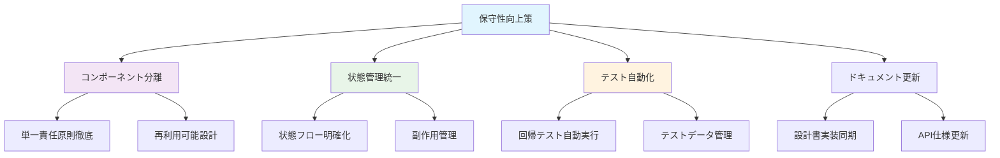
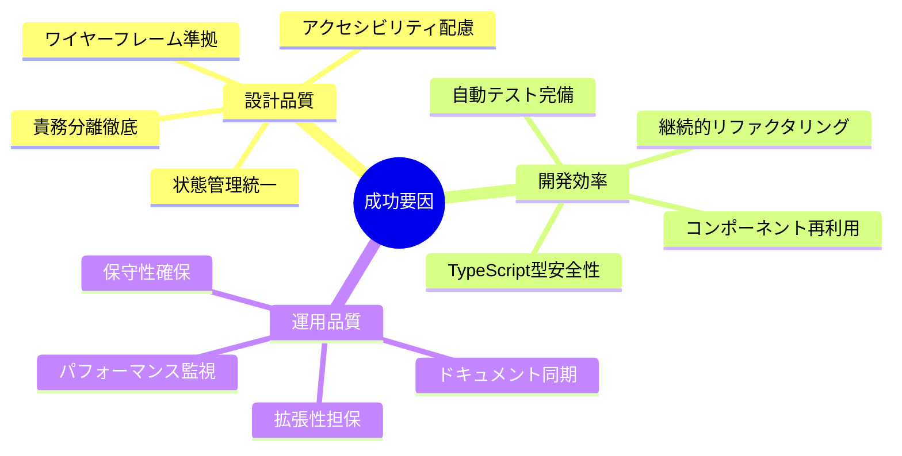

# Feature Card コンポーネント設計仕様書

## 🔗 関連ドキュメント
- @vibes/docs/logics/wireframe/kanban_ui_feature_card_component.drawio
- @vibes/docs/logics/wireframe/kanban_ui_grid_layout.drawio
- @vibes/rules/technical_architecture_standards.md
- @vibes/logics/kanban_ui_implementation.md

## 1. 概要

ワイヤーフレーム準拠のFeature Cardコンポーネント設計。折り畳み可能な階層構造（Feature → UserStory → Task/Test/Bug）でカード表示を実現。

## 2. 機能要求仕様

### 2.1 主要機能


### 2.2 機能詳細
| 機能ID | 機能名 | 説明 | 優先度 | 受容条件 |
|--------|--------|------|---------|----------|
| FC001 | Feature情報表示 | Feature名・ステータス・メタデータ表示 | High | ワイヤーフレーム準拠表示完了 |
| FC002 | UserStory階層管理 | UserStory一覧・展開/折り畳み制御 | High | 階層状態の永続化対応 |
| FC003 | Task/Test/Bug分類 | 種別ごとのコンテナ・視覚的分類表示 | High | 3種別の明確な識別可能 |
| FC004 | ドラッグ&ドロップ | Feature Card間・Epic間の移動操作 | Medium | @dnd-kit統合・操作性確保 |
| FC005 | CRUD操作 | UserStory・Task等の追加・編集・削除 | Medium | 確認ダイアログ・エラー処理 |
| FC006 | 統計表示 | 進捗率・完了数・統計情報リアルタイム | Low | パフォーマンス配慮した更新 |

## 3. コンポーネント設計

### 3.1 階層構造設計
```mermaid
graph TD
    A[FeatureCard] --> B[FeatureHeader]
    A --> C[UserStoryList]

    B --> D[FeatureTitle]
    B --> E[FeatureStatusBadge]

    C --> F[UserStoryItem[]]
    C --> G[AddUserStoryButton]

    F --> H[UserStoryHeader]
    F --> I[TaskContainer]
    F --> J[TestContainer]
    F --> K[BugContainer]

    H --> L[CollapseButton]
    H --> M[UserStoryTitle]
    H --> N[UserStoryStatus]
    H --> O[UserStoryDeleteButton]

    I --> P[BaseItemCard[]]
    J --> Q[BaseItemCard[]]
    K --> R[BaseItemCard[]]

    style A fill:#e1f5fe
    style F fill:#f3e5f5
    style P fill:#e8f5e8
    style Q fill:#fff3e0
    style R fill:#ffebee
```

### 3.2 責務分離設計
```mermaid
classDiagram
    class FeatureCard {
        +責務: Feature全体の表示制御
        +状態: UserStory展開状態管理
        +操作: ドラッグ&ドロップ処理
    }

    class UserStoryItem {
        +責務: UserStory単体の表示制御
        +状態: 展開・折り畳み状態
        +操作: CRUD操作・子要素管理
    }

    class BaseItemCard {
        +責務: Task/Test/Bug共通表示
        +状態: アイテム基本情報
        +操作: 編集・削除操作
    }

    class ContainerComponents {
        +責務: 種別ごとの分類表示
        +状態: アイテム一覧管理
        +操作: 追加操作・レイアウト制御
    }

    FeatureCard ||--o{ UserStoryItem
    UserStoryItem ||--o{ ContainerComponents
    ContainerComponents ||--o{ BaseItemCard
```

## 4. 状態管理設計

### 4.1 状態フロー設計


### 4.2 コンポーネント状態設計


### 4.3 実装パターン
```typescript
// コンポーネント状態管理基本パターン（疑似コード）
interface FeatureCardHooks {
  // 展開状態管理
  useExpansionState(initialExpanded: boolean): {
    expanded: boolean;
    toggle: () => void;
    userStoriesExpanded: Map<number, boolean>;
    toggleUserStory: (id: number) => void;
  };

  // ドラッグ&ドロップ管理
  useDragAndDrop(featureId: number): {
    dragProps: DragProps;
    isDragging: boolean;
    dragStyle: CSSProperties;
  };

  // CRUD操作管理
  useCRUDOperations(): {
    createUserStory: (featureId: number, data: UserStoryData) => Promise<void>;
    updateUserStory: (id: number, data: Partial<UserStoryData>) => Promise<void>;
    deleteUserStory: (id: number) => Promise<void>;
    showDeleteConfirm: (id: number) => void;
    hideDeleteConfirm: () => void;
  };
}

## 5. データフロー設計

### 5.1 システム間データフロー


### 5.2 コンポーネント間通信設計


## 6. アーキテクチャ設計

### 6.1 システム構成


### 6.2 コンポーネントレイヤー構成
```mermaid
C4Component
    Component(feature_card, "FeatureCard", "メインカード", "Feature全体制御・D&D・展開状態")
    Component(user_story_mgr, "UserStoryManager", "UserStory管理", "一覧表示・CRUD・展開制御")
    Component(item_containers, "ItemContainers", "Task/Test/Bug分類", "種別管理・レイアウト制御")
    Component(base_item_card, "BaseItemCard", "共通アイテム", "基本表示・編集・削除")
    Component(shared_ui, "SharedUIComponents", "共通UI", "Modal・Button・Form等")
    Component(state_manager, "StateManager", "状態管理", "展開状態・編集状態・エラー")

    Rel(feature_card, user_story_mgr, "UserStory一覧表示")
    Rel(user_story_mgr, item_containers, "Task/Test/Bug分類表示")
    Rel(item_containers, base_item_card, "個別アイテム表示")
    Rel(base_item_card, shared_ui, "共通UI利用")
    Rel(feature_card, state_manager, "状態管理")
    Rel(user_story_mgr, state_manager, "展開状態管理")

    style feature_card fill:#e1f5fe
    style user_story_mgr fill:#f3e5f5
    style item_containers fill:#e8f5e8
    style base_item_card fill:#fff3e0
```

## 7. 実装指針

### 7.1 技術スタック
- **フロントエンド**: React 18+ Hooks、TypeScript（型安全性）
- **状態管理**: useState・useReducer（ローカル状態）、Context API（グローバル状態）
- **UI操作**: @dnd-kit/core（ドラッグ&ドロップ）、React Hook Form（フォーム）
- **スタイリング**: SCSS Modules（モジュラーCSS）、CSS Custom Properties
- **バックエンド**: Rails API mode、Kanban::FeatureCardDataBuilder（データ変換）

### 7.2 実装パターン
```typescript
// Feature Card基本実装パターン（疑似コード）
interface FeatureCardImplementation {
  // コンポーネント構造
  structure: {
    main: "FeatureCard（状態管理・D&D）";
    header: "FeatureHeader（表示・展開制御）";
    list: "UserStoryList（一覧管理）";
    item: "UserStoryItem（個別制御）";
    containers: "TaskContainer/TestContainer/BugContainer（分類表示）";
    base: "BaseItemCard（共通表示・操作）";
  };

  // 状態管理パターン
  stateManagement: {
    expansion: "Map<id, boolean>（展開状態）";
    editing: "object | null（編集中アイテム）";
    loading: "boolean（通信状態）";
    errors: "string[]（エラー情報）";
  };

  // 操作パターン
  operations: {
    expand: "toggle展開・永続化";
    crud: "create・update・delete・バリデーション";
    drag: "@dnd-kit統合・権限チェック";
    error: "エラーハンドリング・ユーザー通知";
  };
}

## 8. テスト設計

### 8.1 テスト戦略
```mermaid
pyramid
    title Feature Card テストピラミッド

    "E2E（階層操作シナリオ）" : 5
    "統合テスト（API連携）" : 15
    "単体テスト（コンポーネント・ロジック）" : 80
```

### 8.2 テストケース設計
| テストレベル | 対象 | 主要テストケース | カバレッジ目標 |
|-------------|------|------------------|----------------|
| 単体テスト | コンポーネント・状態管理 | 表示・展開・削除・D&D | 95%以上 |
| 統合テスト | API連携・データフロー | CRUD操作・階層更新 | 90%以上 |
| E2Eテスト | ユーザーシナリオ | Feature→UserStory→Task操作 | 主要フロー100% |

## 9. 運用・保守設計

### 9.1 品質監視
- **パフォーマンス監視**: コンポーネント描画時間・状態更新パフォーマンス測定
- **操作品質監視**: 展開・折り畳み応答性・ドラッグ&ドロップ精度確認
- **データ整合性監視**: 階層構造・状態同期の定期検証
- **アクセシビリティ監視**: キーボード操作・スクリーンリーダー対応確認

### 9.2 保守性向上策


### 9.3 スケーラビリティ対応
- **大量データ対応**: Virtual Scrolling・Lazy Loading実装
- **多言語対応**: i18n対応・文字列外部化
- **テーマ対応**: CSS Custom Properties・Dark Mode対応
- **機能拡張対応**: プラグインアーキテクチャ・Hook拡張点

## 10. 結論

### 10.1 設計実現による価値
本Feature Card設計により、以下の価値を実現する：

- **直感的な階層UI**: Feature→UserStory→Task/Test/Bugの3階層構造で、プロジェクト進捗の視認性向上
- **効率的な操作性**: 折り畳み・展開・ドラッグ&ドロップによる快適な管理体験
- **データ整合性**: Redmine Issue階層との同期による正確な情報管理
- **スケーラブル設計**: 大量データ・多機能拡張に対応可能なアーキテクチャ

### 10.2 実装成功要因


### 10.3 継続的改善指針
- **フィードバック駆動**: ユーザビリティテスト結果による継続的UI改善
- **技術負債管理**: 定期的コードレビュー・リファクタリングによる品質維持
- **機能拡張対応**: プラグインアーキテクチャによる柔軟な機能追加
- **パフォーマンス最適化**: Virtual Scrolling・メモ化による大規模対応

---

*ワイヤーフレーム準拠のFeature Cardコンポーネント設計。折り畳み階層構造とRuby-React統合を実現*