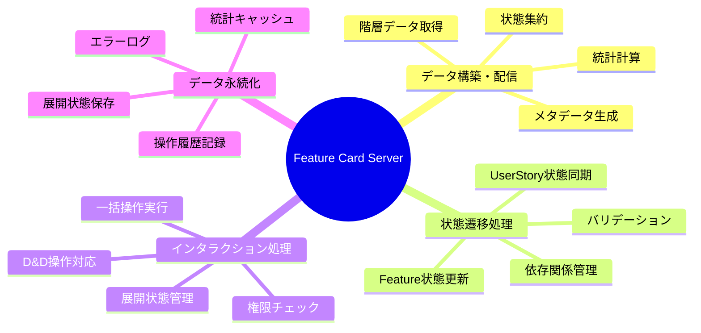
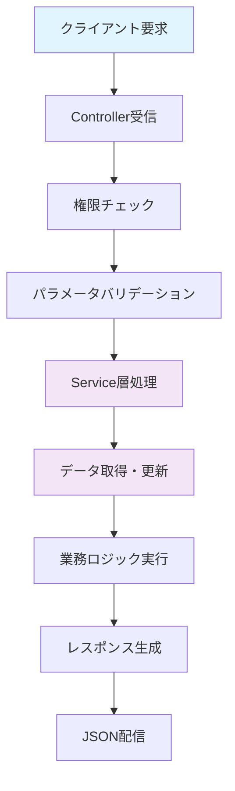
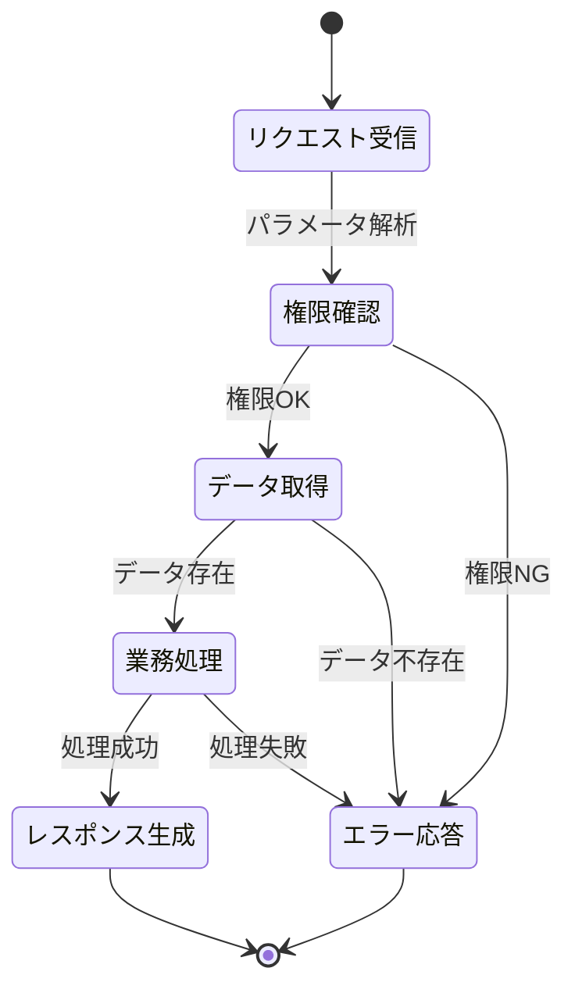
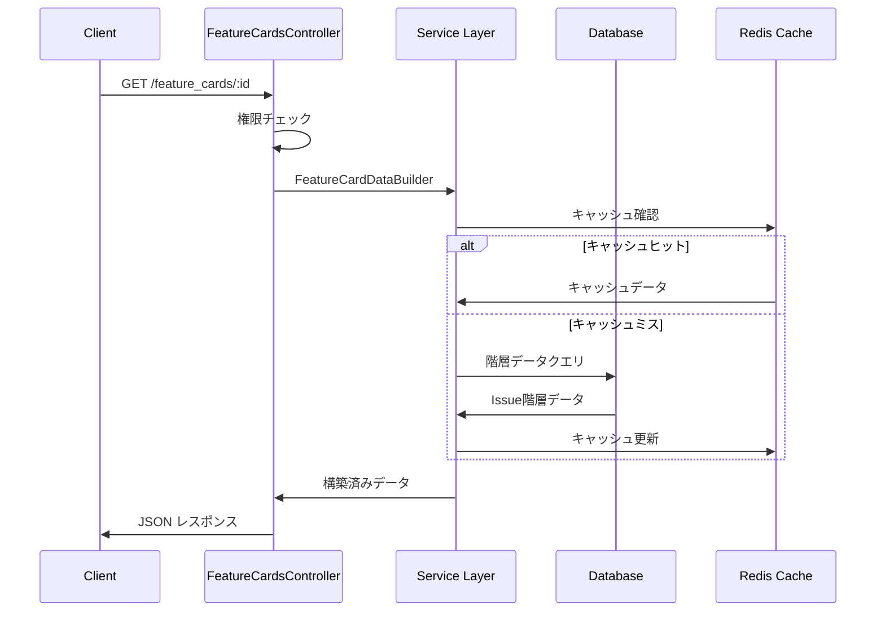
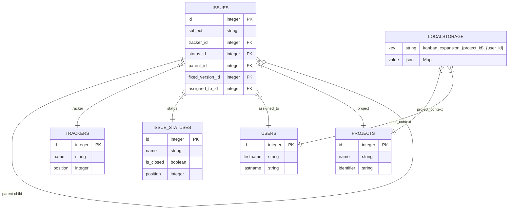
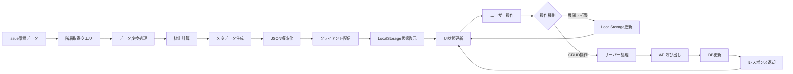
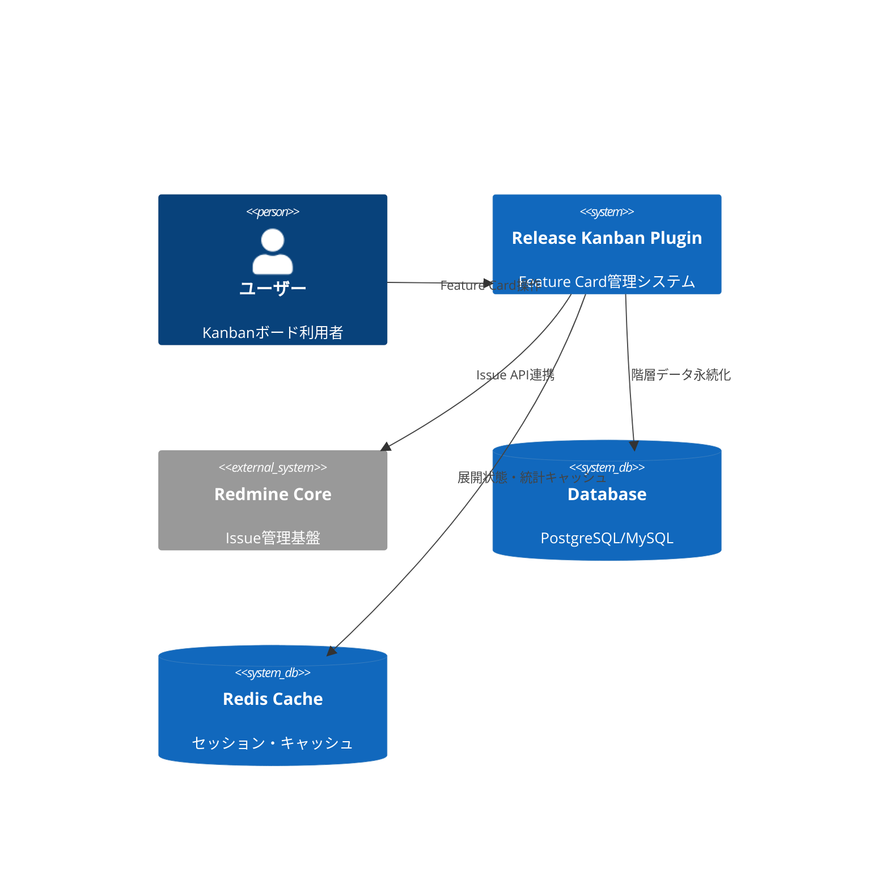
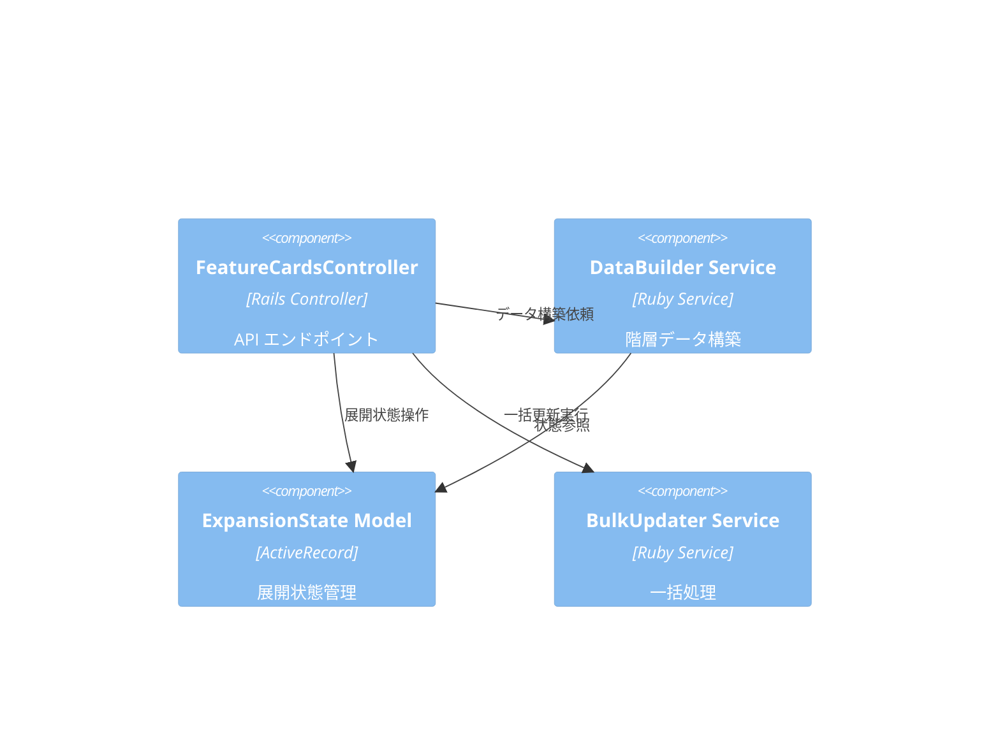
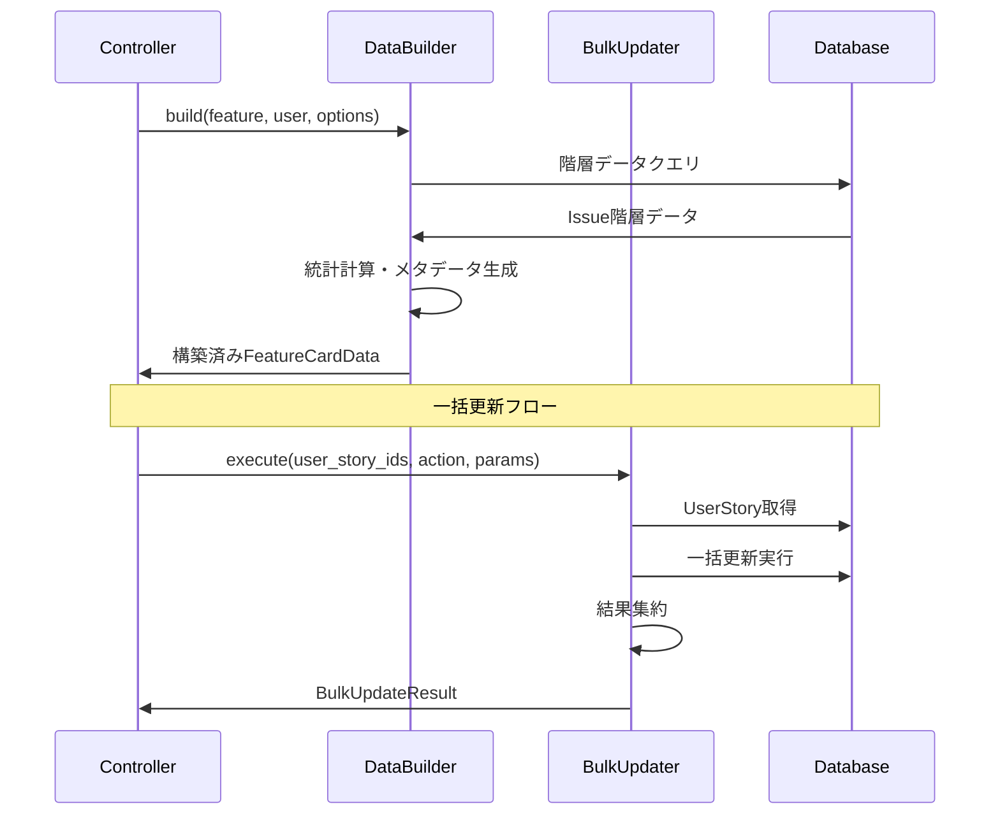
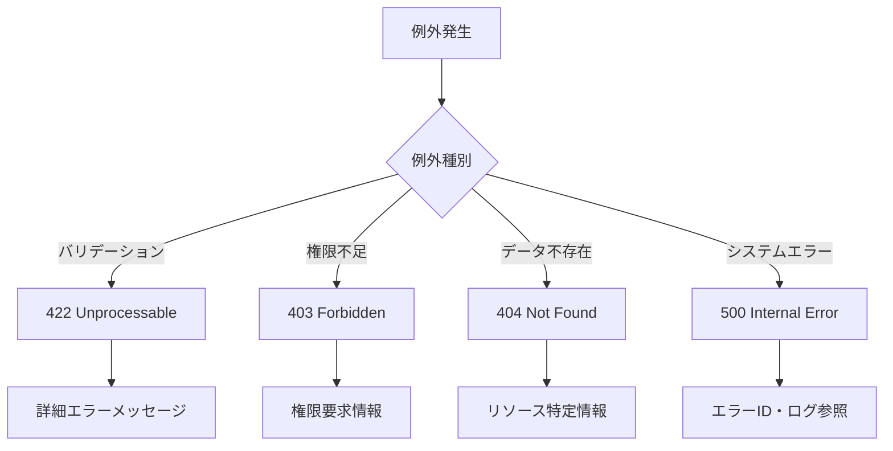

# Feature Card サーバーサイド詳細設計書

## 🔗 関連ドキュメント
- @vibes/docs/logics/wireframe/kanban_ui_feature_card_component.drawio
- @vibes/rules/technical_architecture_standards.md
- @vibes/logics/feature_card/feature_card_component_specification.md

## 1. 設計概要

### 1.1 設計目的・背景
**なぜこのサーバーサイド実装が必要なのか**
- ビジネス要件：Issue階層（Epic→Feature→UserStory→Task/Test/Bug）データの効率的な構築・配信
- ユーザー価値：リアルタイム状態遷移、D&D操作、一括処理による生産性向上
- システム価値：階層データの整合性保持、パフォーマンス最適化、Redmine Core統合

### 1.2 設計方針
**どのようなアプローチで実現するか**
- 主要設計思想：MVC分離、サービス層責務分離、階層データ整合性重視
- 技術選択理由：Rails Controller/Service パターン、Active Record最適化、JSON API設計
- 制約・前提条件：Redmine Core API互換性、既存Issue階層構造準拠、権限制御統合

## 2. 機能要求仕様

### 2.1 主要機能


### 2.2 機能詳細
| 機能ID | 機能名 | 説明 | 優先度 | 受容条件 |
|--------|--------|------|---------|----------|
| FS001 | 階層データ取得 | Feature配下の全UserStory・子アイテムを効率的に取得 | High | N+1クエリ回避、2秒以内レスポンス |
| FS002 | Feature状態遷移 | Feature状態変更とUserStory連動更新 | High | 依存関係整合性維持、ロールバック対応 |
| FS003 | UserStory展開制御 | ユーザー別展開状態のLocalStorage管理 | Medium | ブラウザ内状態保持、瞬時切替 |
| FS004 | 一括操作処理 | 複数UserStoryの版・状態・担当者一括更新 | Medium | トランザクション保証、部分失敗対応 |
| FS005 | テスト生成処理 | UserStoryからテンプレート基盤Test自動生成 | Low | テンプレート選択、生成ログ記録 |

## 3. UI/UX設計仕様

### 3.1 サーバーサイド処理フロー


### 3.2 状態遷移設計


### 3.3 API通信設計


## 4. データ設計

### 4.1 データ構造


### 4.2 データフロー


## 5. アーキテクチャ設計

### 5.1 システム構成


### 5.2 コンポーネント構成


## 6. インターフェース設計

### 6.1 Controller インターフェース
```ruby
# API エンドポイント設計（疑似コード）
class FeatureCardsController
  # GET /kanban/projects/:project_id/feature_cards/:id
  def show
    response_format: {
      feature_card: {
        feature: Issue,
        user_stories: Array<UserStoryData>,
        statistics: AggregatedStats
      },
      metadata: {
        permissions: Hash,
        version_context: Hash
      }
    }
  end

  # PATCH /feature_cards/:id/update_status
  def update_status
    params: { target_column: String }
    response_format: {
      updated_feature: FeatureData,
      affected_relations: Array<Issue>
    }
  end

  # PATCH /feature_cards/bulk_update
  def bulk_update
    params: {
      user_story_ids: Array<Integer>,
      action_type: String,
      bulk_action: Hash
    }
  end
end
```

### 6.2 Service インターフェース


## 7. 非機能要求

### 7.1 パフォーマンス要求
| 項目 | 要求値 | 測定方法 |
|------|---------|----------|
| Feature Card表示 | 2秒以内 | Rails ログ・APM測定 |
| 状態更新処理 | 1秒以内 | コントローラ処理時間 |
| 一括更新処理 | 100件5秒以内 | バッチ処理性能測定 |
| データベースクエリ | N+1回避必須 | Rails クエリログ分析 |

### 7.2 品質要求
- **可用性**: Redmine Core可用性に準拠（99.9%以上）
- **保守性**: Service層単体テストカバレッジ90%以上、Controller層80%以上
- **拡張性**: 新Tracker追加・階層変更に対応可能な抽象化

## 8. 実装指針

### 8.1 技術スタック
- **バックエンド**: Ruby on Rails 6.1+ (Redmine Core準拠)
- **データベース**: PostgreSQL/MySQL (Redmine設定準拠)
- **キャッシュ**: Redis (展開状態・統計キャッシュ)
- **テスト**: RSpec + FactoryBot

### 8.2 実装パターン
```ruby
# Controller実装パターン（疑似コード）
class FeatureCardsController < ApplicationController
  include KanbanApiConcern

  # 1. 権限チェック・パラメータバリデーション
  before_action :find_project, :authorize_kanban_access

  # 2. Service層委譲パターン
  def show
    builder = FeatureCardDataBuilder.new(feature, current_user)
    render json: builder.build
  end

  # 3. エラーハンドリング統一
  rescue_from ActiveRecord::NotFound, with: :render_not_found
  rescue_from SecurityError, with: :render_forbidden
end
```

### 8.3 エラーハンドリング戦略


## 9. テスト設計

テスト戦略・ケース設計・実装については以下を参照：
- @vibes/rules/testing/server_side_testing_strategy.md
- @vibes/rules/testing/feature_card_server_test_specification.md

## 10. 運用・保守設計

### 10.1 監視・ログ設計
- **パフォーマンス監視**: Rails APM、データベースクエリ性能
- **エラートラッキング**: Rails ログ、例外通知システム連携
- **利用状況分析**: Feature Card表示・操作頻度、パフォーマンスメトリクス

### 10.2 更新・デプロイ戦略
- **段階的更新**: Redmine Plugin更新プロセス準拠
- **ロールバック**: マイグレーション逆実行、設定復旧
- **互換性**: Redmine Core API・データベーススキーマ後方互換性維持

---

*Feature Card サーバーサイド実装は、Issue階層データの効率的な構築・配信、リアルタイム状態遷移、一括操作処理を担う基盤設計です。Rails MVC + Service層パターンにより、保守性と拡張性を重視した実装指針を提供します。*