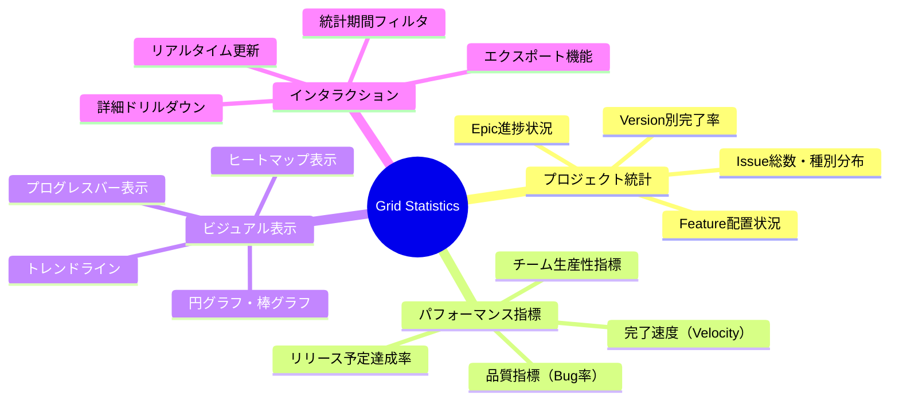
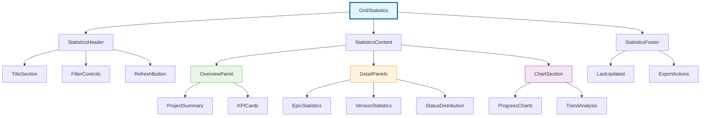
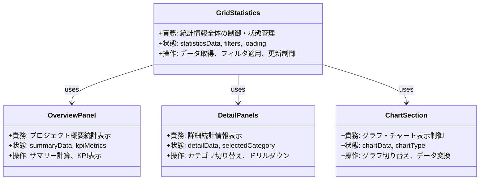
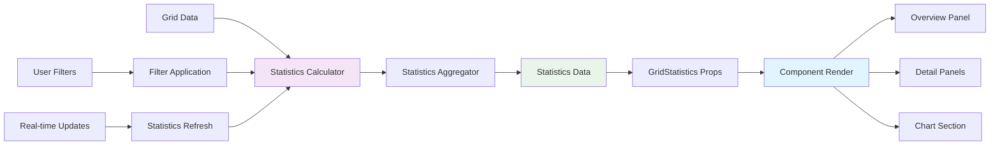
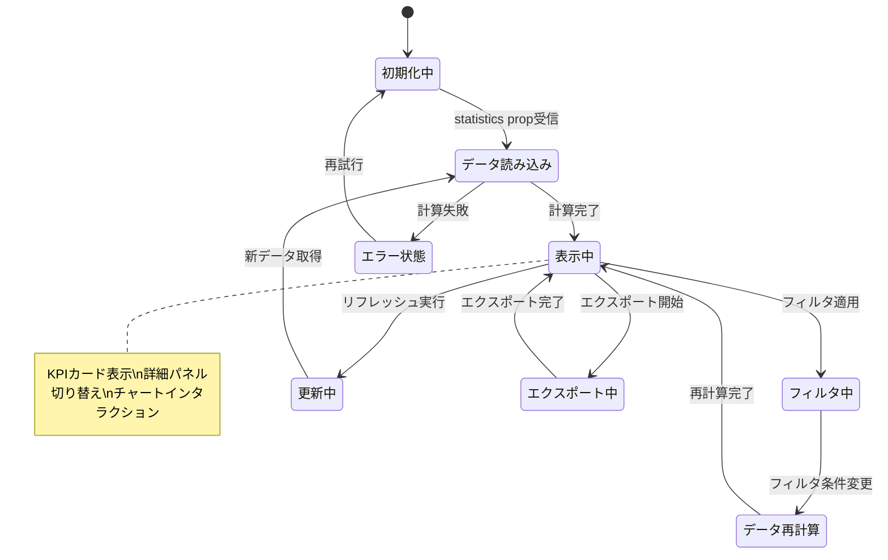
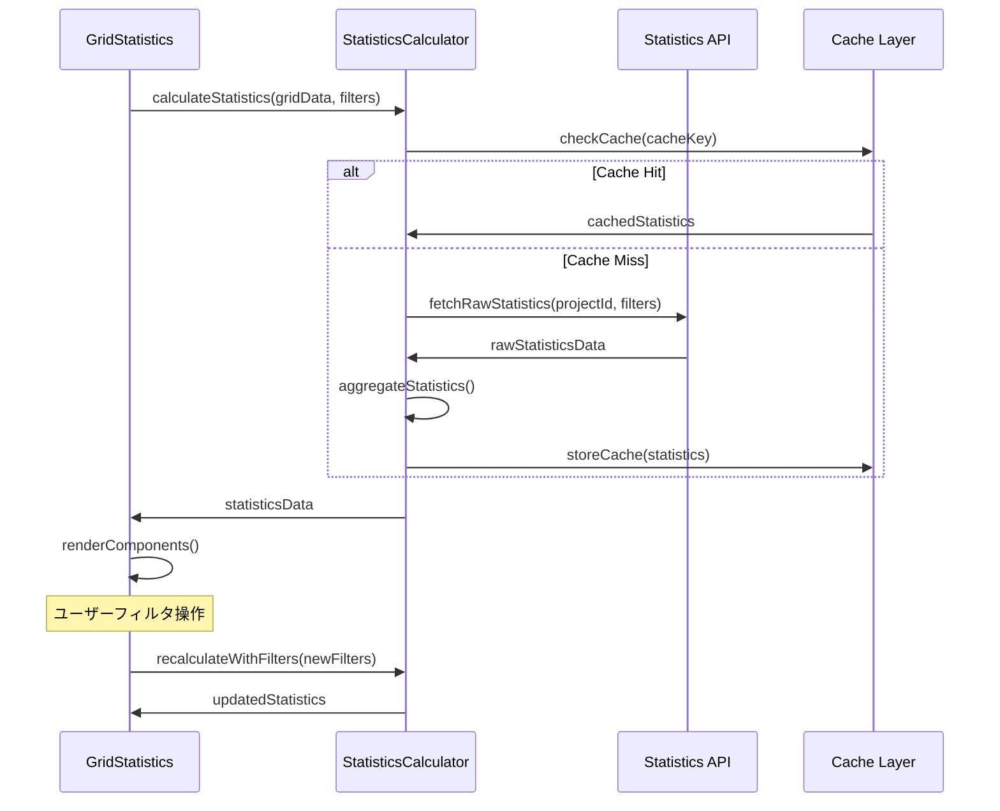
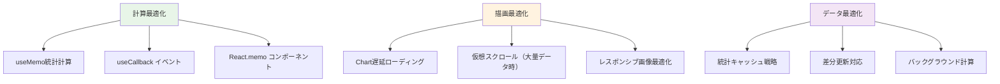

# Grid Statistics コンポーネント設計仕様書

## 🔗 関連ドキュメント
- @vibes/docs/logics/kanban_grid/kanban_grid_layout_specification.md
- @vibes/docs/logics/data_structures/data_structures_specification.md
- @vibes/rules/technical_architecture_standards.md
- @vibes/docs/logics/shared_components/shared_components_specification.md

## 1. 設計概要

### 1.1 設計目的・背景
**なぜこのコンポーネントが必要なのか**
- ビジネス要件：プロジェクト全体の進捗状況・リソース配分・品質指標を一目で把握
- ユーザー価値：数値による客観的なプロジェクト状況理解、意思決定支援、リスク早期発見
- システム価値：リアルタイムデータ可視化、統計情報の標準化、パフォーマンス監視

### 1.2 設計方針
**どのようなアプローチで実現するか**
- 主要設計思想：データドリブン設計、リアルタイム更新、視覚的理解促進、レスポンシブ対応
- 技術選択理由：React（宣言的UI）、Chart.js/Recharts（グラフ表示）、useMemo（計算最適化）
- 制約・前提条件：Kanban Grid統合、統計データリアルタイム同期、パフォーマンス配慮

## 2. 機能要求仕様

### 2.1 主要機能


### 2.2 機能詳細
| 機能ID | 機能名 | 説明 | 優先度 | 受容条件 |
|--------|--------|------|---------|----------|
| GS001 | Epic進捗表示 | Epic別完了率・Feature配置数表示 | High | 各Epic進捗リアルタイム更新 |
| GS002 | Version統計 | Version別Issue数・完了率・リリース予定 | High | Version情報正確表示 |
| GS003 | 全体サマリー | プロジェクト全体統計・KPI表示 | High | 主要指標一覧表示完了 |
| GS004 | グラフ表示 | 進捗グラフ・分布チャート表示 | Medium | Chart.js統合・レスポンシブ対応 |
| GS005 | フィルタリング | 期間・担当者・ステータス絞り込み | Medium | 動的フィルタ・URL同期 |
| GS006 | エクスポート | 統計データCSV・PDF出力 | Low | 各フォーマット対応・権限制御 |

## 3. コンポーネント設計

### 3.1 階層構造設計


### 3.2 責務分離設計


## 4. データ設計

### 4.1 Props インターフェース
```typescript
interface GridStatisticsProps {
  // 基本データ
  statistics: StatisticsData;
  projectId: number;

  // 表示制御
  compactMode?: boolean;
  showCharts?: boolean;
  enableFiltering?: boolean;

  // インタラクション
  onFilterChange?: (filters: StatisticsFilters) => void;
  onExport?: (format: ExportFormat) => void;
  onRefresh?: () => void;
}

interface StatisticsData {
  project: ProjectStatistics;
  epics: EpicStatistics[];
  versions: VersionStatistics[];
  overview: OverviewStatistics;
  trends: TrendData[];
  lastUpdated: string;
}

interface ProjectStatistics {
  totalEpics: number;
  totalFeatures: number;
  totalVersions: number;
  completionRate: number;
  velocityMetrics: VelocityData;
}

interface EpicStatistics {
  epicId: number;
  epicName: string;
  totalFeatures: number;
  completedFeatures: number;
  completionRate: number;
  averageVelocity: number;
  estimatedCompletion: string;
}

interface VersionStatistics {
  versionId: number;
  versionName: string;
  releaseDate: string;
  totalIssues: number;
  completedIssues: number;
  completionRate: number;
  isOverdue: boolean;
}
```

### 4.2 データフロー


## 5. UI/UX設計仕様

### 5.1 レイアウト設計
```mermaid
wireframe
    title Grid Statistics Layout

    section Header
        [Title: "Project Statistics"] [Filter Controls] [Refresh]
    end

    section Overview
        [KPI Card 1] [KPI Card 2] [KPI Card 3] [KPI Card 4]
        [Progress Bar: Overall Completion]
    end

    section Details
        tabs
            tab Epic Statistics
                [Epic 1: Progress Bar + Metrics]
                [Epic 2: Progress Bar + Metrics]
                [Epic 3: Progress Bar + Metrics]
            end
            tab Version Statistics
                [Version 1: Status + Timeline]
                [Version 2: Status + Timeline]
            end
            tab Distribution
                [Pie Chart: Issue Types]
                [Bar Chart: Status Distribution]
            end
        end
    end

    section Charts
        [Line Chart: Velocity Trends] [Burndown Chart]
    end

    section Footer
        [Last Updated: timestamp] [Export CSV] [Export PDF]
    end
```

### 5.2 状態遷移設計


## 6. インターフェース設計

### 6.1 API連携


### 6.2 実装パターン
```typescript
// GridStatistics実装基本パターン（疑似コード）
export const GridStatistics: FC<GridStatisticsProps> = ({
  statistics,
  compactMode = false,
  showCharts = true,
  onFilterChange,
  onExport
}) => {
  // 1. 状態管理
  const [filters, setFilters] = useState<StatisticsFilters>({});
  const [selectedTab, setSelectedTab] = useState<string>('overview');
  const [exportLoading, setExportLoading] = useState(false);

  // 2. 計算済み統計データ（メモ化）
  const filteredStatistics = useMemo(() =>
    applyFiltersToStatistics(statistics, filters), [statistics, filters]);

  const kpiMetrics = useMemo(() =>
    calculateKPIMetrics(filteredStatistics), [filteredStatistics]);

  const chartData = useMemo(() =>
    transformDataForCharts(filteredStatistics), [filteredStatistics]);

  // 3. イベントハンドラー
  const handleFilterChange = useCallback((newFilters: StatisticsFilters) => {
    setFilters(newFilters);
    onFilterChange?.(newFilters);
  }, [onFilterChange]);

  const handleExport = useCallback(async (format: ExportFormat) => {
    setExportLoading(true);
    try {
      await onExport?.(format);
    } finally {
      setExportLoading(false);
    }
  }, [onExport]);

  // 4. レンダリング
  return (
    <div className={`grid-statistics ${compactMode ? 'compact' : ''}`}>
      <StatisticsHeader
        filters={filters}
        onFilterChange={handleFilterChange}
        lastUpdated={statistics.lastUpdated}
      />

      <StatisticsContent
        statistics={filteredStatistics}
        kpiMetrics={kpiMetrics}
        chartData={chartData}
        selectedTab={selectedTab}
        onTabChange={setSelectedTab}
        showCharts={showCharts}
        compactMode={compactMode}
      />

      <StatisticsFooter
        onExport={handleExport}
        exportLoading={exportLoading}
        lastUpdated={statistics.lastUpdated}
      />
    </div>
  );
};
```

## 7. 非機能要求

### 7.1 パフォーマンス要求
| 項目 | 要求値 | 測定方法 | 想定条件 |
|------|---------|----------|----------|
| 初期表示 | 2秒以内 | 統計計算→UI表示完了 | 100Epic×20Version |
| フィルタ適用 | 0.5秒以内 | フィルタ変更→再計算→表示 | useMemo最適化適用 |
| チャート描画 | 1秒以内 | データ変換→Chart.js描画 | 複雑グラフ表示時 |
| メモリ使用量 | 10MB以内 | DevTools Memory測定 | 大規模統計データ時 |

### 7.2 品質要求
- **可用性**: 統計データ欠損時の適切なフォールバック表示
- **保守性**: コンポーネント単位テスト、統計計算ロジック分離
- **拡張性**: 新統計指標追加、カスタムチャート対応
- **ユーザビリティ**: 直感的な数値理解、適切な色彩・レイアウト

## 8. テスト設計

### 8.1 テスト戦略
```mermaid
pyramid
    title Grid Statistics テストピラミッド

    "E2E（統計表示・エクスポート）" : 5
    "統合テスト（計算・表示）" : 25
    "単体テスト（計算・コンポーネント）" : 70
```

### 8.2 テストケース設計
| テストレベル | 対象 | 主要テストケース | カバレッジ目標 |
|-------------|------|------------------|----------------|
| 単体テスト | 統計計算・コンポーネント | データ計算正確性・表示・フィルタ | 90%以上 |
| 統合テスト | API連携・リアルタイム更新 | データ取得・更新・キャッシュ | 85%以上 |
| E2Eテスト | ユーザーシナリオ | 統計確認→フィルタ→エクスポート | 主要フロー100% |

## 9. 実装指針

### 9.1 技術スタック
- **UI Framework**: React 18 + TypeScript 4.8+
- **チャートライブラリ**: Recharts（React統合）or Chart.js
- **スタイリング**: CSS Modules + CSS Variables
- **状態管理**: useState + useMemo（軽量・局所的）
- **テスト**: Jest + React Testing Library + MSW

### 9.2 パフォーマンス最適化戦略


## 10. 運用・保守設計

### 10.1 監視・ログ設計
- **パフォーマンス監視**: 統計計算時間、チャート描画時間、メモリ使用量
- **エラートラッキング**: 計算エラー、データ欠損、チャート描画失敗
- **使用状況分析**: 統計参照頻度、フィルタ使用パターン、エクスポート利用状況

### 10.2 拡張対応
- **新統計指標**: プラグイン形式での指標追加機能
- **カスタムダッシュボード**: ユーザー定義統計パネル配置
- **外部連携**: 他システム統計データインポート機能

---

*Grid Statisticsコンポーネントは、Kanban Grid システムの統計情報を視覚的に表示し、プロジェクト管理者が迅速な意思決定を行えるよう支援する中核UIコンポーネントです。リアルタイムデータ更新とパフォーマンス最適化により、大規模プロジェクトでも快適な統計情報表示を実現します。*