# Kanban Grid Layout コンポーネント詳細設計書

## 🔗 関連ドキュメント
- @vibes/docs/logics/ui_components/wireframe/kanban_ui_grid_layout.drawio
- @vibes/docs/logics/ui_components/wireframe/kanban_ui_feature_card_component.drawio
- @vibes/rules/technical_architecture_standards.md
- @vibes/logics/ui_components/feature_card/feature_card_component_specification.md

## 1. 設計概要

### 1.1 設計目的・背景
**なぜこのコンポーネントが必要なのか**
- ビジネス要件：Epic（スイムレーン）× Version（時間軸）の2次元マトリクスでプロジェクト全体を俯瞰
- ユーザー価値：複雑なプロジェクト構造を直感的に理解・操作可能な鳥瞰図表示
- システム価値：Feature配置最適化、リソース配分可視化、リリース計画管理の統合

### 1.2 設計方針
**どのようなアプローチで実現するか**
- 主要設計思想：2次元マトリクス表示、ドラッグ&ドロップ直感操作、階層データの平面展開
- 技術選択理由：React（宣言的UI）、@dnd-kit（高性能D&D）、CSS Grid（レスポンシブ）
- 制約・前提条件：Redmine Issue階層準拠、大量データ表示対応、リアルタイム同期

## 2. 機能要求仕様

### 2.1 主要機能
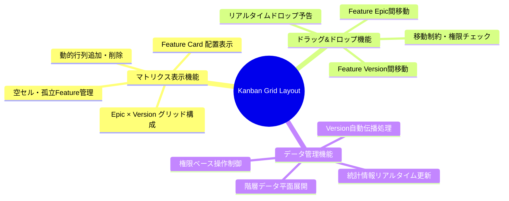

### 2.2 機能詳細
| 機能ID | 機能名 | 説明 | 優先度 | 受容条件 |
|--------|--------|------|---------|----------|
| G001 | 2次元マトリクス表示 | Epic行×Version列の格子状レイアウト | High | 全Epic・Versionが正確に表示 |
| G002 | Feature D&D移動 | Feature CardのEpic・Version間自由移動 | High | ドロップ時に即座にデータ更新 |
| G003 | 動的グリッド管理 | Epic・Version行列の追加・削除・編集 | High | 操作後グリッド構造即座更新 |
| G004 | 孤立Feature管理 | 親Epic未設定FeatureのNo Epic行表示 | High | 孤立状態Feature適切管理 |
| G005 | Version自動伝播 | Feature移動時の子要素Version継承 | Medium | 階層全体Version一貫性保持 |
| G006 | セル統計表示 | 各セルのFeature数・進捗率表示 | Medium | リアルタイム統計情報更新 |
| G007 | グリッドフィルタ | 条件絞り込み・キーワード検索機能 | Low | 大量データ快適操作対応 |

## 3. UI/UX設計仕様

### 3.1 コンポーネント階層構造
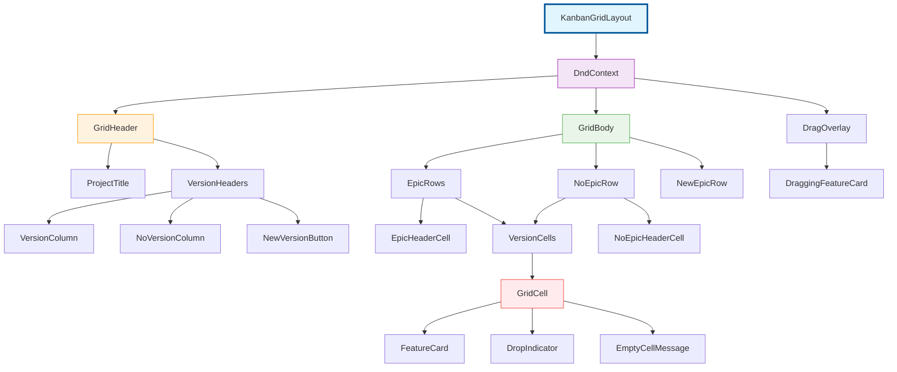

### 3.2 グリッド構造設計
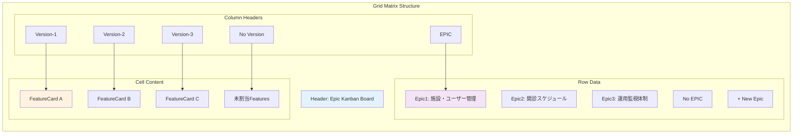

### 3.3 状態遷移設計
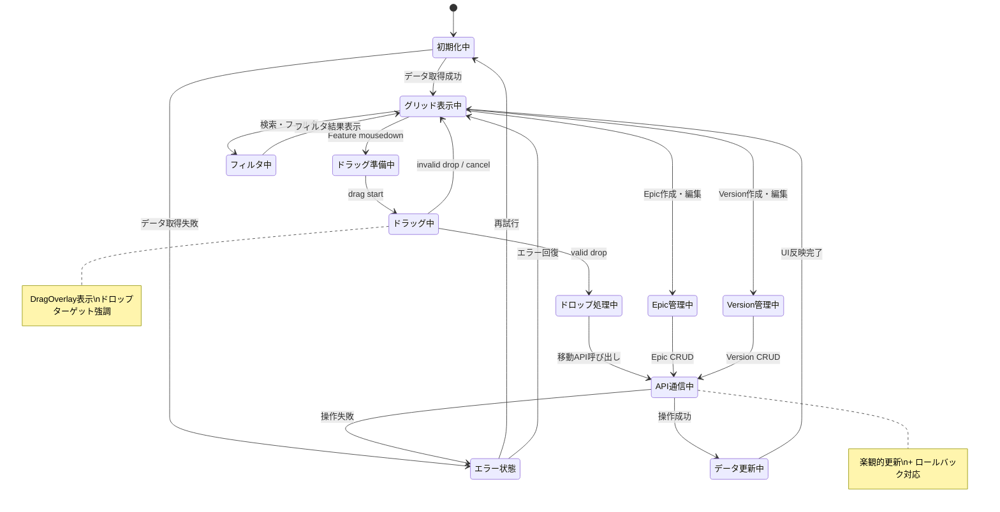

### 3.4 ユーザーインタラクション設計
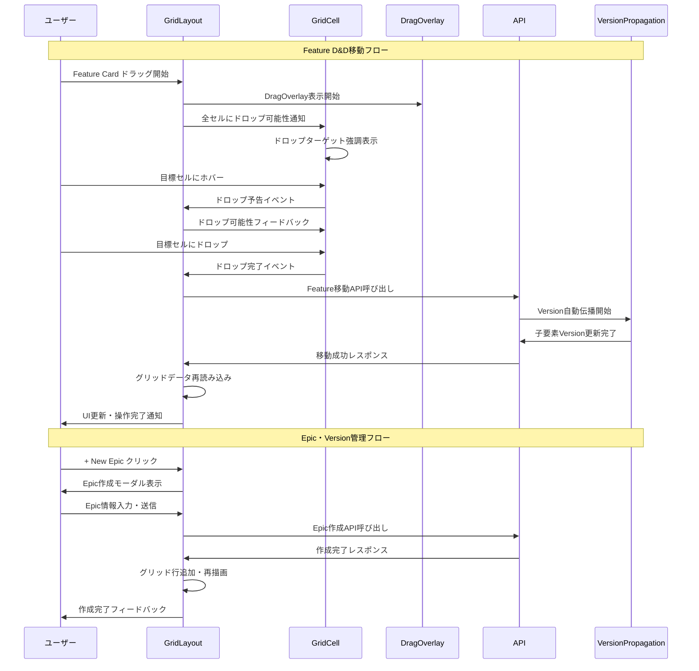

## 4. データ設計

### 4.1 データ構造
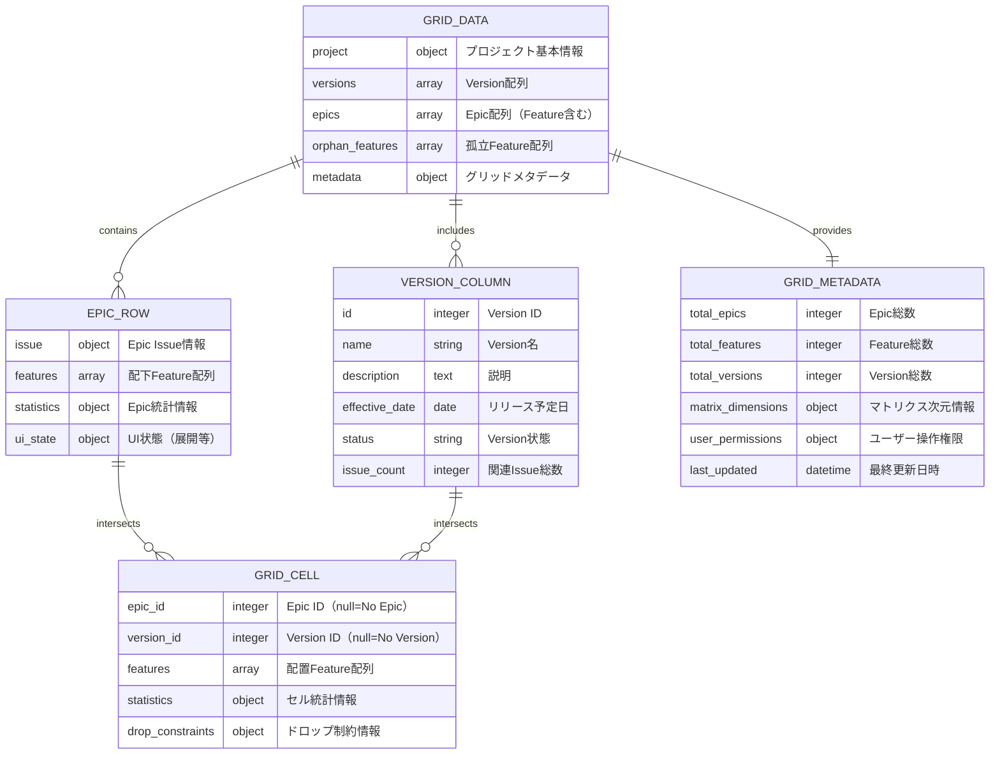

### 4.2 データフロー
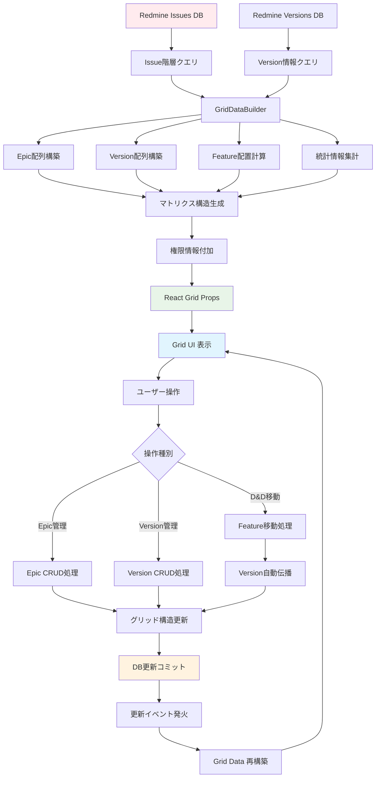

## 5. アーキテクチャ設計

### 5.1 システム構成
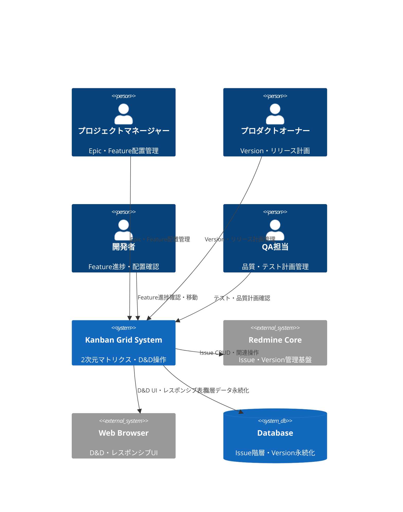

### 5.2 コンポーネント構成
```mermaid
C4Component
    Component(grid_ui, "Grid UI Layer", "React + @dnd-kit", "マトリクス表示・D&D操作")
    Component(grid_controller, "Grid Controller", "React Hooks + Context", "状態管理・イベント制御")
    Component(grid_service, "Grid Service", "GridDataBuilder", "マトリクス構造構築・変換")
    Component(dnd_service, "D&D Service", "@dnd-kit integration", "ドラッグ&ドロップ制御")
    Component(grid_api, "Grid API", "Rails GridController", "CRUD操作・データ配信")
    Component(version_service, "Version Service", "VersionPropagationService", "Version自動伝播処理")
    Component(issue_repository, "Issue Repository", "Redmine Issue + ActiveRecord", "Issue階層永続化")

    Rel(grid_ui, grid_controller, "状態参照・イベント発火")
    Rel(grid_ui, dnd_service, "D&D操作統合")
    Rel(grid_controller, grid_service, "データ変換要求")
    Rel(grid_controller, grid_api, "HTTP通信")
    Rel(grid_api, version_service, "Version伝播処理")
    Rel(grid_api, issue_repository, "Issue CRUD操作")

    style grid_ui fill:#e1f5fe
    style grid_controller fill:#f3e5f5
    style grid_service fill:#fff3e0
    style grid_api fill:#e8f5e8
```

## 6. インターフェース設計

### 6.1 Props インターフェース
```typescript
interface KanbanGridLayoutProps {
  // 基本プロパティ
  projectId: number;
  currentUser: UserData;

  // データ制御
  initialData?: GridData;
  onDataUpdate?: (updatedData: GridData) => void;
  onError?: (error: GridError) => void;

  // 表示制御
  compactMode?: boolean;
  showStatistics?: boolean;
  enableFiltering?: boolean;

  // D&D制御
  dragEnabled?: boolean;
  dropConstraints?: DropConstraintConfig;
}

interface GridData {
  project: ProjectMetadata;
  versions: VersionColumn[];
  epics: EpicRow[];
  orphan_features: FeatureCard[];
  matrix_dimensions: MatrixDimensions;
  metadata: GridMetadata;
}

interface GridCellData {
  coordinates: CellCoordinate;
  features: FeatureCard[];
  statistics: CellStatistics;
  drop_allowed: boolean;
  cell_type: 'epic-version' | 'epic-no-version' | 'no-epic-version' | 'no-epic-no-version';
}

interface DropConstraintConfig {
  epic_change_allowed: boolean;
  version_change_allowed: boolean;
  required_permissions: string[];
  max_features_per_cell?: number;
}
```

### 6.2 API インターフェース
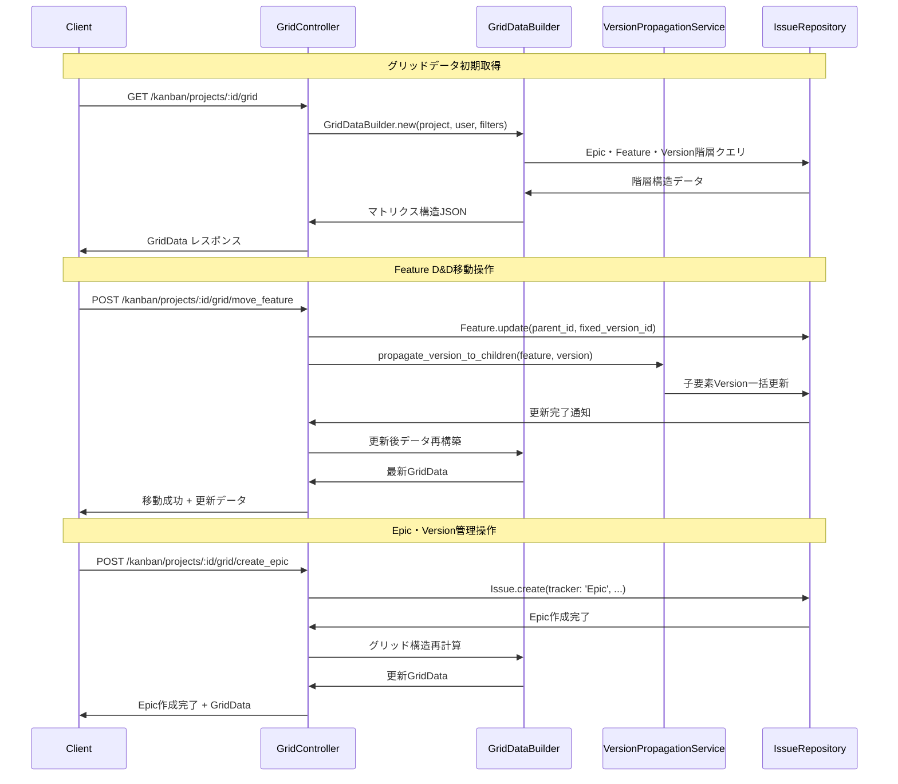

## 7. 非機能要求

### 7.1 パフォーマンス要求
| 項目 | 要求値 | 測定方法 | 想定条件 |
|------|---------|----------|----------|
| グリッド初期表示 | 5秒以内 | Time to Interactive | 100Epic×20Version |
| D&D操作レスポンス | 0.3秒以内 | Drag→Drop→UI更新 | 楽観的更新適用時 |
| セル追加・削除 | 2秒以内 | API→グリッド再描画 | 差分更新活用時 |
| 大量スクロール | 60FPS維持 | Chrome Performance | 仮想スクロール対応 |
| メモリ使用量 | セル当たり1.5MB以内 | DevTools Memory | React.memo最適化 |

### 7.2 品質要求
- **可用性**: 99.9%以上（Redmine本体稼働時）
- **保守性**: コンポーネント粒度テスト、循環複雑度8以下
- **拡張性**: 新トラッカー・カスタムフィールド追加対応
- **互換性**: Redmine 5.0-6.0、既存プラグイン共存

### 7.3 ユーザビリティ要求
- **学習性**: 初回利用時5分以内でD&D操作習得
- **効率性**: 従来画面遷移の70%時間短縮
- **満足度**: SUS（System Usability Scale）スコア80以上
- **アクセシビリティ**: WCAG 2.1 AA準拠

## 8. 実装指針

### 8.1 技術スタック
- **UI Framework**: React 18 + TypeScript 4.8+
- **D&D System**: @dnd-kit/core + @dnd-kit/sortable
- **レイアウト**: CSS Grid + Flexbox
- **状態管理**: useState + useContext（React Query併用）
- **API通信**: Fetch API + SWR（キャッシング・同期）

### 8.2 実装パターン
```typescript
// Grid Layout実装基本パターン（疑似コード）
export const KanbanGridLayout: FC<KanbanGridLayoutProps> = ({
  projectId,
  initialData,
  onDataUpdate
}) => {
  // 1. 状態管理（階層化）
  const [gridState, gridDispatch] = useReducer(gridReducer, {
    data: initialData,
    ui: { draggedCard: null, hoveredCell: null },
    loading: false,
    error: null
  });

  // 2. グリッド構造計算（メモ化）
  const gridMatrix = useMemo(() =>
    buildGridMatrix(gridState.data), [gridState.data]);

  // 3. D&D統合
  const sensors = useSensors(
    useSensor(PointerSensor, { activationConstraint: { distance: 8 } }),
    useSensor(KeyboardSensor, { coordinateGetter: sortableKeyboardCoordinates })
  );

  // 4. 操作ハンドラー（最適化）
  const handleDragEnd = useCallback(async (event: DragEndEvent) => {
    const { active, over } = event;

    if (!over || !validateDropTarget(active.data, over.data)) {
      return;
    }

    // 楽観的更新
    const optimisticUpdate = applyOptimisticMove(active.data, over.data);
    gridDispatch({ type: 'OPTIMISTIC_UPDATE', payload: optimisticUpdate });

    try {
      const result = await moveFeature(active.data.feature, over.data.cell);
      gridDispatch({ type: 'MOVE_SUCCESS', payload: result });
      onDataUpdate?.(result.updatedData);
    } catch (error) {
      gridDispatch({ type: 'MOVE_ROLLBACK', payload: { error } });
    }
  }, [onDataUpdate]);

  // 5. レンダリング（条件分岐最小化）
  return (
    <div className="kanban-grid-layout">
      <DndContext sensors={sensors} onDragEnd={handleDragEnd}>
        <GridHeader matrix={gridMatrix} />
        <GridBody
          matrix={gridMatrix}
          dragState={gridState.ui}
          onCellInteraction={handleCellInteraction}
        />
        <DragOverlay>
          {gridState.ui.draggedCard &&
            <FeatureCard {...gridState.ui.draggedCard} isDragging />}
        </DragOverlay>
      </DndContext>
    </div>
  );
};
```

### 8.3 パフォーマンス最適化戦略
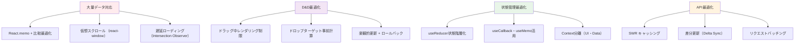

## 9. テスト設計

### 9.1 テスト戦略
```mermaid
pyramid
    title Grid Layout テストピラミッド

    "E2E（Playwright）" : 5
    "統合テスト（MSW + RTL）" : 25
    "コンポーネントテスト（RTL）" : 70
```

### 9.2 テストケース設計
| テストレベル | 対象コンポーネント | 主要テストケース | カバレッジ目標 |
|-------------|-------------------|------------------|----------------|
| 単体テスト | GridLayout・GridCell・D&D | 表示・移動・作成・削除・エラー処理 | 90%以上 |
| 統合テスト | API連携・状態管理 | データ取得・移動・伝播・整合性 | 85%以上 |
| E2Eテスト | ユーザーシナリオ | Epic追加→Feature移動→Version伝播 | 主要フロー100% |

### 9.3 テスト実装例
```typescript
// Grid Layout統合テスト例（疑似コード）
describe('KanbanGridLayout', () => {
  const mockGridData = createMockGridData({
    epics: 3,
    versions: 4,
    featuresPerEpic: 2
  });

  it('should display complete grid matrix', async () => {
    render(<KanbanGridLayout projectId={1} initialData={mockGridData} />);

    // Epic行表示確認
    expect(screen.getAllByTestId('epic-row')).toHaveLength(4); // 3 + No Epic

    // Version列表示確認
    expect(screen.getAllByTestId('version-column')).toHaveLength(5); // 4 + No Version

    // Feature Card配置確認
    expect(screen.getAllByTestId('feature-card')).toHaveLength(6); // 3×2
  });

  it('should perform drag and drop movement', async () => {
    const onDataUpdate = jest.fn();
    render(
      <KanbanGridLayout
        projectId={1}
        initialData={mockGridData}
        onDataUpdate={onDataUpdate}
      />
    );

    const featureCard = screen.getByText('Feature A');
    const targetCell = screen.getByTestId('cell-epic2-version3');

    // D&D操作実行
    await dragAndDrop(featureCard, targetCell);

    // API呼び出し確認
    expect(mockApi.moveFeature).toHaveBeenCalledWith({
      featureId: 1,
      targetEpicId: 2,
      targetVersionId: 3
    });

    // データ更新コールバック確認
    expect(onDataUpdate).toHaveBeenCalled();
  });
});
```

## 10. 運用・保守設計

### 10.1 監視・ログ設計
- **パフォーマンス監視**: Web Vitals測定（LCP, FID, CLS）
- **操作ログ**: D&D操作・Epic/Version作成をRedmine Journal記録
- **エラートラッキング**: クライアントサイドエラー→サーバーログ連携
- **使用状況分析**: グリッド操作パターン・頻度分析

### 10.2 更新・デプロイ戦略
- **段階的リリース**: 機能フラグによる段階的展開
- **A/Bテスト**: 新UI・旧UI並行運用による効果測定
- **ロールバック**: webpack chunk単位の部分ロールバック
- **データ移行**: Issue階層変更時の自動マイグレーション

### 10.3 スケーラビリティ対応
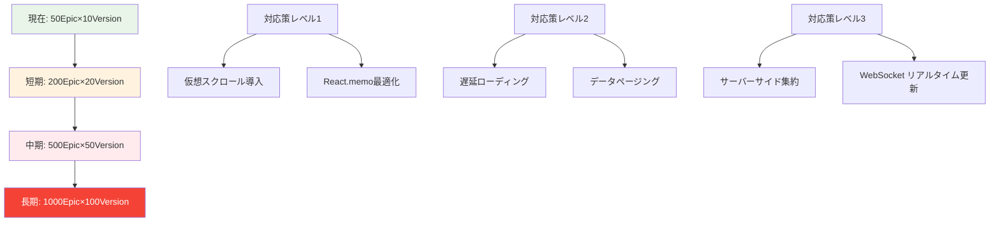

---

*Kanban Grid Layoutは、Epic×Versionの2次元マトリクスでプロジェクト全体を俯瞰し、直感的なD&D操作でFeature配置を最適化する中核システムです。この設計書は実装コードではなく、設計思想・要求仕様・アーキテクチャ構造を体系化し、開発・運用チーム全体での共通理解を促進します。*