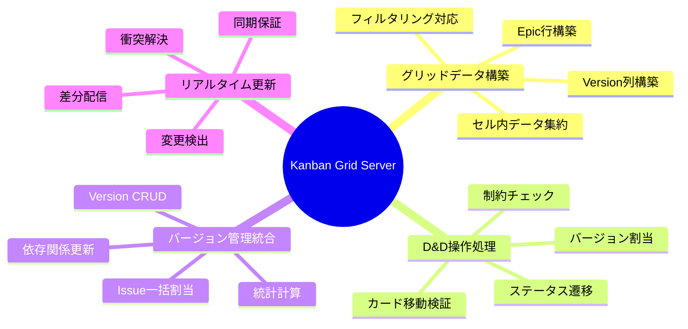
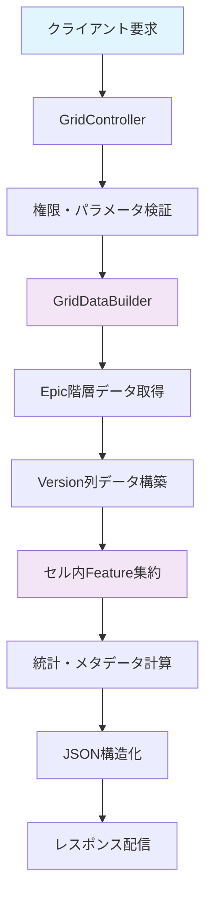
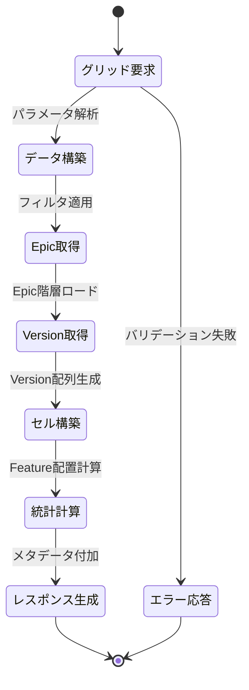
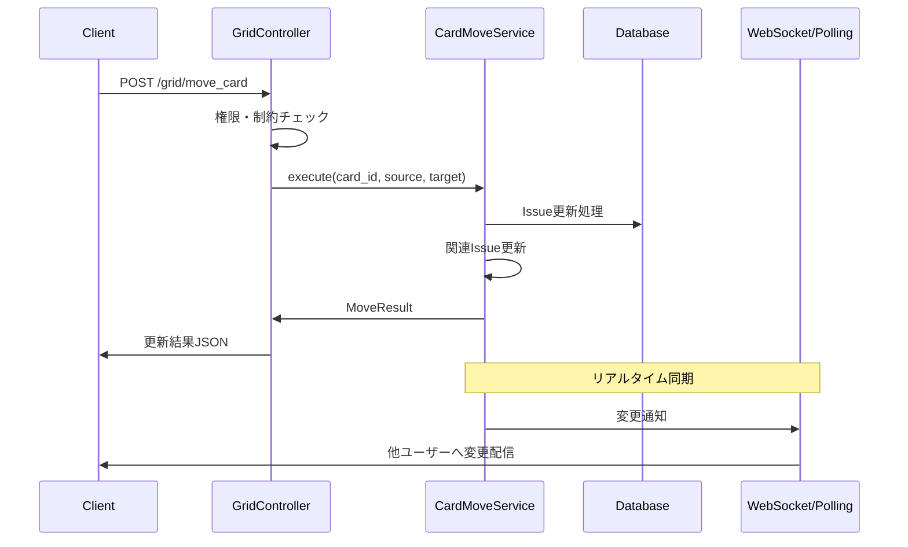
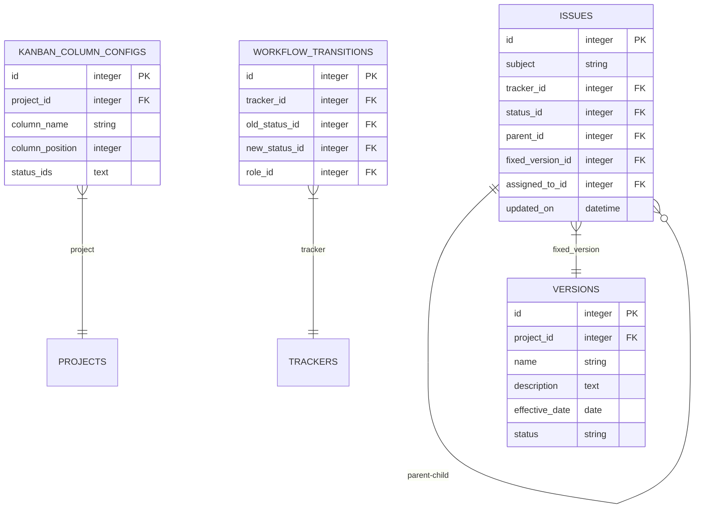
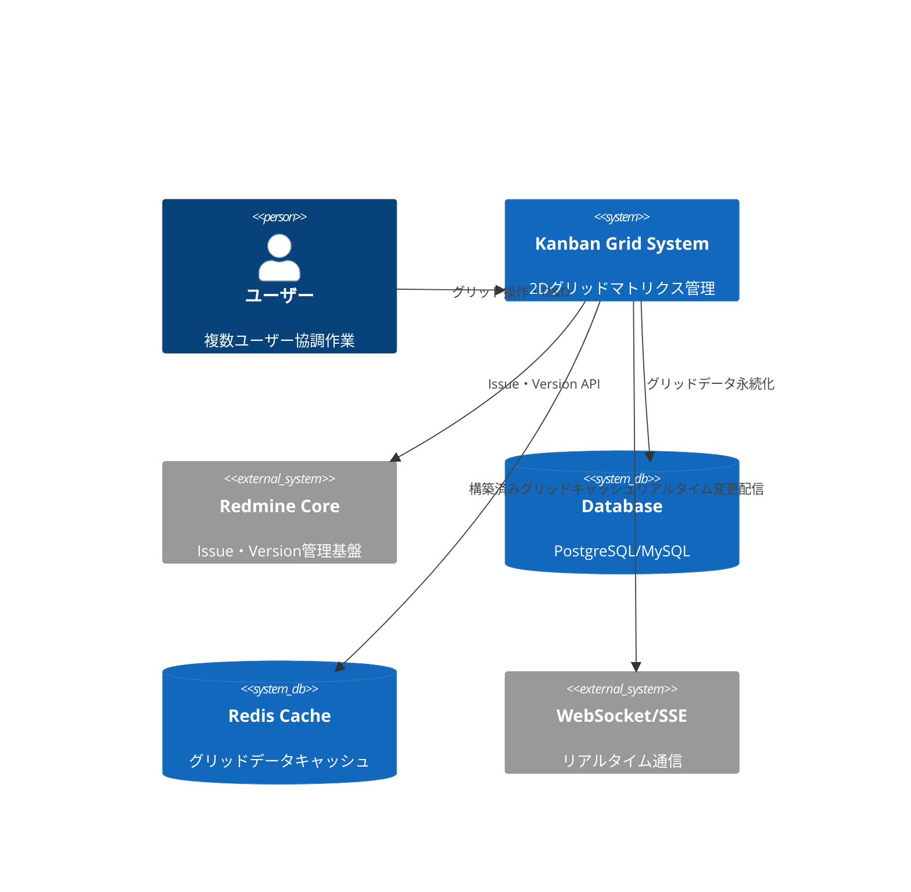
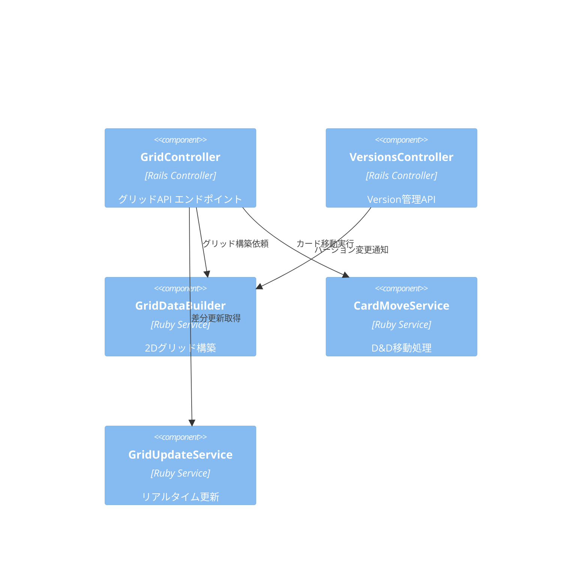
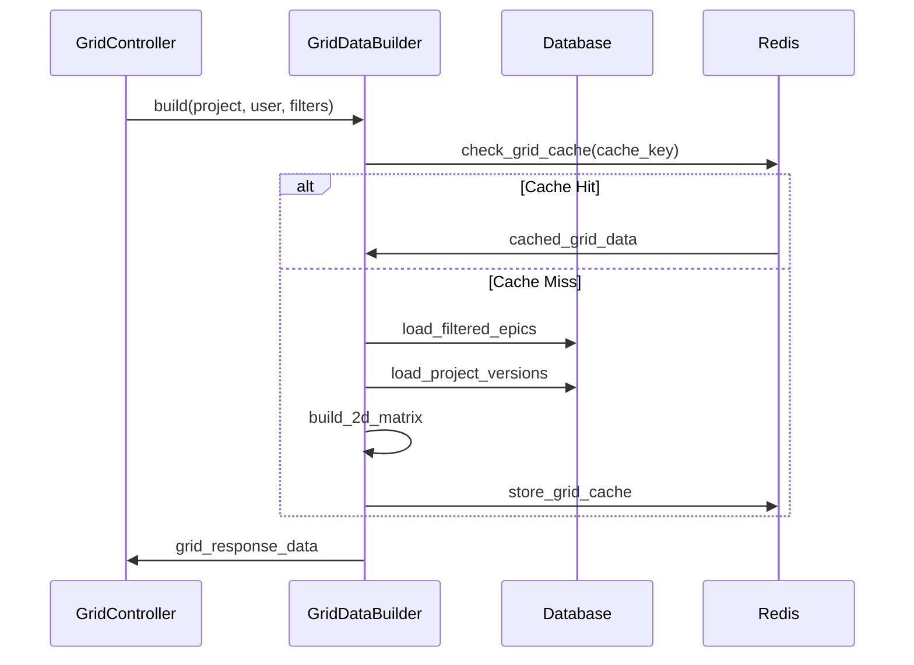
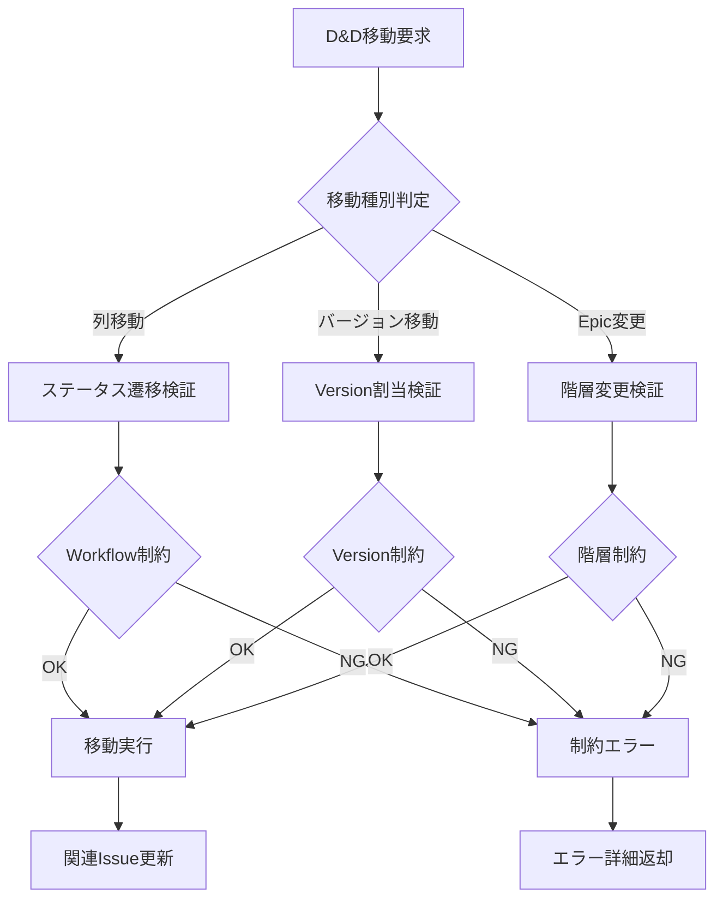

# Kanban Grid サーバーサイド詳細設計書

## 🔗 関連ドキュメント
- @vibes/docs/logics/wireframe/kanban_ui_grid_layout.drawio
- @vibes/rules/technical_architecture_standards.md
- @vibes/logics/kanban_grid/kanban_grid_layout_specification.md

## 1. 設計概要

### 1.1 設計目的・背景
**なぜこのサーバーサイド実装が必要なのか**
- ビジネス要件：2次元グリッド（Epic行×Version列）データの効率的な構築・配信、リアルタイム同期
- ユーザー価値：直感的な D&D操作、バージョン管理統合、複数ユーザー協調作業支援
- システム価値：データ整合性保持、パフォーマンス最適化、拡張可能なグリッド構造

### 1.2 設計方針
**どのようなアプローチで実現するか**
- 主要設計思想：2D マトリクス構造、リアルタイム更新、階層データ整合性重視
- 技術選択理由：Rails MVC + Service層、JSON API設計、WebSocket/ポーリング併用
- 制約・前提条件：Redmine版管理統合、Issue階層準拠、マルチユーザー対応

## 2. 機能要求仕様

### 2.1 主要機能


### 2.2 機能詳細
| 機能ID | 機能名 | 説明 | 優先度 | 受容条件 |
|--------|--------|------|---------|----------|
| GS001 | 2Dグリッド構築 | Epic×Versionマトリクス効率的構築 | High | N+1クエリ回避、3秒以内レスポンス |
| GS002 | カード移動処理 | D&D操作の状態・バージョン更新 | High | 制約検証、ロールバック対応 |
| GS003 | バージョン管理 | Version作成・更新・Issue割当 | High | 依存関係整合性、一括処理対応 |
| GS004 | リアルタイム同期 | マルチユーザー間のグリッド状態同期 | Medium | 衝突検出、差分更新配信 |
| GS005 | フィルタ・検索 | Epic・Version・ステータス・担当者フィルタ | Medium | 動的フィルタ、組み合わせ対応 |

## 3. UI/UX設計仕様

### 3.1 サーバーサイド処理フロー


### 3.2 状態遷移設計


### 3.3 D&D操作シーケンス設計


## 4. データ設計

### 4.1 データ構造


### 4.2 データフロー


## 5. アーキテクチャ設計

### 5.1 システム構成


### 5.2 コンポーネント構成


## 6. インターフェース設計

### 6.1 Grid Controller インターフェース
```ruby
# Grid API エンドポイント設計（疑似コード）
class GridController
  # GET /kanban/projects/:project_id/grid
  def index
    response_format: {
      grid: {
        rows: Array<EpicRow>,
        columns: Array<ColumnConfig>,
        versions: Array<Version>
      },
      metadata: {
        project: ProjectInfo,
        user_permissions: Hash,
        grid_configuration: GridConfig
      },
      statistics: {
        overview: ProjectStats,
        by_version: VersionStats,
        by_status: StatusDistribution
      }
    }
  end

  # POST /grid/move_card
  def move_card
    params: {
      card_id: Integer,
      source_cell: { epic_id, version_id, column_id },
      target_cell: { epic_id, version_id, column_id }
    }
    response_format: {
      updated_card: Issue,
      affected_cells: Array<CellUpdate>,
      statistics_update: StatsDelta
    }
  end

  # GET /grid/updates?since=timestamp
  def real_time_updates
    response_format: {
      updates: Array<IssueUpdate>,
      deleted_issues: Array<Integer>,
      grid_structure_changes: Array<GridChange>
    }
  end
end
```

### 6.2 Grid構築インターフェース


## 7. 非機能要求

### 7.1 パフォーマンス要求
| 項目 | 要求値 | 測定方法 |
|------|---------|----------|
| グリッド初期表示 | 3秒以内 | Epic×Version マトリクス構築時間 |
| D&D移動処理 | 1秒以内 | カード移動〜UI更新完了時間 |
| リアルタイム更新 | 5秒以内 | 変更検出〜配信完了時間 |
| 大規模グリッド | 100 Epic × 20 Version対応 | メモリ使用量・クエリ性能 |

### 7.2 品質要求
- **可用性**: マルチユーザー同時操作99.9%成功率
- **保守性**: Service層テストカバレッジ90%以上、Controller層85%以上
- **拡張性**: 新Tracker・カスタムフィールド対応可能な抽象化

## 8. 実装指針

### 8.1 技術スタック
- **バックエンド**: Ruby on Rails 6.1+ (Redmine準拠)
- **データベース**: PostgreSQL/MySQL (複雑クエリ最適化)
- **キャッシュ**: Redis (グリッドデータ・統計キャッシュ)
- **リアルタイム**: ActionCable/Server-Sent Events
- **テスト**: RSpec + FactoryBot + JSON Schema検証

### 8.2 実装パターン
```ruby
# GridDataBuilder実装パターン（疑似コード）
class GridDataBuilder
  # 1. キャッシュ戦略
  def build
    Rails.cache.fetch(cache_key, expires_in: 5.minutes) do
      build_grid_structure
    end
  end

  # 2. N+1クエリ回避 + トラッカー判定システム
  def load_filtered_epics
    # ⚠️ 重要: 設定ベースのトラッカー判定
    epic_tracker_name = Kanban::TrackerHierarchy.tracker_names[:epic]

    @project.issues
            .includes(:tracker, :status, :fixed_version,
                     children: [:tracker, :status, :fixed_version])
            .joins(:tracker)
            .where(trackers: { name: epic_tracker_name })
            # ← 'Epic'ハードコーディングではなく設定値使用
  end

  # トラッカー階層設定取得（TrackerHierarchy.rb）
  # settings = Setting.plugin_redmine_release_kanban || {}
  # {
  #   epic: settings['epic_tracker'] || 'Epic',
  #   feature: settings['feature_tracker'] || 'Feature',
  #   user_story: settings['user_story_tracker'] || 'UserStory'
  # }

  # 3. 2Dマトリクス効率構築
  def build_epic_row(epic, versions, columns)
    versions.map { |version| build_grid_cell(epic, version) }
  end
end
```

### 8.3 エラーハンドリング戦略


## 9. テスト設計

テスト戦略・ケース設計・実装については以下を参照：
- @vibes/rules/testing/server_side_testing_strategy.md
- @vibes/rules/testing/kanban_grid_server_test_specification.md

## 10. 運用・保守設計

### 10.1 監視・ログ設計
- **パフォーマンス監視**: グリッド構築時間、D&D処理時間、メモリ使用量
- **エラートラッキング**: 移動制約違反、データ不整合、同時更新衝突
- **利用状況分析**: グリッドサイズ分布、操作頻度、リアルタイム同期負荷

### 10.2 スケーラビリティ対応
- **水平分割**: プロジェクト単位でのデータ分散
- **キャッシュ戦略**: Redis Cluster、グリッドデータ段階的キャッシュ
- **非同期処理**: 大規模一括操作のジョブキュー化

---

*Kanban Grid サーバーサイド実装は、Epic×Versionの2次元マトリクス構造を効率的に構築・配信し、リアルタイムなD&D操作とマルチユーザー協調作業を支援する基盤設計です。スケーラブルなアーキテクチャにより大規模プロジェクトでも高いパフォーマンスを実現します。*