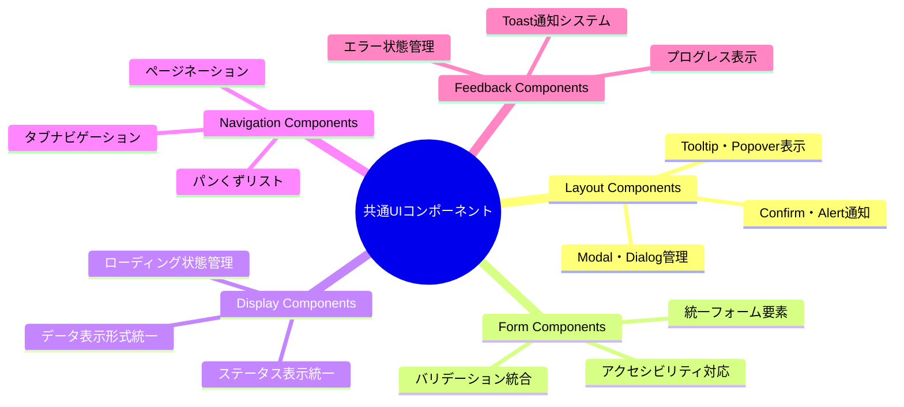
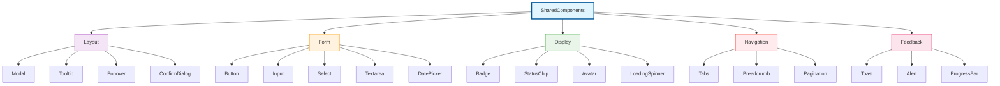
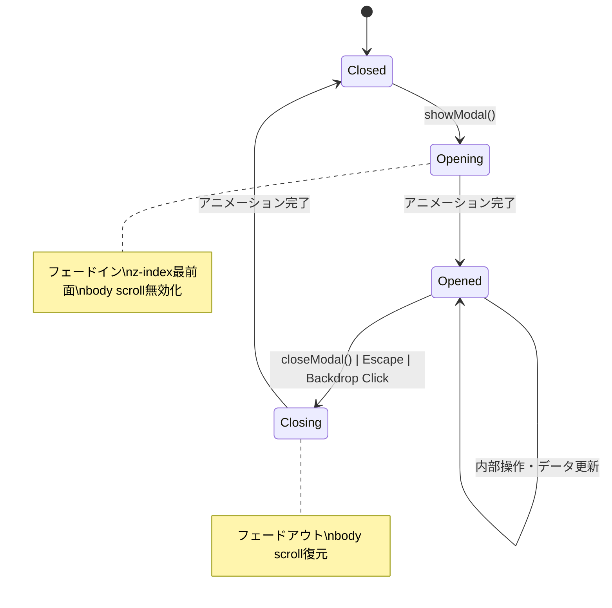
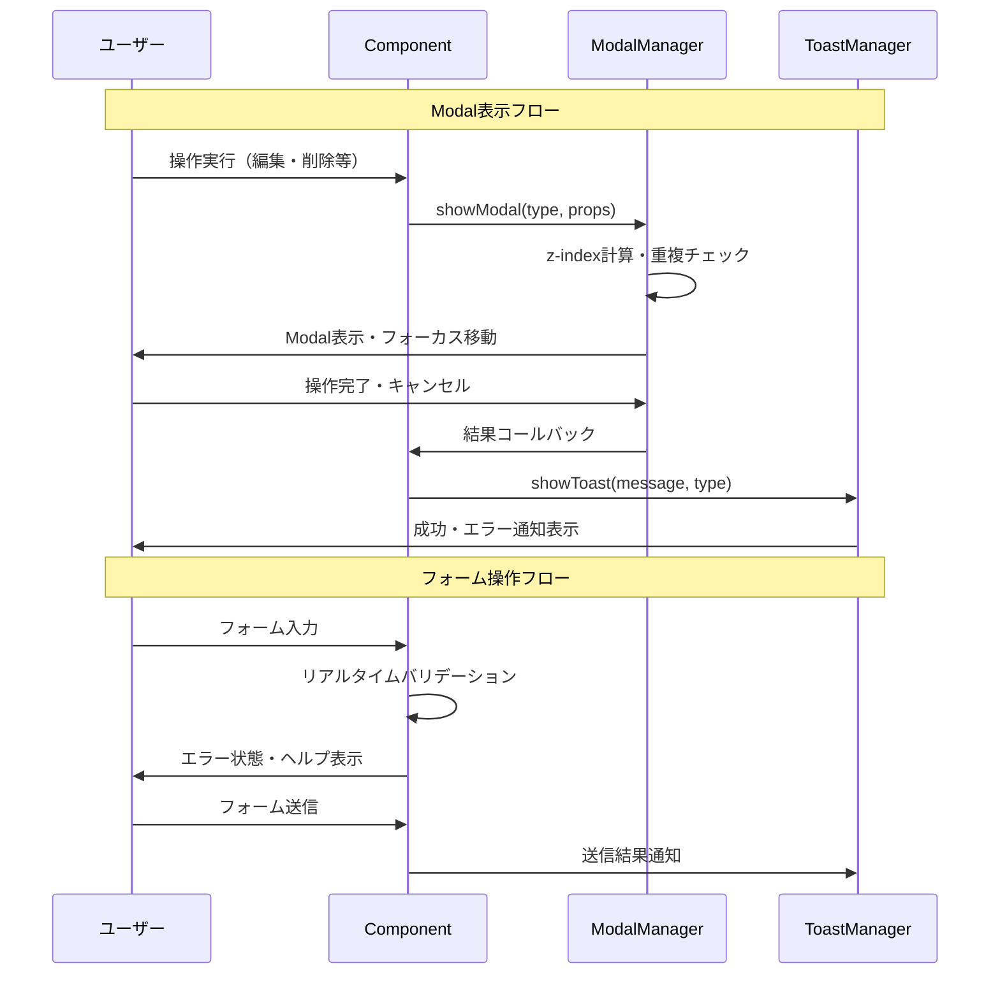
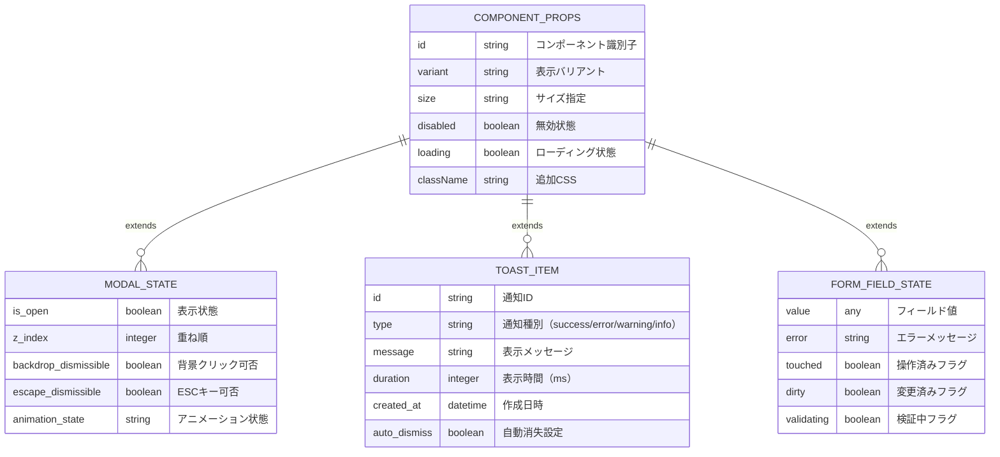
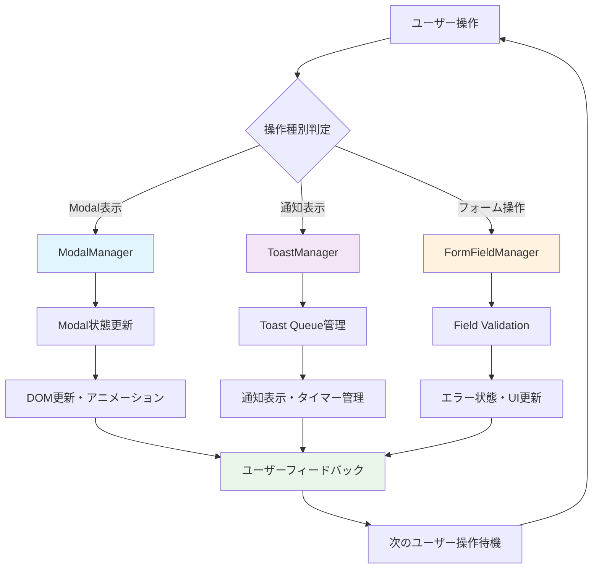
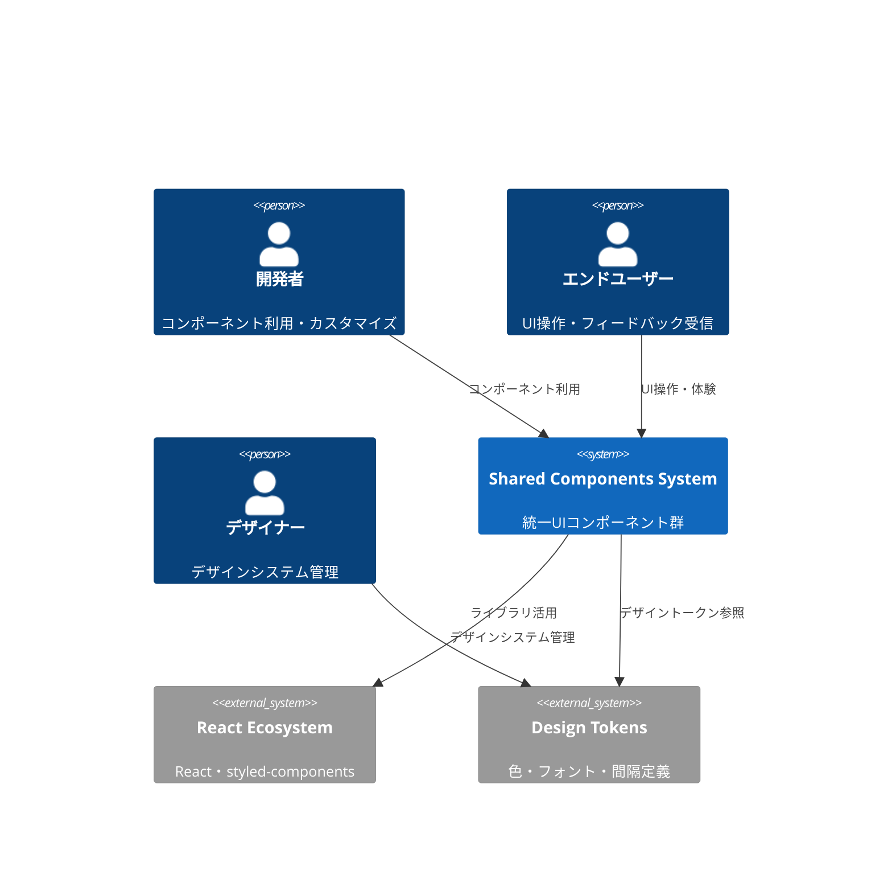
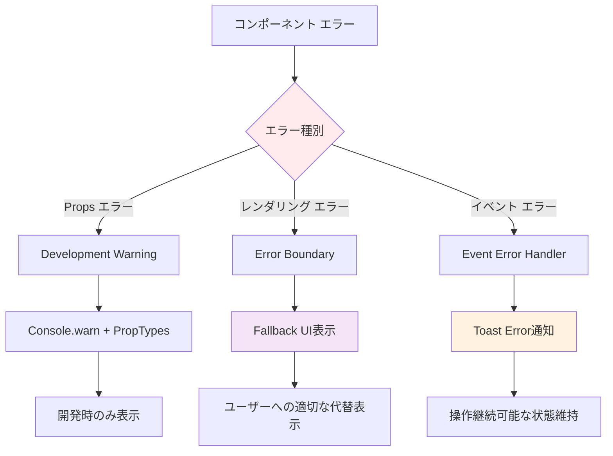
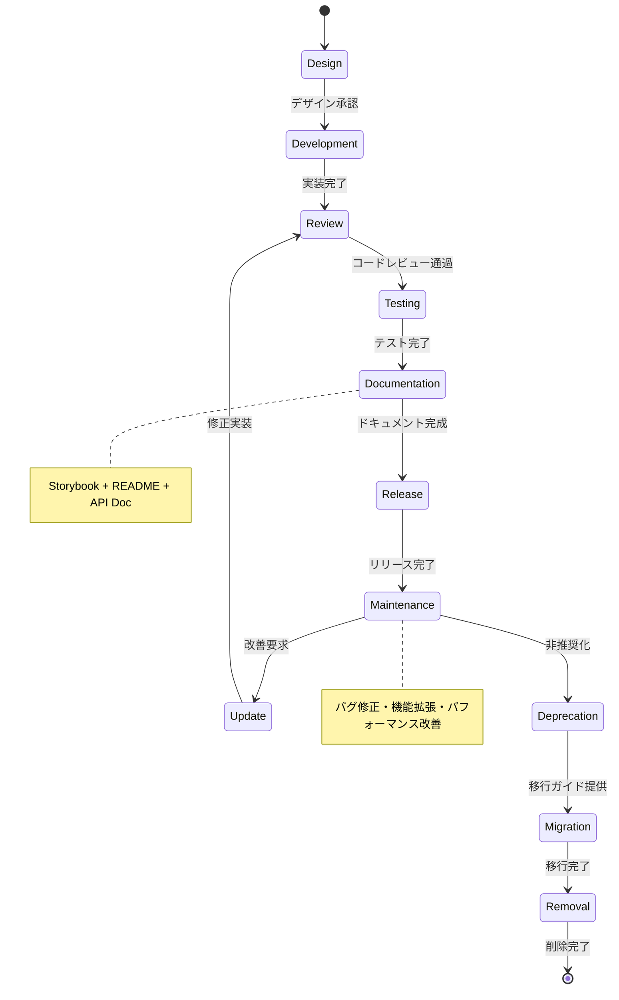
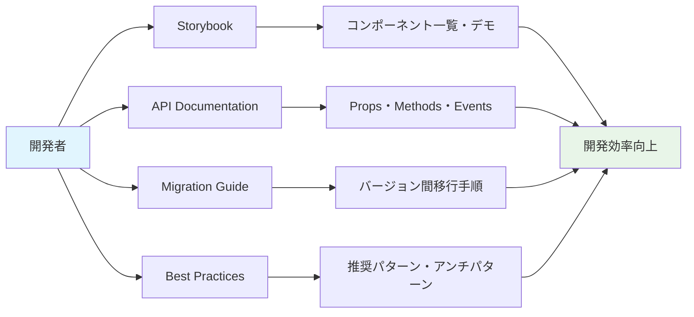

# 共通UIコンポーネント 詳細設計書

## 🔗 関連ドキュメント
- @vibes/logics/ui_components/feature_card/feature_card_component_specification.md
- @vibes/logics/ui_components/kanban_grid/kanban_grid_layout_specification.md
- @vibes/rules/technical_architecture_standards.md

## 1. 設計概要

### 1.1 設計目的・背景
**なぜこの共通コンポーネント群が必要なのか**
- ビジネス要件：統一されたUXによるユーザー学習コスト削減、開発効率向上
- ユーザー価値：一貫性のある操作感、予測可能なインタラクション、アクセシビリティ対応
- システム価値：再利用性向上、保守性確保、デザインシステム統一、品質担保

### 1.2 設計方針
**どのようなアプローチで実現するか**
- 主要設計思想：Atomic Design、単一責務原則、合成可能性、テスト容易性
- 技術選択理由：React（合成パターン）、TypeScript（型安全性）、CSS-in-JS（スコープ化）
- 制約・前提条件：Redmine UI統合、既存スタイル踏襲、パフォーマンス配慮、アクセシビリティ準拠

## 2. 機能要求仕様

### 2.1 主要機能


### 2.2 機能詳細
| 機能ID | コンポーネント名 | 説明 | 優先度 | 受容条件 |
|--------|------------------|------|---------|----------|
| SC001 | Modal | モーダルダイアログ表示・管理 | High | キーボード・マウス操作対応 |
| SC002 | Button | 統一ボタンコンポーネント | High | 全バリアント・状態対応 |
| SC003 | Toast | 通知メッセージ表示システム | High | 自動消失・スタック管理 |
| SC004 | StatusChip | ステータス表示統一 | High | Issue状態色・アイコン統一 |
| SC005 | ConfirmDialog | 確認ダイアログ統一 | Medium | 危険操作時の適切な警告 |
| SC006 | LoadingSpinner | ローディング状態表示 | Medium | 非同期処理中の適切フィードバック |
| SC007 | Tooltip | ヘルプ・説明表示 | Medium | ホバー・フォーカス対応 |
| SC008 | Input・Select | フォーム要素統一 | Low | バリデーション・エラー表示 |

## 3. UI/UX設計仕様

### 3.1 コンポーネント階層構造


### 3.2 Modal システム状態遷移


### 3.3 Toast 通知システム設計
```mermaid
stateDiagram-v2
    [*] --> Queue待機
    Queue待機 --> 表示中: show()
    表示中 --> 自動消失待ち: タイマー開始
    表示中 --> ホバー中: マウスホバー
    ホバー中 --> 表示中: マウスリーブ
    自動消失待ち --> 消失中: タイマー完了
    表示中 --> 消失中: 手動クローズ
    消失中 --> [*]: アニメーション完了

    note right of 自動消失待ち: success: 3秒\nerror: 5秒\nwarning: 4秒
    note right of ホバー中: タイマー一時停止
```

### 3.4 ユーザーインタラクション設計


## 4. データ設計

### 4.1 データ構造


### 4.2 データフロー


## 5. アーキテクチャ設計

### 5.1 システム構成


### 5.2 コンポーネント構成
```mermaid
C4Component
    Component(component_lib, "Component Library", "React Components", "統一UIコンポーネント")
    Component(theme_provider, "Theme Provider", "Context + CSS-in-JS", "テーマ・スタイル管理")
    Component(modal_manager, "Modal Manager", "React Portal + Context", "モーダル状態管理")
    Component(toast_manager, "Toast Manager", "React Context + Queue", "通知システム管理")
    Component(form_manager, "Form Manager", "React Hook Form", "フォーム状態・バリデーション")
    Component(accessibility, "A11y Helper", "ARIA・Focus管理", "アクセシビリティ支援")

    Rel(component_lib, theme_provider, "スタイル適用")
    Rel(component_lib, modal_manager, "モーダル制御")
    Rel(component_lib, toast_manager, "通知発信")
    Rel(component_lib, form_manager, "フォーム統合")
    Rel(component_lib, accessibility, "A11y対応")

    style component_lib fill:#e1f5fe
    style theme_provider fill:#f3e5f5
    style modal_manager fill:#fff3e0
    style toast_manager fill:#e8f5e8
```

## 6. インターフェース設計

### 6.1 Props インターフェース
```typescript
// 基底コンポーネントProps
interface BaseComponentProps {
  className?: string;
  testId?: string;
  children?: React.ReactNode;
}

// Modal Props
interface ModalProps extends BaseComponentProps {
  isOpen: boolean;
  onClose: () => void;
  title: string;
  size?: 'small' | 'medium' | 'large' | 'fullscreen';
  closeOnBackdropClick?: boolean;
  closeOnEscape?: boolean;
  zIndex?: number;
}

// Button Props
interface ButtonProps extends BaseComponentProps {
  variant?: 'primary' | 'secondary' | 'danger' | 'ghost';
  size?: 'small' | 'medium' | 'large';
  loading?: boolean;
  disabled?: boolean;
  onClick?: (event: React.MouseEvent) => void;
  type?: 'button' | 'submit' | 'reset';
  icon?: React.ReactNode;
  fullWidth?: boolean;
}

// Toast Props
interface ToastProps extends BaseComponentProps {
  type: 'success' | 'error' | 'warning' | 'info';
  message: string;
  duration?: number;
  autoClose?: boolean;
  onClose?: () => void;
  action?: {
    label: string;
    onClick: () => void;
  };
}

// StatusChip Props
interface StatusChipProps extends BaseComponentProps {
  status: IssueStatus;
  size?: 'small' | 'medium';
  clickable?: boolean;
  onClick?: () => void;
}

// Form Field Props
interface FormFieldProps extends BaseComponentProps {
  label: string;
  value: any;
  onChange: (value: any) => void;
  error?: string;
  required?: boolean;
  disabled?: boolean;
  placeholder?: string;
  helperText?: string;
}
```

### 6.2 Context API設計
```typescript
// Modal Context
interface ModalContextValue {
  showModal: (component: React.ComponentType, props?: any) => string;
  closeModal: (id: string) => void;
  closeAllModals: () => void;
  activeModals: ModalInstance[];
}

// Toast Context
interface ToastContextValue {
  showToast: (toast: ToastOptions) => string;
  removeToast: (id: string) => void;
  clearAllToasts: () => void;
  toasts: ToastInstance[];
}

// Theme Context
interface ThemeContextValue {
  currentTheme: ThemeConfig;
  colors: ColorTokens;
  typography: TypographyTokens;
  spacing: SpacingTokens;
  breakpoints: BreakpointTokens;
  setTheme: (theme: ThemeConfig) => void;
}
```

### 6.3 Hook API設計
```typescript
// Modal Hook
const useModal = () => {
  const showConfirm = (options: ConfirmOptions) => Promise<boolean>;
  const showAlert = (message: string, type?: AlertType) => void;
  const showCustomModal = (component: React.ComponentType, props?: any) => string;

  return { showConfirm, showAlert, showCustomModal };
};

// Toast Hook
const useToast = () => {
  const showSuccess = (message: string) => void;
  const showError = (message: string) => void;
  const showWarning = (message: string) => void;
  const showInfo = (message: string) => void;

  return { showSuccess, showError, showWarning, showInfo };
};

// Form Hook
const useFormField = <T>(initialValue: T, validators?: Validator<T>[]) => {
  const value: T;
  const error: string | null;
  const touched: boolean;
  const setValue: (value: T) => void;
  const validate: () => boolean;
  const reset: () => void;

  return { value, error, touched, setValue, validate, reset };
};
```

## 7. 非機能要求

### 7.1 パフォーマンス要求
| 項目 | 要求値 | 測定方法 | 備考 |
|------|---------|----------|------|
| コンポーネント初期化 | 100ms以内 | React DevTools Profiler | 初回マウント時 |
| Modal表示・非表示 | 300ms以内 | アニメーション完了まで | CSS transition |
| Toast表示応答 | 50ms以内 | API呼び出し→表示開始 | キュー処理含む |
| フォームバリデーション | 200ms以内 | 入力→エラー表示 | 複雑バリデーション |
| メモリ使用量 | 1コンポーネント100KB以内 | Bundle analyzer | Tree shaking適用 |

### 7.2 品質要求
- **可用性**: 99.9%以上（エラー境界による保護）
- **保守性**: 単一責務・高凝集・低結合、テストカバレッジ90%以上
- **拡張性**: 新コンポーネント追加・既存カスタマイズ容易
- **互換性**: React 16.8+ 対応、主要ブラウザ対応

### 7.3 アクセシビリティ要求
- **WCAG 2.1 AA準拠**: すべてのコンポーネントで対応
- **キーボード操作**: Tab・Enter・Spaceキー完全対応
- **スクリーンリーダー**: ARIA属性適切設定
- **色覚サポート**: 色以外の手段でも情報伝達
- **フォーカス管理**: Modal・Toast適切なフォーカス制御

## 8. 実装指針

### 8.1 技術スタック
- **UI Framework**: React 18 + TypeScript 4.8+
- **スタイリング**: styled-components + CSS-in-JS
- **アニメーション**: CSS Transitions + React Transition Group
- **フォーム管理**: React Hook Form + yup（バリデーション）
- **テスト**: Jest + React Testing Library + Storybook

### 8.2 実装パターン
```typescript
// 共通コンポーネント基本パターン（疑似コード）
export const Button: FC<ButtonProps> = ({
  variant = 'primary',
  size = 'medium',
  loading = false,
  disabled = false,
  children,
  onClick,
  ...restProps
}) => {
  // 1. 状態管理（必要最小限）
  const [isPressed, setIsPressed] = useState(false);

  // 2. スタイル計算（メモ化）
  const buttonStyles = useMemo(() => ({
    variant,
    size,
    loading,
    disabled: disabled || loading,
    pressed: isPressed
  }), [variant, size, loading, disabled, isPressed]);

  // 3. イベントハンドラー（最適化）
  const handleClick = useCallback((event: React.MouseEvent) => {
    if (disabled || loading) return;
    onClick?.(event);
  }, [disabled, loading, onClick]);

  const handleMouseDown = useCallback(() => setIsPressed(true), []);
  const handleMouseUp = useCallback(() => setIsPressed(false), []);

  // 4. アクセシビリティ対応
  const ariaProps = {
    'aria-disabled': disabled || loading,
    'aria-busy': loading,
    role: 'button',
    tabIndex: disabled ? -1 : 0
  };

  // 5. レンダリング（条件分岐最小化）
  return (
    <StyledButton
      {...restProps}
      {...ariaProps}
      styleProps={buttonStyles}
      onClick={handleClick}
      onMouseDown={handleMouseDown}
      onMouseUp={handleMouseUp}
    >
      {loading && <LoadingSpinner size="small" />}
      {children}
    </StyledButton>
  );
};

// styled-components実装例
const StyledButton = styled.button<{ styleProps: ButtonStyleProps }>`
  ${({ styleProps, theme }) => css`
    // 基本スタイル
    border: none;
    border-radius: ${theme.borderRadius.medium};
    cursor: ${styleProps.disabled ? 'not-allowed' : 'pointer'};
    transition: all 0.2s ease;

    // バリアント別スタイル
    ${getVariantStyles(styleProps.variant, theme)}

    // サイズ別スタイル
    ${getSizeStyles(styleProps.size, theme)}

    // 状態別スタイル
    ${styleProps.disabled && disabledStyles}
    ${styleProps.loading && loadingStyles}
    ${styleProps.pressed && pressedStyles}
  `}
`;
```

### 8.3 エラーハンドリング戦略


## 9. テスト設計

### 9.1 テスト戦略
```mermaid
pyramid
    title 共通コンポーネント テストピラミッド

    "Visual Regression (Chromatic)" : 5
    "Integration (MSW + RTL)" : 15
    "Component Test (RTL)" : 50
    "Unit Test (Jest)" : 30
```

### 9.2 テストケース設計
| テストレベル | 対象 | 主要テストケース | カバレッジ目標 |
|-------------|------|------------------|----------------|
| Unit Test | Hooks・Utils | ロジック・計算・変換処理 | 95%以上 |
| Component Test | 個別コンポーネント | Props・イベント・状態変化 | 90%以上 |
| Integration Test | Context・Manager | 複数コンポーネント連携 | 80%以上 |
| Visual Test | Storybook | デザイン回帰・アクセシビリティ | 主要パターン100% |

### 9.3 Storybook活用設計
```typescript
// Button.stories.tsx（疑似コード）
export default {
  title: 'Components/Button',
  component: Button,
  argTypes: {
    variant: {
      control: { type: 'select' },
      options: ['primary', 'secondary', 'danger', 'ghost']
    },
    size: {
      control: { type: 'select' },
      options: ['small', 'medium', 'large']
    }
  }
} as ComponentMeta<typeof Button>;

// 基本パターン
export const Default: ComponentStory<typeof Button> = (args) => (
  <Button {...args}>ボタン</Button>
);

// バリエーション展示
export const AllVariants = () => (
  <div style={{ display: 'flex', gap: '1rem' }}>
    {['primary', 'secondary', 'danger', 'ghost'].map(variant => (
      <Button key={variant} variant={variant}>
        {variant}
      </Button>
    ))}
  </div>
);

// インタラクション テスト
export const WithInteraction: ComponentStory<typeof Button> = () => {
  const [count, setCount] = useState(0);

  return (
    <Button onClick={() => setCount(c => c + 1)}>
      クリック数: {count}
    </Button>
  );
};

// アクセシビリティ テスト
WithInteraction.play = async ({ canvasElement }) => {
  const canvas = within(canvasElement);
  const button = canvas.getByRole('button');

  await userEvent.tab(); // キーボードフォーカス確認
  await expect(button).toHaveFocus();

  await userEvent.click(button); // クリック動作確認
  await expect(canvas.getByText('クリック数: 1')).toBeInTheDocument();
};
```

## 10. 運用・保守設計

### 10.1 コンポーネント ライフサイクル管理


### 10.2 バージョニング戦略
- **Semantic Versioning**: MAJOR.MINOR.PATCH形式
  - MAJOR: 破壊的変更（Props API変更等）
  - MINOR: 後方互換性ある機能追加
  - PATCH: バグ修正・パフォーマンス改善
- **Breaking Changes**: 事前告知 + 移行ガイド + 段階的廃止
- **リリース頻度**: 月1回メジャー、随時パッチ

### 10.3 品質管理・監視
- **自動品質チェック**: ESLint・Prettier・TypeScript・テスト必須
- **デザインレビュー**: Figma連携・デザインシステム準拠確認
- **パフォーマンス監視**: Bundle size・レンダリング時間測定
- **使用状況分析**: コンポーネント利用頻度・エラー発生傾向

### 10.4 コミュニティ・ドキュメント


---

*共通UIコンポーネントは、Kanban Release システム全体の統一されたユーザー体験を支える基盤です。この設計書は実装コードではなく、設計思想・要求仕様・アーキテクチャ構造を明確化し、開発チームの効率的な協働と高品質なコンポーネント開発を実現します。*