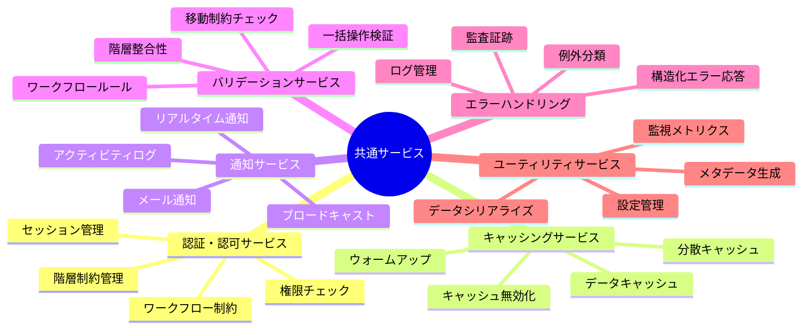
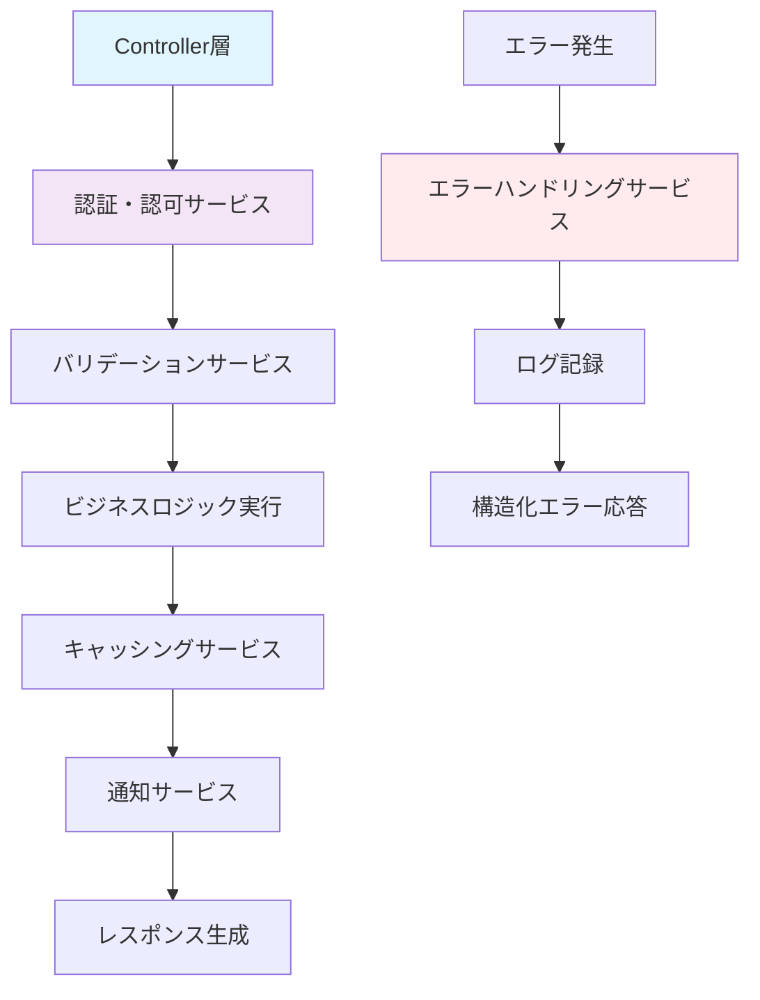
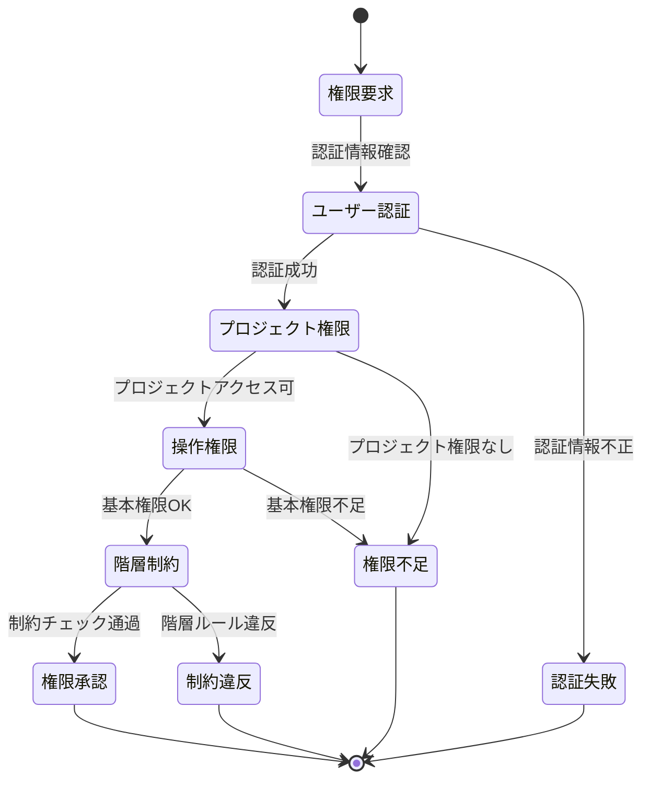
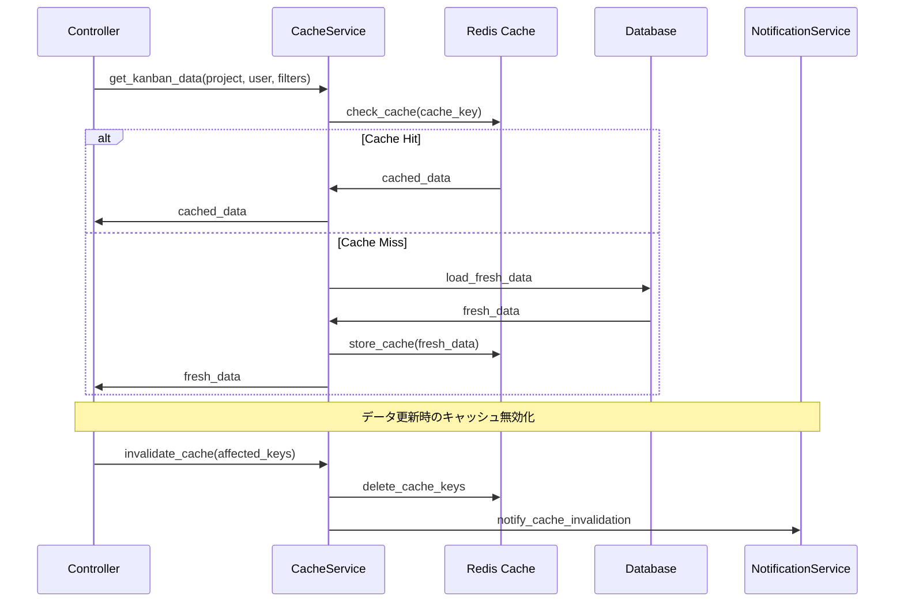
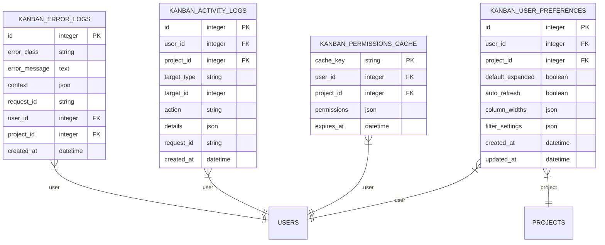
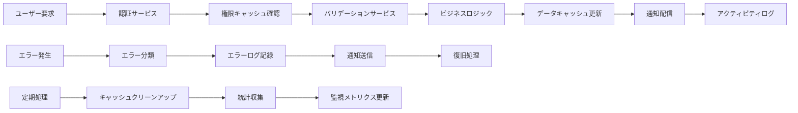
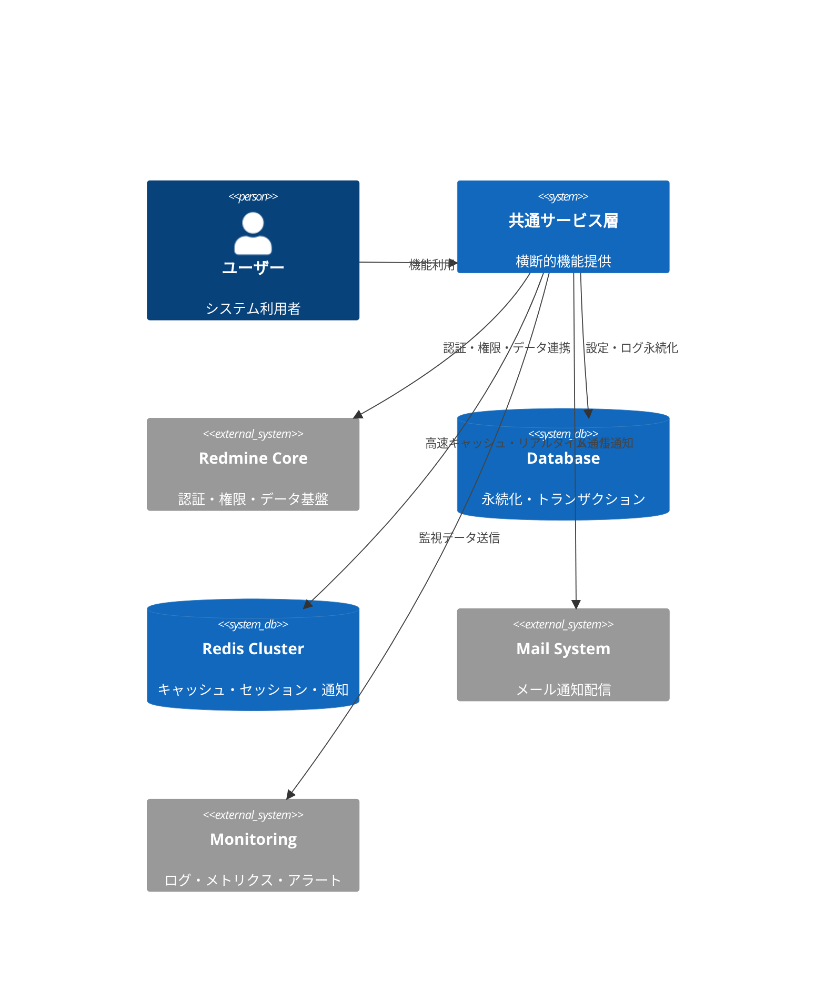
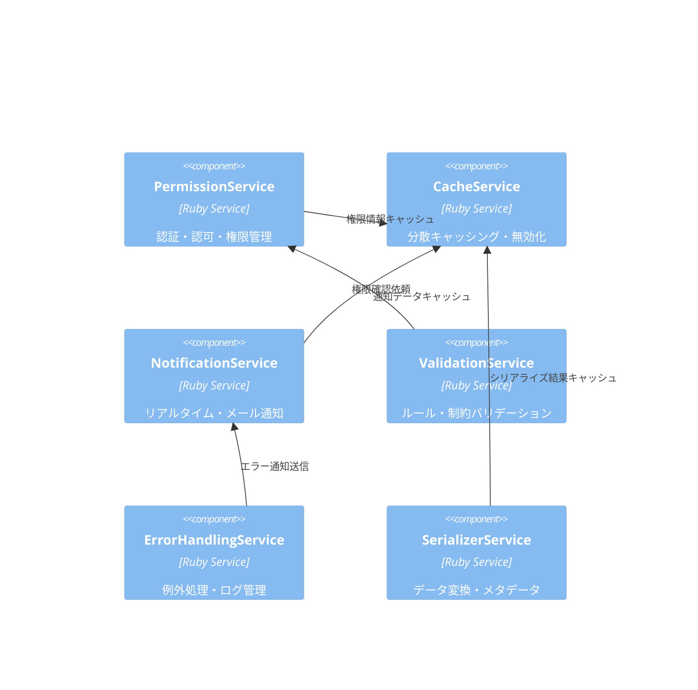
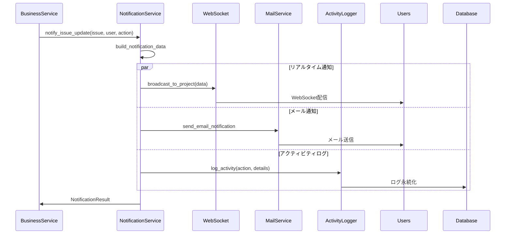
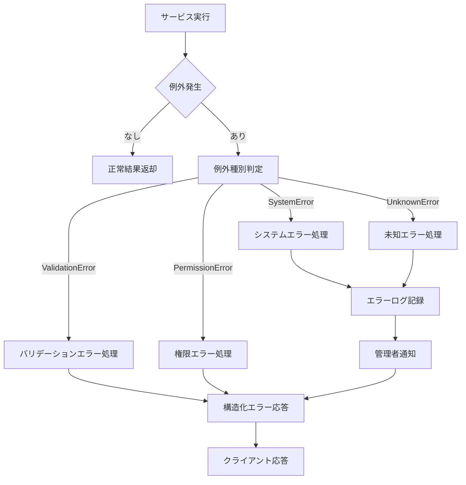

# 共通サービス サーバーサイド詳細設計書

## 🔗 関連ドキュメント
- @vibes/specs/ui/shared_services_wireframe.drawio
- @vibes/rules/technical_architecture_standards.md
- @vibes/logics/shared_components/shared_components_specification.md

## 1. 設計概要

### 1.1 設計目的・背景
**なぜこの共通サービス実装が必要なのか**
- ビジネス要件：Kanbanコンポーネント間で共有される横断的機能の統一実装
- ユーザー価値：一貫したセキュリティ、パフォーマンス、ユーザビリティの提供
- システム価値：コード重複排除、保守性向上、品質標準化、運用効率化

### 1.2 設計方針
**どのようなアプローチで実現するか**
- 主要設計思想：関心の分離、単一責任原則、依存性注入、設定駆動
- 技術選択理由：Rails Service Object パターン、Redis キャッシング、非同期処理
- 制約・前提条件：Redmine Core統合、プラグイン間互換性、パフォーマンス要求

## 2. 機能要求仕様

### 2.1 主要機能


### 2.2 機能詳細
| 機能ID | 機能名 | 説明 | 優先度 | 受容条件 |
|--------|--------|------|---------|----------|
| SS001 | 統一認証・認可 | Redmine権限モデル統合、階層制約チェック | High | 権限チェック100%、セキュリティ保証 |
| SS002 | 高性能キャッシング | Redis分散キャッシュ、自動無効化 | High | 90%キャッシュヒット率、5倍高速化 |
| SS003 | リアルタイム通知 | WebSocket/メール通知、アクティビティログ | Medium | 3秒以内配信、通知漏れゼロ |
| SS004 | 包括的バリデーション | 移動・階層・ワークフロー制約の統合検証 | High | ルール違反100%検出、詳細エラー |
| SS005 | 統一エラーハンドリング | 構造化例外処理、監査ログ、復旧支援 | Medium | 全例外捕捉、トレーサビリティ |

## 3. UI/UX設計仕様

### 3.1 サービス連携フロー


### 3.2 権限チェック状態遷移


### 3.3 キャッシング戦略シーケンス


## 4. データ設計

### 4.1 サービス共通データ構造


### 4.2 サービス間データフロー


## 5. アーキテクチャ設計

### 5.1 システム構成


### 5.2 サービス層構成


## 6. インターフェース設計

### 6.1 共通サービス インターフェース
```ruby
# 共通サービス統一インターフェース（疑似コード）
module Kanban
  class ServiceBase
    # 共通初期化
    def initialize(context = {})
      @project = context[:project]
      @user = context[:user]
      @request_id = context[:request_id] || SecureRandom.uuid
    end

    # 結果オブジェクト標準化
    class ServiceResult
      attr_reader :success, :data, :errors, :metadata

      def initialize(success:, data: nil, errors: [], metadata: {})
        @success = success
        @data = data
        @errors = errors
        @metadata = metadata.merge(
          timestamp: Time.zone.now.iso8601,
          service: self.class.name
        )
      end

      def success?
        @success
      end

      def failed?
        !@success
      end
    end
  end

  # 権限サービス
  class PermissionService < ServiceBase
    def check_kanban_access(user, project, operation)
      ServiceResult.new(
        success: permission_granted?,
        data: { allowed_operations: calculate_permissions },
        errors: permission_granted? ? [] : ['Access denied'],
        metadata: { operation: operation, checked_at: Time.zone.now }
      )
    end
  end

  # キャッシングサービス
  class CacheService < ServiceBase
    def get_or_set(key, expires_in: 15.minutes, &block)
      ServiceResult.new(
        success: true,
        data: Rails.cache.fetch(key, expires_in: expires_in, &block),
        metadata: { cache_key: key, expires_in: expires_in }
      )
    end
  end
end
```

### 6.2 通知システム インターフェース


## 7. 非機能要求

### 7.1 パフォーマンス要求
| 項目 | 要求値 | 測定方法 |
|------|---------|----------|
| 権限チェック処理 | 50ms以内 | キャッシュヒット率90%以上 |
| キャッシュアクセス | 10ms以内 | Redis レスポンス時間 |
| 通知配信時間 | 3秒以内 | WebSocket配信完了時間 |
| バリデーション処理 | 100ms以内 | 複数ルール同時チェック |

### 7.2 可用性・信頼性要求
- **可用性**: Redis Cluster冗長化、99.9%稼働率
- **整合性**: キャッシュ-DB間データ整合性保証、楽観的ロック
- **耐障害性**: サービス障害時のフォールバック処理、サーキットブレーカー

## 8. 実装指針

### 8.1 技術スタック
- **フレームワーク**: Ruby on Rails Service Object パターン
- **キャッシュ**: Redis Cluster (分散キャッシング・高可用性)
- **非同期処理**: Sidekiq/ActiveJob (バックグラウンドジョブ)
- **監視**: Prometheus/Grafana (メトリクス・アラート)
- **ログ**: Elasticsearch/Kibana (構造化ログ・検索)

### 8.2 実装パターン
```ruby
# 共通サービス実装パターン（疑似コード）
module Kanban
  class ValidationService < ServiceBase
    # 1. メイン処理メソッド
    def validate_issue_move(issue, target_column, target_version = nil)
      return early_validation_failure unless basic_checks_pass?

      errors = []
      errors.concat(validate_status_transition(issue, target_column))
      errors.concat(validate_hierarchy_constraints(issue, target_column))
      errors.concat(validate_version_assignment(issue, target_version)) if target_version

      ServiceResult.new(
        success: errors.empty?,
        data: { validated_issue: issue, target_column: target_column },
        errors: errors,
        metadata: build_validation_metadata
      )
    end

    # 2. プライベートメソッド（単一責任）
    private

    def validate_status_transition(issue, target_column)
      # 具体的なバリデーションロジック
    end

    # 3. 結果メタデータ構築
    def build_validation_metadata
      {
        validation_time: Time.zone.now,
        rules_checked: @checked_rules,
        performance_metrics: @metrics
      }
    end
  end
end
```

### 8.3 エラーハンドリング戦略


## 9. テスト設計

テスト戦略・ケース設計・実装については以下を参照：
- @vibes/rules/testing/server_side_testing_strategy.md
- @vibes/rules/testing/shared_services_server_test_specification.md

## 10. 運用・保守設計

### 10.1 監視・メトリクス設計
- **パフォーマンス監視**: サービス応答時間・スループット・エラー率
- **リソース監視**: Redis メモリ使用量・接続数・キュー長
- **ビジネス監視**: 権限チェック頻度・キャッシュヒット率・通知配信成功率

### 10.2 運用自動化
- **ヘルスチェック**: 各サービス生存監視・依存システム接続確認
- **自動復旧**: Redis再接続・キャッシュ再構築・通知リトライ
- **キャパシティ管理**: Redis クラスター自動スケーリング・ログローテーション

---

*共通サービス サーバーサイド実装は、Kanban システム全体の品質・パフォーマンス・セキュリティを支える横断的基盤です。統一されたアーキテクチャパターンにより、保守性と拡張性を重視した設計を実現します。*