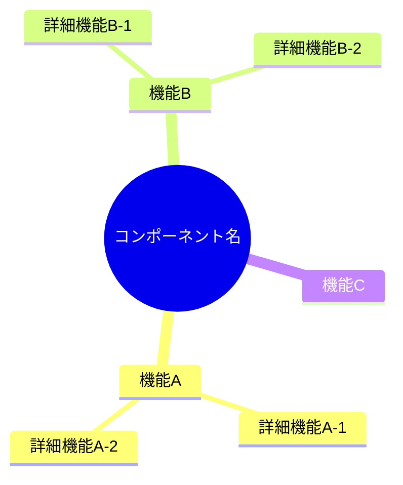
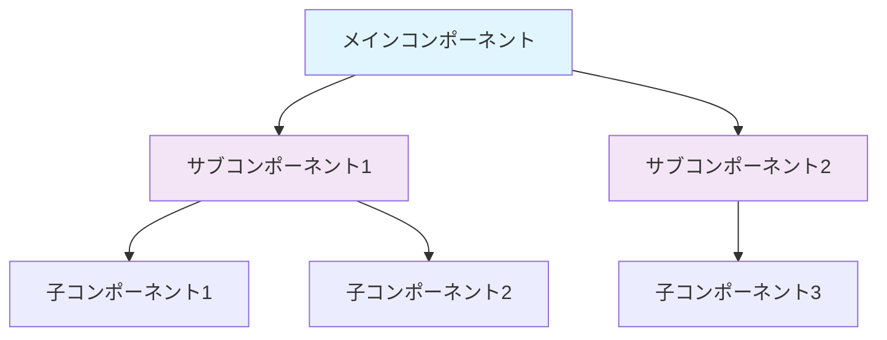
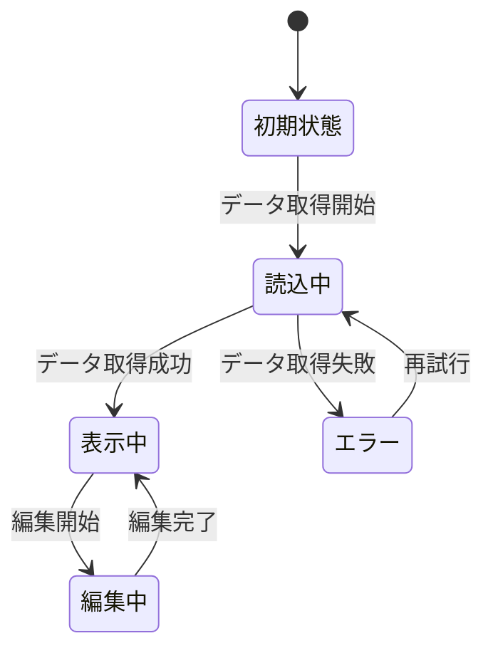
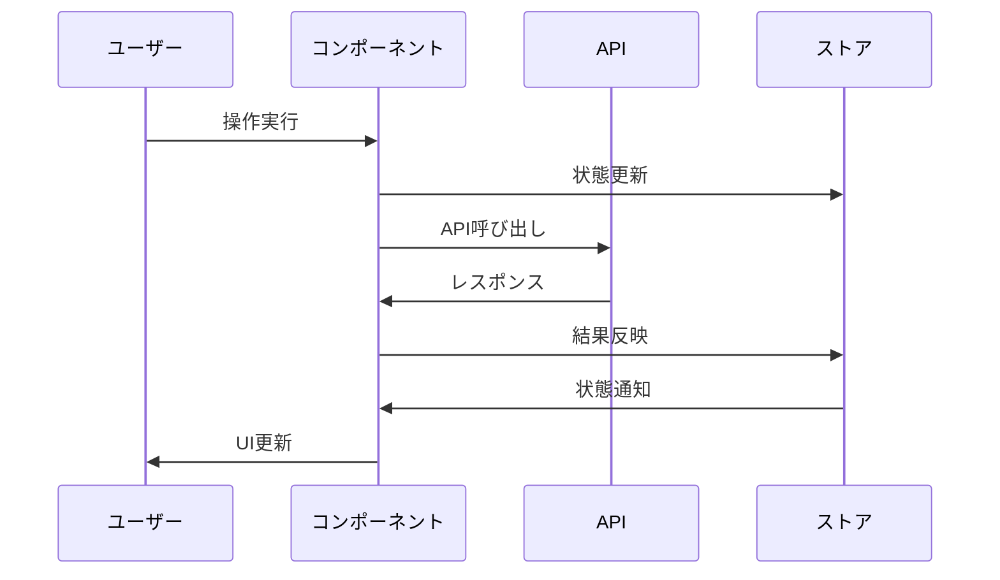
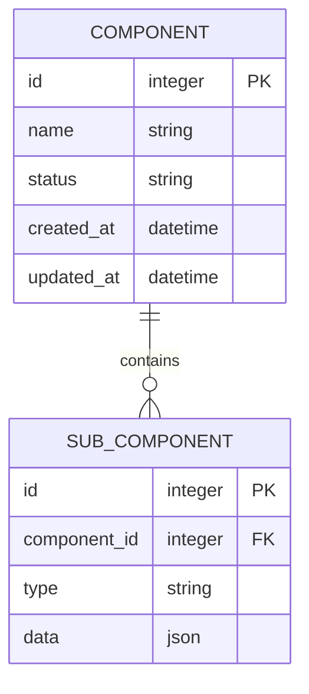
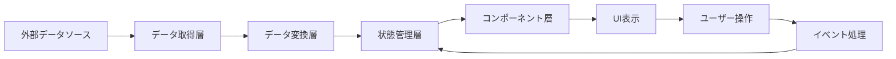
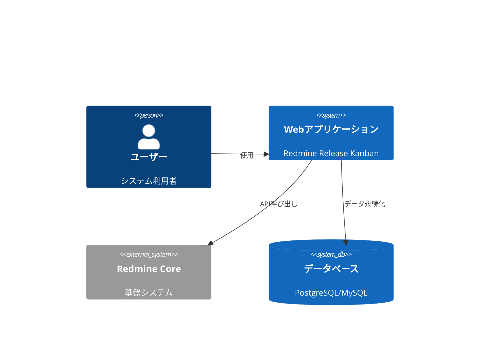
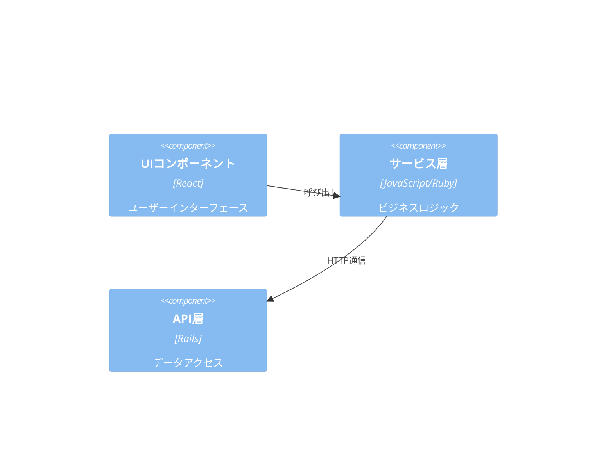
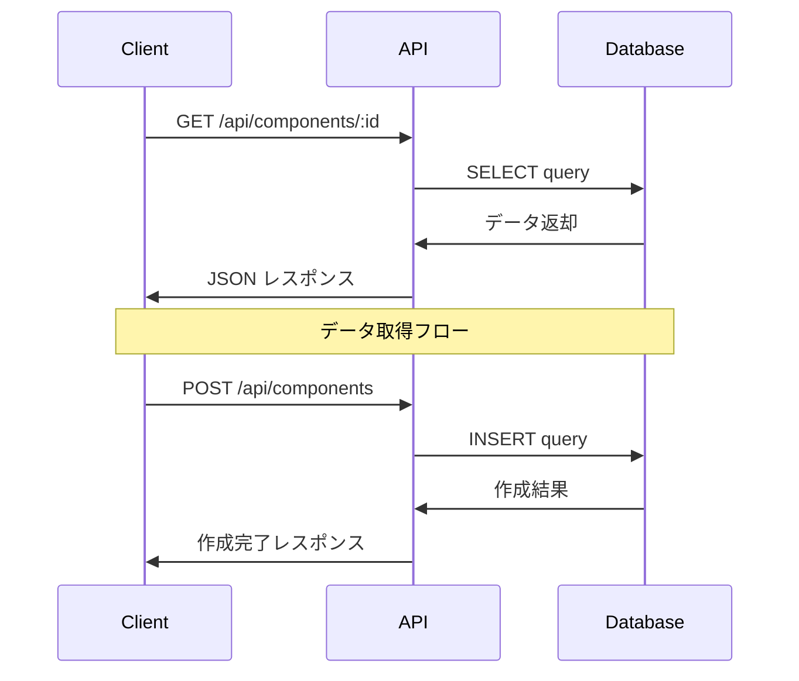
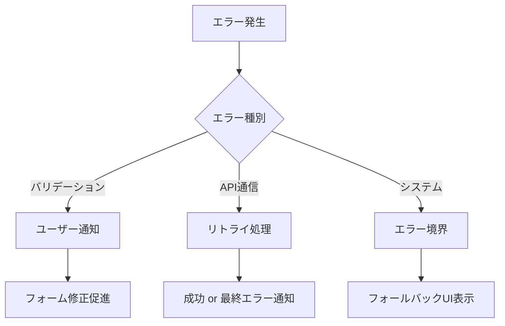

# [コンポーネント名] 詳細設計書

## 🔗 関連ドキュメント
- @vibes/specs/ui/[関連するワイヤーフレーム].drawio
- @vibes/rules/technical_architecture_standards.md
- @vibes/logics/[関連するロジック].md

## 1. 設計概要

### 1.1 設計目的・背景
**なぜこのコンポーネントが必要なのか**
- ビジネス要件：[ビジネス上の課題・要求]
- ユーザー価値：[ユーザーが得られる価値]
- システム価値：[システム全体への寄与]

### 1.2 設計方針
**どのようなアプローチで実現するか**
- 主要設計思想：[責務分離、再利用性、保守性など]
- 技術選択理由：[React、mermaid等の選択根拠]
- 制約・前提条件：[技術的・業務的制約]

## 2. 機能要求仕様

### 2.1 主要機能


### 2.2 機能詳細
| 機能ID | 機能名 | 説明 | 優先度 | 受容条件 |
|--------|--------|------|---------|----------|
| F001 | [機能名] | [機能説明] | High | [完了判定条件] |
| F002 | [機能名] | [機能説明] | Medium | [完了判定条件] |

## 3. UI/UX設計仕様

### 3.1 コンポーネント階層構造


### 3.2 状態遷移設計


### 3.3 ユーザーインタラクション設計


## 4. データ設計

### 4.1 データ構造


### 4.2 データフロー


## 5. アーキテクチャ設計

### 5.1 システム構成


### 5.2 コンポーネント構成


## 6. インターフェース設計

### 6.1 Props インターフェース
```typescript
interface ComponentProps {
  // 必須プロパティ
  id: string;
  data: ComponentData;
  onUpdate: (data: ComponentData) => void;

  // オプションプロパティ
  className?: string;
  disabled?: boolean;
  variant?: 'primary' | 'secondary';
}

interface ComponentData {
  name: string;
  status: ComponentStatus;
  metadata: Record<string, unknown>;
}
```

### 6.2 API インターフェース


## 7. 非機能要求

### 7.1 パフォーマンス要求
| 項目 | 要求値 | 測定方法 |
|------|---------|----------|
| 初期表示時間 | 2秒以内 | First Contentful Paint |
| 操作応答時間 | 0.5秒以内 | Click to Visual Change |
| メモリ使用量 | 50MB以内 | Chrome DevTools |

### 7.2 品質要求
- **可用性**: 99.9%以上（システム全体の制約に準拠）
- **保守性**: 循環複雑度10以下、テストカバレッジ80%以上
- **拡張性**: 新機能追加時の既存機能への影響最小化

## 8. 実装指針

### 8.1 技術スタック
- **フロントエンド**: React 18 + TypeScript
- **状態管理**: Context API / Redux Toolkit
- **スタイリング**: SCSS / CSS Modules
- **テスト**: Jest + React Testing Library

### 8.2 実装パターン
```typescript
// コンポーネント実装の基本パターン（疑似コード）
export const Component: FC<ComponentProps> = ({ id, data, onUpdate }) => {
  // 1. 状態管理
  const [localState, setLocalState] = useState(initialState);

  // 2. 副作用処理
  useEffect(() => {
    // データ取得・購読処理
  }, [dependencies]);

  // 3. イベントハンドラー
  const handleAction = useCallback(() => {
    // ビジネスロジック呼び出し
    onUpdate(newData);
  }, [onUpdate]);

  // 4. レンダリング
  return (
    <div className="component">
      {/* UI要素 */}
    </div>
  );
};
```

### 8.3 エラーハンドリング戦略


## 9. テスト設計

### 9.1 テスト戦略
```mermaid
pyramid
    title テストピラミッド

    "E2Eテスト" : 10
    "統合テスト" : 20
    "単体テスト" : 70
```

### 9.2 テストケース設計
| テストレベル | 対象 | テスト手法 | カバレッジ目標 |
|-------------|------|-----------|----------------|
| 単体テスト | コンポーネント | Jest + RTL | 90%以上 |
| 統合テスト | API連携 | MSW + Jest | 80%以上 |
| E2Eテスト | ユーザーシナリオ | Playwright | 主要フロー100% |

## 10. 運用・保守設計

### 10.1 監視・ログ設計
- **パフォーマンス監視**: Web Vitals測定
- **エラートラッキング**: クライアントエラーログ収集
- **ユーザー行動分析**: 操作ログ記録

### 10.2 更新・デプロイ戦略
- **段階的更新**: Feature Flag活用
- **ロールバック**: 前バージョンへの即座復旧
- **互換性**: 既存API・データ形式との後方互換性維持

---

*このテンプレートは要求仕様・アーキテクチャ設計・実装指針のハイブリッドアプローチによる詳細設計書です。mermaid図表を活用し、実装コードではなく設計思想と仕様を記述します。*