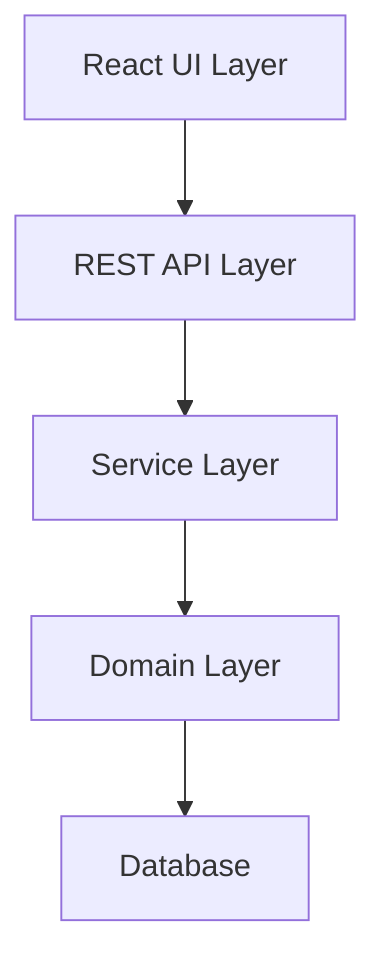

# 技術アーキテクチャ規約（Redmine Release Kanbanプラグイン）

## 📋 目次
- [技術アーキテクチャ規約](#技術アーキテクチャ規約redmine-release-kanbanプラグイン)
  - [🔗 関連ドキュメント](#-関連ドキュメント)
  - [1. システム概要](#1-システム概要)
    - [1.1 目的](#11-目的)
    - [1.2 対象環境](#12-対象環境)
    - [1.3 基本構成](#13-基本構成)
  - [2. アーキテクチャ構成](#2-アーキテクチャ構成)
    - [2.1 レイヤー構造](#21-レイヤー構造)
    - [2.2 コンポーネント設計](#22-コンポーネント設計)
    - [2.3 データフロー](#23-データフロー)
  - [3. 技術スタック](#3-技術スタック)
    - [3.1 バックエンド](#31-バックエンド)
    - [3.2 フロントエンド](#32-フロントエンド)
    - [3.3 開発ツール](#33-開発ツール)
  - [4. API設計](#4-api設計)
    - [4.1 REST API仕様](#41-rest-api仕様)
    - [4.2 内部API設計](#42-内部api設計)
    - [4.3 リレーション管理](#43-リレーション管理)
  - [5. 状態管理とビジネスルール](#5-状態管理とビジネスルール)
    - [5.1 チケット階層構造](#51-チケット階層構造)
    - [5.2 ステータス遷移](#52-ステータス遷移)
    - [5.3 自動化ルール](#53-自動化ルール)
  - [6. UI/UX設計](#6-uiux設計)
    - [6.1 カンバンレイアウト](#61-カンバンレイアウト)
    - [6.2 ドラッグ&ドロップ](#62-ドラッグドロップ)
    - [6.3 リアルタイム更新](#63-リアルタイム更新)
  - [7. セキュリティ設計](#7-セキュリティ設計)
    - [7.1 認証・認可](#71-認証認可)
    - [7.2 データ保護](#72-データ保護)
  - [8. パフォーマンス設計](#8-パフォーマンス設計)
    - [8.1 最適化戦略](#81-最適化戦略)
    - [8.2 キャッシング](#82-キャッシング)
  - [9. 品質基準](#9-品質基準)
    - [9.1 コード品質](#91-コード品質)
    - [9.2 テスト戦略](#92-テスト戦略)
    - [9.3 監査ログ](#93-監査ログ)

## 🔗 関連ドキュメント
- @vibes/docs/rules/ai_collaboration_standards.md
- @vibes/docs/rules/vibes_documentation_standards.md
- @vibes/docs/apis/claudeCode/ClaudeCodeBestPracticesAnthropic.md

## 1. システム概要

### 1.1 目的

**4段階構造（Epic→Feature→UserStory→Task）**で進行を可視化し、UserStoryに割り当てたVersion（=バックログ/リリース）を子Task/Testへ自動伝播、かつTestでUserStoryを必ずblocks関係で塞ぐ運用をUIで強制・簡便化する。

### 1.2 対象環境

- **Redmine**: 6.0.3
- **Ruby on Rails**: Redmine同梱版
- **PostgreSQL/MySQL**: Redmine標準DB
- **Node.js**: 18.x（フロントエンドビルド用）

### 1.3 基本構成

```
redmine_release_kanban/
├── init.rb              # プラグインエントリポイント
├── config/
│   ├── routes.rb        # ルーティング定義
│   └── locales/         # 国際化ファイル
├── app/
│   ├── controllers/     # APIエンドポイント
│   ├── models/          # ビジネスロジック
│   ├── services/        # 複合処理サービス
│   └── views/           # Reactマウント用ERB
├── assets/
│   └── javascripts/     # Reactアプリケーション
└── spec/                # テストスイート
```

## 2. アーキテクチャ構成

### 2.1 レイヤー構造



**責務分離**:
- **UIレイヤー**: カンバン表示、D&D操作、ユーザー入力
- **APIレイヤー**: HTTPリクエスト処理、認証、レスポンス整形
- **サービスレイヤー**: トランザクション制御、複合処理
- **ドメインレイヤー**: ビジネスルール実装
- **DBレイヤー**: データ永続化

### 2.2 コンポーネント設計

**サーバーサイド**:
```ruby
# app/controllers/kanban_controller.rb
class KanbanController < ApplicationController
  def index
    # Reactアプリマウント
  end

  def cards
    # カード一覧API
  end

  def move_card
    # カード移動API（列遷移トリガー）
  end

  def batch_update
    # 一括更新API
  end
end

# app/services/kanban/auto_propagation_service.rb
class Kanban::AutoPropagationService
  def propagate_version(user_story, version)
    # 子Task/Testへのバージョン自動伝播
  end
end

# app/services/kanban/test_generation_service.rb
class Kanban::TestGenerationService
  def generate_test_with_blocks(user_story)
    # Test自動生成とblocks関係設定
  end
end
```

**フロントエンド**:
```javascript
// assets/javascripts/kanban/App.jsx
const KanbanApp = () => {
  return (
    <DndContext>
      <VersionBar />
      <KanbanBoard />
      <BatchActionPanel />
    </DndContext>
  );
};

// assets/javascripts/kanban/components/KanbanBoard.jsx
const KanbanBoard = () => {
  // 列定義、Swimlane、カード表示
};

// assets/javascripts/kanban/hooks/useCardActions.js
const useCardActions = () => {
  // カード操作フック（移動、作成、更新）
};
```

### 2.3 データフロー

```
1. ユーザー操作（D&D）
   ↓
2. React Event Handler
   ↓
3. REST API呼び出し
   ↓
4. Controller処理
   ↓
5. Service実行（自動化ルール適用）
   ↓
6. Model更新
   ↓
7. レスポンス返却
   ↓
8. React State更新
   ↓
9. UI再レンダリング
```

## 3. 技術スタック

### 3.1 バックエンド

- **フレームワーク**: Ruby on Rails（Redmine同梱）
- **プラグインAPI**: Redmine::Plugin.register
- **フック**: ViewListener、ControllerHooks
- **ジョブキュー**: ActiveJob（オプション）

### 3.2 フロントエンド

- **UIライブラリ**: React 18
- **D&D**: @dnd-kit/sortable
- **状態管理**: Context API + useReducer
- **HTTPクライアント**: axios
- **スタイリング**: CSS Modules
- **ビルドツール**: Webpack 5 + Babel

### 3.3 開発ツール

- **テスト**: RSpec（サーバー）、Jest（クライアント）
- **リンター**: RuboCop、ESLint
- **CI/CD**: GitHub Actions（推奨）

## 4. API設計

### 4.1 REST API仕様

**Redmine標準API活用**:
```
GET    /issues.json          # Issue一覧取得
POST   /issues.json          # Issue作成
PUT    /issues/:id.json      # Issue更新
POST   /issues/:id/relations.json  # リレーション作成
GET    /projects/:id/versions.json # バージョン一覧
POST   /projects/:id/versions.json # バージョン作成
```

### 4.2 内部API設計

**プラグイン専用エンドポイント**:
```
GET    /kanban/cards         # カンバン用カード取得（階層構造含む）
POST   /kanban/move_card     # カード移動（自動化トリガー）
POST   /kanban/batch_update  # 一括更新（トランザクション保証）
POST   /kanban/generate_test # Test自動生成
GET    /kanban/gate_check    # 移動可否判定
```

**リクエスト/レスポンス例**:
```json
// POST /kanban/move_card
{
  "card_id": 123,
  "from_column": "in_progress",
  "to_column": "ready_for_test",
  "swimlane_id": 45
}

// Response
{
  "success": true,
  "card": { /* 更新後のカードデータ */ },
  "triggered_actions": [
    { "type": "test_generated", "test_id": 456 },
    { "type": "blocks_created", "relation_id": 789 }
  ]
}
```

### 4.3 リレーション管理

**blocks関係の強制**:
```ruby
def create_blocks_relation(test, user_story)
  IssueRelation.create!(
    issue_from: test,
    issue_to: user_story,
    relation_type: 'blocks'
  )
end
```

## 5. 状態管理とビジネスルール

### 5.1 チケット階層構造

```
Epic (tracker: epic)
└── Feature (tracker: feature)
    └── UserStory (tracker: user_story)
        ├── Task (tracker: task)
        └── Test (tracker: test) --blocks--> UserStory
```

### 5.2 ステータス遷移

**列定義**:
- ToDo: 未着手
- In Progress: 作業中
- Ready for Test: テスト待ち
- Released: リリース済み

**遷移ルール**:
```ruby
TRANSITION_RULES = {
  'in_progress' => ['ready_for_test'],
  'ready_for_test' => ['released', 'in_progress'],
  'released' => [] # 終端
}
```

### 5.3 自動化ルール

**ルール定義**:
```ruby
class AutomationRule
  RULES = [
    {
      trigger: :user_story_created,
      action: :generate_test_with_blocks
    },
    {
      trigger: :version_assigned_to_user_story,
      action: :propagate_to_children
    },
    {
      trigger: :moved_to_ready_for_test,
      condition: :test_not_exists,
      action: :generate_test
    },
    {
      trigger: :high_severity_bug_created,
      action: :block_user_story
    }
  ]
end
```

## 6. UI/UX設計

### 6.1 カンバンレイアウト

```
┌─────────────────────────────────────────────┐
│ [Backlog-1] [Backlog-2] [Icebox] [+新規]    │ <- VersionBar
├─────────────────────────────────────────────┤
│     │ ToDo │ In Prog │ Ready │ Released     │
├─────┼──────┼─────────┼───────┼──────────────┤
│Epic1│      │ [Card]  │       │              │ <- Swimlane
│     │[Card]│         │[Card] │              │
├─────┼──────┼─────────┼───────┼──────────────┤
│Epic2│[Card]│         │       │ [Card]       │
└─────┴──────┴─────────┴───────┴──────────────┘
```

### 6.2 ドラッグ&ドロップ

**実装方針**:
```javascript
const handleDragEnd = (event) => {
  const { active, over } = event;

  if (over.type === 'column') {
    // 列間移動
    moveCard(active.id, over.id);
  } else if (over.type === 'version') {
    // バージョン割当
    assignVersion(active.id, over.id);
  }
};
```

### 6.3 リアルタイム更新

**楽観的UI更新**:
```javascript
const optimisticUpdate = async (cardId, newColumn) => {
  // 1. UI即座更新
  updateUI(cardId, newColumn);

  try {
    // 2. API呼び出し
    await api.moveCard(cardId, newColumn);
  } catch (error) {
    // 3. 失敗時ロールバック
    rollbackUI(cardId);
    showError(error.message);
  }
};
```

## 7. セキュリティ設計

### 7.1 認証・認可

**権限チェック**:
```ruby
before_action :require_login
before_action :check_kanban_permission

def check_kanban_permission
  unless User.current.allowed_to?(:view_kanban, @project)
    deny_access
  end
end
```

**ロール定義**:
- PM/PO: 全機能使用可
- Dev/QA: カード操作、列移動
- Viewer: 閲覧のみ

### 7.2 データ保護

- CSRF対策: Rails標準機能使用
- XSS対策: React自動エスケープ
- SQLインジェクション対策: ActiveRecord使用

## 8. パフォーマンス設計

### 8.1 最適化戦略

**N+1問題回避**:
```ruby
def kanban_cards
  Issue.includes(:tracker, :status, :assigned_to, :fixed_version)
       .joins(:project)
       .where(projects: { id: @project.id })
end
```

**仮想スクロール**:
```javascript
// 大量カード対応
import { VariableSizeList } from 'react-window';
```

### 8.2 キャッシング

- カード一覧: 5分キャッシュ
- バージョン情報: 10分キャッシュ
- ユーザー権限: セッション期間

## 9. 品質基準

### 9.1 コード品質

- **RuboCop準拠**: 警告0を維持
- **ESLint準拠**: エラー0を維持
- **カバレッジ**: 80%以上
- **複雑度**: Cyclomaticは10以下

### 9.2 テスト戦略

**テストピラミッド**:
```
      /\      E2E（10%）
     /  \     統合テスト（30%）
    /    \    ユニットテスト（60%）
   /______\
```

**重点テスト項目**:
- 自動化ルールの発火条件
- 権限制御
- バージョン伝播ロジック
- blocks関係の整合性

### 9.3 監査ログ

**自動操作の記録**:
```ruby
def log_automation(action, details)
  journal = Journal.new(
    journalized: @issue,
    user: User.current,
    notes: "自動化: #{action}",
    private_notes: false
  )
  journal.details << JournalDetail.new(
    property: 'attr',
    prop_key: details[:key],
    old_value: details[:old],
    value: details[:new]
  )
  journal.save!
end
```

---

*本ドキュメントは要件定義に基づき、Redmine 6.0.3向けカンバンプラグインの技術アーキテクチャを定義したものである。実装時は本規約に準拠し、変更が必要な場合は事前にレビューを実施すること。*